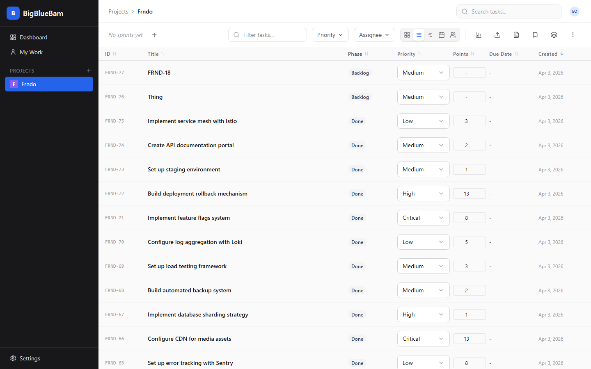
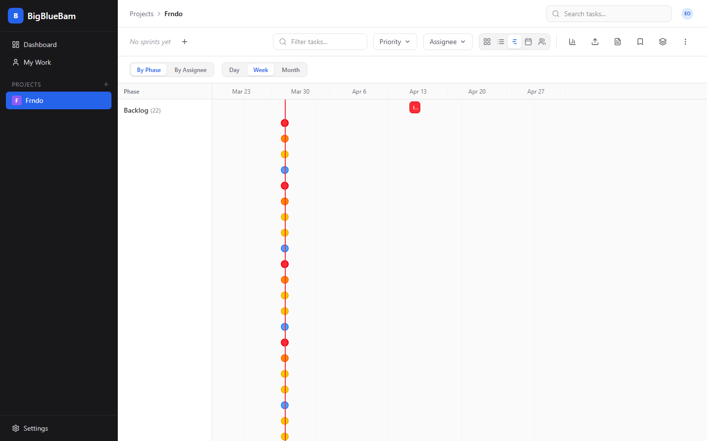
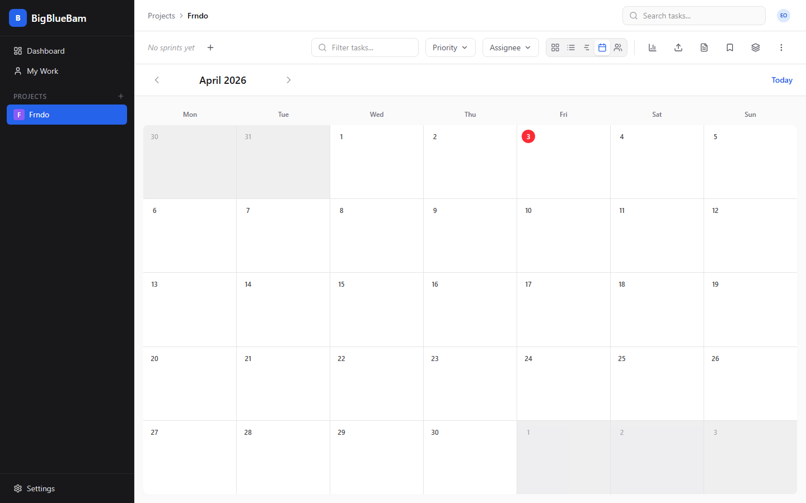
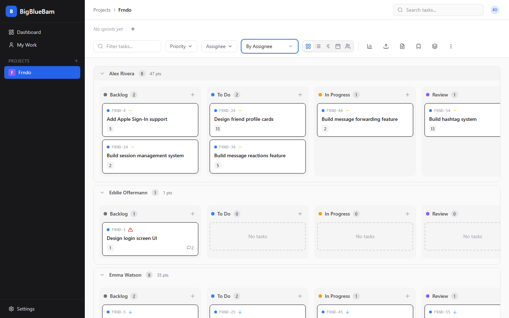
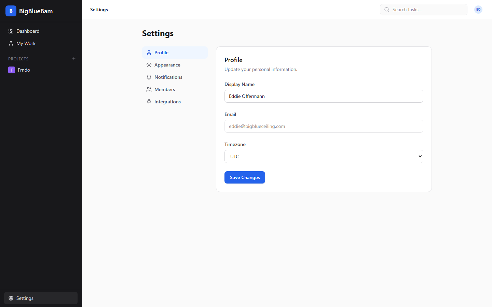
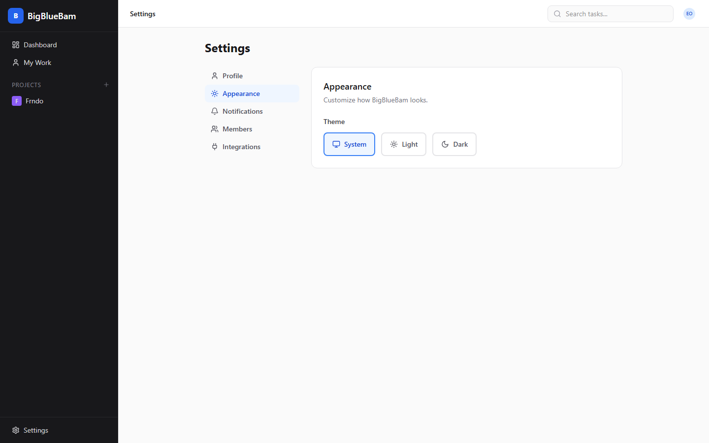
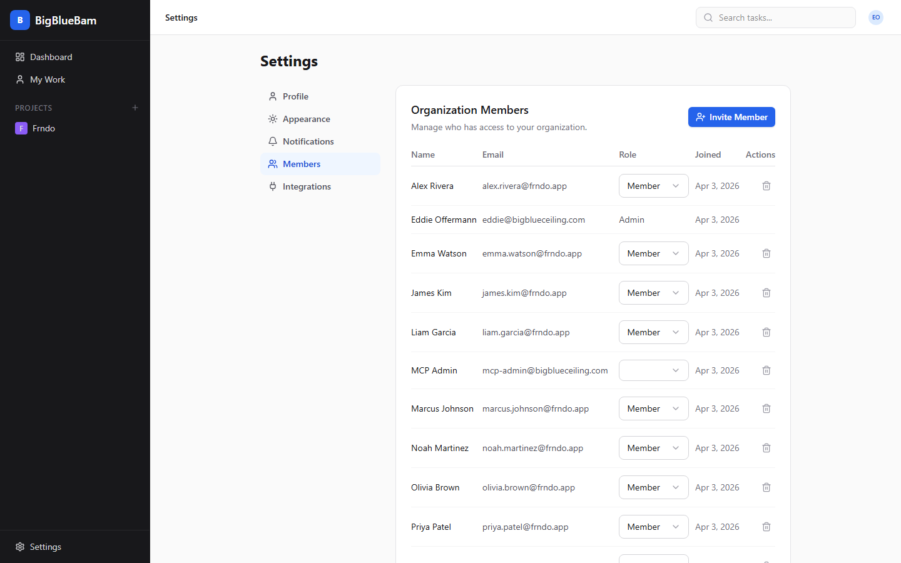
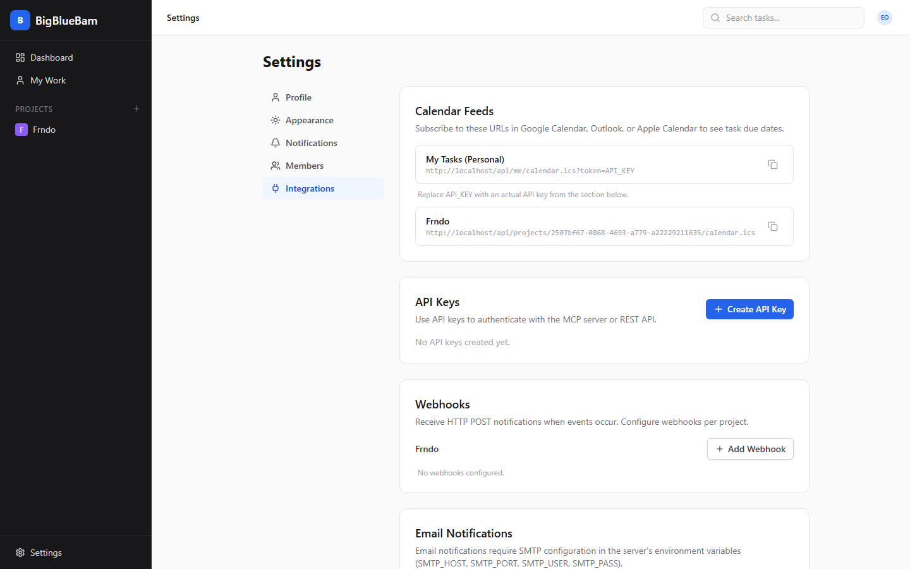
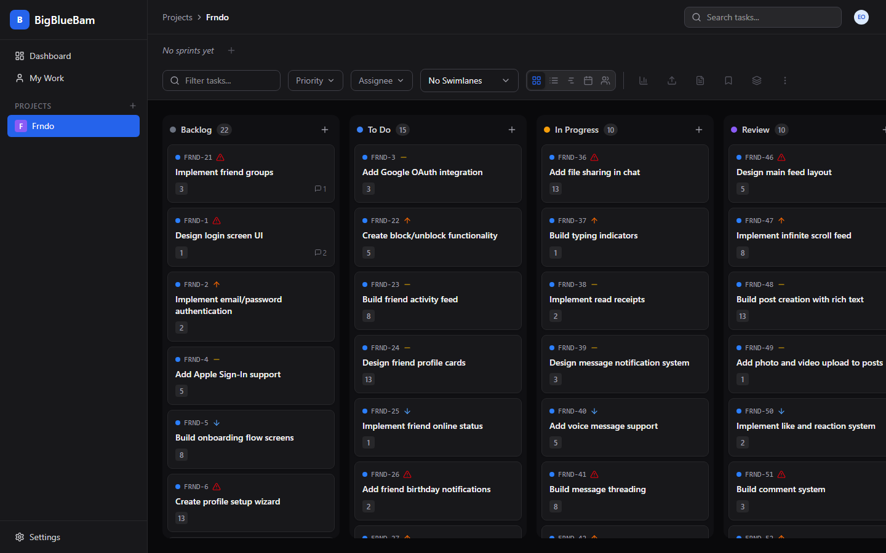

<p align="center">
  
</p>

<h1 align="center">BigBlueBam</h1>

<p align="center">
  <strong>A web-based, multi-user Kanban project planning tool with sprint management, real-time collaboration, and AI integration via MCP.</strong>
</p>

<p align="center">
  <a href="#features">Features</a> &bull;
  <a href="#quick-start">Quick Start</a> &bull;
  <a href="#screenshots">Screenshots</a> &bull;
  <a href="#architecture">Architecture</a> &bull;
  <a href="#mcp-server">MCP Server</a> &bull;
  <a href="#documentation">Documentation</a>
</p>

---

## Features

**Board & Task Management**
- Drag-and-drop Kanban board with animated cards (Motion spring physics)
- 5 configurable phases per project with WIP limits
- Multiple views: Board, List, Timeline/Gantt, Calendar, Workload
- Swimlanes by assignee, priority, or epic
- Inline task creation, duplication, and bulk operations
- Task templates for repeatable workflows
- Sprint management with carry-forward ceremony
- Story points, time tracking, due dates, subtasks

**Collaboration**
- Real-time sync via WebSocket + Redis PubSub
- Comments with emoji reactions
- @mention notifications
- Activity feed and audit log
- File attachments

**Integrations**
- **MCP Server** with 38 tools for AI-powered project management
- iCal calendar feeds (Google Calendar, Outlook)
- Webhooks for CI/CD integration
- Data import from Jira, Trello, GitHub Issues, and CSV
- REST API with OpenAPI/Swagger docs
- API key management for automation

**Customization**
- Dark/light/system theme with class-based toggle
- Custom date picker with calendar popover
- Keyboard shortcuts + command palette (Ctrl+K)
- Saved views and filter presets
- Labels, epics, and custom fields
- Per-project phase and state configuration

---

## Quick Start

### Prerequisites

- [Docker](https://docs.docker.com/get-docker/) and Docker Compose
- [Node.js 22+](https://nodejs.org/) and [pnpm 9+](https://pnpm.io/) (for development)

### Run with Docker

```bash
# Clone the repo
git clone https://github.com/eoffermann/BigBlueBam.git
cd BigBlueBam

# Set up environment
cp .env.example .env
# Edit .env with your secrets (passwords, session secret)

# Start all services
docker compose up -d

# Create your admin account
docker compose exec api node dist/cli.js create-admin \
  --email admin@example.com \
  --password YourPassword123 \
  --name "Admin User" \
  --org "My Organization"
```

Open **http://localhost** and log in.

### Services

| Service | Port | Description |
|---------|------|-------------|
| Frontend | :80 | React SPA via nginx |
| API | :4000 | Fastify REST + WebSocket |
| MCP Server | :3001 | Model Context Protocol |
| PostgreSQL | :5432 | Primary database |
| Redis | :6379 | Cache, PubSub, queues |
| MinIO | :9000 | S3-compatible storage |
| Worker | — | Background job processor |

### Development Mode

```bash
pnpm install
pnpm --filter @bigbluebam/shared build
docker compose -f docker-compose.yml -f docker-compose.dev.yml up
```

### Run Tests

```bash
pnpm test  # 439 tests across all packages
```

---

## Screenshots

### Login

Clean, centered login form with BigBlueBam branding.


### Project Dashboard

Overview page with cards for each project.


### Kanban Board

Drag-and-drop board with 5 configurable phases, task cards with priority icons, story points, due dates, and comment counts.


### Task Detail

Slide-out drawer with full task editing: title, description, assignee, priority, phase, sprint, story points, dates, subtasks, comments with emoji reactions, and activity feed.


### List View

Sortable table with inline editing for priority and story points.



### Timeline / Gantt View

Horizontal task bars spanning start-to-due dates with a today marker.



### Calendar View

Monthly calendar showing tasks on their due dates with navigation and today highlighting.



### Swimlanes

Horizontal grouping by assignee (or priority/epic) with collapsible rows showing task count and total story points.



### Project Dashboard

Charts and widgets: sprint progress, priority breakdown, overdue tasks, task distribution, and team workload.


### My Work

Cross-project view of all tasks assigned to you, grouped by section.


### Settings — Profile

Edit display name, email, and timezone.



### Settings — Appearance

System, Light, and Dark theme toggle.



### Settings — Members

Organization member management with invite, role editing, and removal.



### Settings — Integrations

Calendar feed URLs, API key management, and webhook configuration.



### Dark Mode

Full dark mode support across all views.



---

## Architecture

```
┌─────────────────────────────────────────────────────────────┐
│                   Client (SPA)                               │
│  React 19 · Motion · TanStack Query · Zustand · dnd-kit     │
│  TailwindCSS v4 · Radix UI                                  │
└──────────────────────┬──────────────────────────────────────┘
                       │ HTTPS / WSS
┌──────────────────────▼──────────────────────────────────────┐
│              nginx (reverse proxy + static SPA)              │
└──────────┬───────────────────────┬──────────────────────────┘
           │ REST / WS             │ SSE / HTTP
┌──────────▼──────────┐  ┌────────▼─────────────┐  ┌────────────────────┐
│ Fastify API :4000   │  │ MCP Server :3001     │  │ BullMQ Worker      │
│ + WebSocket         │  │ 38 tools, 7 resources│  │ email, notifications│
└──────────┬──────────┘  └────────┬─────────────┘  └────────┬───────────┘
           │                      │                          │
┌──────────▼──────────────────────▼──────────────────────────▼───────────┐
│  PostgreSQL 16     │  Redis 7           │  MinIO (S3)                  │
│  20+ tables        │  PubSub + cache    │  File storage                │
└────────────────────┴───────────────────┴──────────────────────────────┘
```

### Tech Stack

| Layer | Technology |
|-------|-----------|
| Frontend | React 19, TailwindCSS v4, Motion, TanStack Query, Zustand, dnd-kit, Radix UI |
| API | Node.js 22, Fastify v5, Drizzle ORM, Zod |
| Realtime | WebSocket + Redis PubSub |
| MCP | @modelcontextprotocol/sdk (Streamable HTTP + SSE) |
| Database | PostgreSQL 16, Redis 7, MinIO |
| Worker | BullMQ, Nodemailer |
| Build | Turborepo, pnpm, tsup, Vite |
| Test | Vitest (439 tests) |
| Deploy | Docker Compose, multi-stage Dockerfiles |

### Monorepo Structure

```
apps/
  api/          → Fastify REST API + WebSocket (18 route modules)
  frontend/     → React SPA (33 components, 6 pages)
  mcp-server/   → MCP protocol server (38 tools)
  worker/       → BullMQ background jobs
packages/
  shared/       → Zod schemas, TypeScript types, constants
infra/
  postgres/     → Database schema (init.sql)
  nginx/        → Reverse proxy config
docs/           → 7 documentation pages with Mermaid diagrams
```

---

## MCP Server

BigBlueBam exposes a Model Context Protocol server enabling AI assistants (Claude, Claude Code, custom agents) to manage projects through structured tool calls.

### Setup

```json
{
  "mcpServers": {
    "bigbluebam": {
      "url": "http://localhost:3001/mcp",
      "headers": {
        "Authorization": "Bearer YOUR_API_KEY"
      }
    }
  }
}
```

### Available Tools (38)

| Category | Tools |
|----------|-------|
| Projects | list_projects, get_project, create_project |
| Board | get_board, list_phases, create_phase, reorder_phases |
| Tasks | search_tasks, get_task, create_task, update_task, move_task, delete_task, duplicate_task, bulk_update_tasks |
| Sprints | list_sprints, create_sprint, start_sprint, complete_sprint, get_sprint_report |
| Comments | list_comments, add_comment |
| Members | list_members, get_my_tasks |
| Reports | get_velocity_report, get_burndown, get_cumulative_flow, get_overdue_tasks, get_workload, get_status_distribution |
| Templates | list_templates, create_from_template |
| Import | import_csv, import_github_issues, suggest_branch_name |
| Time | log_time |
| Utility | get_server_info, confirm_action |

---

## Documentation

| Document | Description |
|----------|-------------|
| [Getting Started](docs/getting-started.md) | Setup, first run, troubleshooting |
| [Architecture](docs/architecture.md) | System design, data flow, components |
| [Database](docs/database.md) | ER diagrams, table descriptions, indexing |
| [API Reference](docs/api-reference.md) | All REST endpoints with examples |
| [MCP Server](docs/mcp-server.md) | Tools, resources, prompts, configuration |
| [Deployment](docs/deployment.md) | Docker, Kubernetes, scaling, backup |
| [Development](docs/development.md) | Contributing, testing, code style |

---

## License

MIT

---

<p align="center">
  Built with <a href="https://claude.ai/code">Claude Code</a>
</p>
