<p align="center">
  
</p>

<h1 align="center">BigBlueBam</h1>

<p align="center">
  <strong>Project management built for human-AI teams.</strong><br/>
  Engineers set the strategy. AI agents handle the grunt work. Everyone sees it on the board.
</p>

<p align="center">
  <a href="#the-vision">Vision</a> &bull;
  <a href="#product-tour">Tour</a> &bull;
  <a href="#for-teams">For Teams</a> &bull;
  <a href="#for-ai-agents">For AI Agents</a> &bull;
  <a href="#banter">Banter</a> &bull;
  <a href="#helpdesk">Helpdesk</a> &bull;
  <a href="#beacon">Beacon</a> &bull;
  <a href="#brief">Brief</a> &bull;
  <a href="#bolt">Bolt</a> &bull;
  <a href="#bearing">Bearing</a> &bull;
  <a href="#quick-start">Quick Start</a> &bull;
  <a href="#architecture">Architecture</a> &bull;
  <a href="#documentation">Docs</a>
</p>

<p align="center">
  
  
  
  
</p>

---

## The Vision

Most project management tools are built for humans talking to humans. BigBlueBam is built for **human-AI collaborative development** — a world where engineers and AI agents work side by side on the same board, in the same sprints, toward the same goals.

**Humans** own the strategy: setting priorities, defining epics, reviewing deliverables, talking to customers.

**AI agents** own the routine: triaging helpdesk tickets, creating tasks from bug reports, posting status updates, generating sprint reports, and keeping the board organized.

The **Kanban board** is the shared workspace. When an AI agent creates a task, moves a card, or replies to a customer, it shows up on the board in real time — right alongside everything your team is doing. No separate dashboards. No hidden automation. Full transparency.

This is made possible by **182 MCP tools** that give AI assistants (Claude, Claude Code, custom agents) full read-write access to projects, tasks, sprints, comments, reports, helpdesk tickets, team messaging, the knowledge base, collaborative documents, workflow automations, and goals & OKRs.

---

## Product Tour

<p align="center">
  
</p>
<p align="center"><em>The Kanban board — the central hub where human and AI work converges.</em></p>

<br/>

<table>
  <tr>
    <td width="50%"></td>
    <td width="50%"></td>
  </tr>
  <tr>
    <td align="center"><em>Timeline / Gantt view</em></td>
    <td align="center"><em>Calendar view</em></td>
  </tr>
  <tr>
    <td width="50%"></td>
    <td width="50%"></td>
  </tr>
  <tr>
    <td align="center"><em>List / table view</em></td>
    <td align="center"><em>Project analytics dashboard</em></td>
  </tr>
  <tr>
    <td width="50%"></td>
    <td width="50%"></td>
  </tr>
  <tr>
    <td align="center"><em>Helpdesk ticket list</em></td>
    <td align="center"><em>Command palette (Ctrl+K)</em></td>
  </tr>
</table>

---

## For Teams

### Kanban Board

Drag-and-drop cards across 5 configurable phases with WIP limits. Each card shows priority, assignee, story points, due date, and comment count at a glance. Motion spring physics make the interactions feel natural.

<p align="center">
  
</p>
<p align="center"><em>Dark mode — the default for late-night deploys.</em></p>

<p align="center">
  
</p>
<p align="center"><em>Light mode — because some people like the sun.</em></p>

### Swimlanes

Group tasks by assignee, priority, or epic. Collapsible rows show task count and total story points per group, making it easy to spot bottlenecks and unbalanced workloads.

<p align="center">
  
</p>

### Five Views, One Board

Every project supports five views — switch between them without losing your filters or context:

| View | What it shows |
|------|--------------|
| **Board** | Kanban columns with drag-and-drop cards |
| **List** | Sortable, filterable table with inline editing |
| **Timeline** | Gantt-style horizontal bars from start to due date |
| **Calendar** | Monthly calendar with tasks on their due dates |
| **Workload** | Team member capacity and allocation |

<table>
  <tr>
    <td width="50%"></td>
    <td width="50%"></td>
  </tr>
  <tr>
    <td align="center"><em>List view with sortable columns</em></td>
    <td align="center"><em>Timeline / Gantt view with today marker</em></td>
  </tr>
</table>

<p align="center">
  
</p>
<p align="center"><em>Calendar view — monthly navigation with task due dates</em></p>

### Task Detail

Click any card to open the detail drawer. Full rich-text description with image support, assignee, priority, phase, sprint, story points, start and due dates, subtasks, file attachments, comments with emoji reactions, and a complete activity feed.

<p align="center">
  
</p>

### Sprint Management

Create sprints, assign tasks, track velocity. When a sprint ends, the carry-forward ceremony moves incomplete work to the next sprint automatically. Sprint reports show burndown, velocity trends, and completion rates.

### Project Dashboard

Charts and widgets for sprint progress, priority breakdown, overdue tasks, task distribution by phase, and team workload — all in one place.

<p align="center">
  
</p>

### My Work

A cross-project view of everything assigned to you, grouped by project. One place to see your full plate.

<p align="center">
  
</p>

### Command Palette

Press **Ctrl+K** to open the command palette. Search tasks, switch projects, navigate views, and trigger actions without touching the mouse.

<p align="center">
  
</p>

### Organization Management

BigBlueBam ships a dedicated **People** surface (not buried under Settings) that covers the full identity lifecycle — invite, edit, assign, disable — with strict role-based gating.

<p align="center">
  
</p>

Filter by role or status, search by name or email, and act on individual members or in bulk.

#### Per-user detail, four tabs

<table>
  <tr>
    <td width="50%"></td>
    <td width="50%"></td>
  </tr>
  <tr>
    <td align="center"><em>Overview — identity, membership, disable toggle</em></td>
    <td align="center"><em>Projects — per-project roles, bulk assign</em></td>
  </tr>
  <tr>
    <td width="50%"></td>
    <td width="50%"></td>
  </tr>
  <tr>
    <td align="center"><em>Access — API keys, password reset, force change</em></td>
    <td align="center"><em>Activity — per-user audit trail</em></td>
  </tr>
</table>

Admins can reset passwords (manual or auto-generated), mint API keys on behalf of users with scoped permissions, force a password change on next login, or sign the user out of every device.

<table>
  <tr>
    <td width="50%"></td>
    <td width="50%"></td>
  </tr>
  <tr>
    <td align="center"><em>Reset password — auto-generate or set manually</em></td>
    <td align="center"><em>Create API key on behalf of a user (one-time token reveal)</em></td>
  </tr>
</table>

#### Bulk operations

Select multiple members to disable, enable, change role, remove from org, or export as CSV — all with rank-gating that mirrors the server:

<p align="center">
  
</p>

#### Multi-org membership

Users can belong to multiple organizations. The header shows the current org + role, and the org switcher lets multi-org users hop between them in one click — the session rotates and every query is invalidated, so the rest of the app instantly reflects the new org's data.

<p align="center">
  
</p>

A persistent banner warns when an org has no active owner, so operators can promote a replacement before the situation becomes invisible:

<p align="center">
  
</p>

#### SuperUser console

A separate SuperUser namespace at `/b3/superuser` gives platform operators cross-org visibility without impersonation. See every org on the server, context-switch into any of them, and manage users globally.

<p align="center">
  
</p>

**Cross-org user management** — one view of every user regardless of org:

<p align="center">
  
</p>

<table>
  <tr>
    <td width="50%"></td>
    <td width="50%"></td>
  </tr>
  <tr>
    <td align="center"><em>Every org the user belongs to — add, remove, change role, set default</em></td>
    <td align="center"><em>Every active session with IP, device, and revoke controls</em></td>
  </tr>
</table>

<p align="center">
  
</p>
<p align="center"><em>Audit log — every SuperUser action against this user with expandable details</em></p>

When a SuperUser is context-switched into a non-native org, a red banner and chip in the header make the privileged state impossible to miss:

<p align="center">
  
</p>

#### Forced password change

Admins can flag a user to require a password change on their next login. On sign-in, the user is bounced to a dedicated form that blocks every other page until a new password is set:

<p align="center">
  
</p>

#### Theme-aware UI

Every screen adapts to light and dark mode. Most of the shots in this README are dark; here's the same People list in light mode:

<p align="center">
  
</p>

#### Integrations

Configure calendar feeds, API keys, and webhooks under Settings:

<p align="center">
  
</p>

---

## For AI Agents

BigBlueBam exposes **182 MCP (Model Context Protocol) tools** that give AI assistants full access to your project management workflow, team messaging, customer support, knowledge base, collaborative documents, workflow automations, and goals & OKRs. Connect Claude, Claude Code, or any MCP-compatible agent and let it work alongside your team.

### What AI Agents Can Do

- **Create and manage tasks** — create tasks, set priority and assignee, move cards across phases, add subtasks
- **Run sprints** — create sprints, assign tasks, start/complete sprints, generate sprint reports
- **Triage helpdesk tickets** — when a customer submits a ticket, a task is auto-created; AI agents can then triage by adjusting priority, setting timelines, assigning to the right engineer, rejecting out-of-scope requests, and posting responses to customers
- **Generate reports** — velocity reports, burndown charts, cumulative flow, workload distribution, overdue task alerts
- **Collaborate** — post comments, log time, bulk update tasks, suggest branch names
- **Message the team via Banter** — post messages, read channels, respond in threads, share task updates, manage channels, react to messages, search conversations, and participate in voice calls as spoken participants
- **Manage the knowledge base via Beacon** — create and publish Beacons, search with semantic + graph retrieval, verify content freshness, link related knowledge, manage governance policies, and save reusable queries
- **Author collaborative documents via Brief** — create, edit, and search documents, manage version history, leave inline comments, apply templates, and graduate finished documents into Beacons
- **Automate workflows with Bolt** — create trigger-condition-action rules, manage executions, browse templates, and orchestrate cross-product automations that compile to MCP tool calls
- **Track goals & OKRs with Bearing** — create time-boxed periods, define goals with key results, link KRs to Bam tasks for automatic progress, post status updates, and generate at-risk reports

### Example: AI-Powered Helpdesk Triage

> A customer submits a bug report through the helpdesk portal. BigBlueBam automatically creates a `FRND-` prefixed task on the board. An AI agent picks up the new task, analyzes the description, sets priority to High, assigns it to the right engineer based on the related epic, adjusts the timeline, and posts a response to the customer: *"Thanks for reporting this — we've assigned task FRND-247 to the team and it's been prioritized. We'll update you when there's a fix."*
>
> The engineer sees the triaged card on their board. The customer sees the response in their portal. The task was created automatically; the AI handled the triage.

### Example: AI Gathering Details from Vague Reports

> A customer submits a ticket: *"The app isn't working."* BigBlueBam auto-creates a task, and an AI agent picks it up. Recognizing the report lacks actionable detail, the agent responds to the customer through the helpdesk portal:
>
> *"Sorry to hear that! To help us investigate, could you provide a few details?*
> - *What were you trying to do when the issue occurred?*
> - *What device and browser are you using? (e.g., iPhone 14 / Safari, Windows / Chrome)*
> - *Does the issue happen every time or intermittently?*
> - *If possible, a screenshot of any error message would be very helpful."*
>
> The agent sets the task to `waiting_on_customer` and adds an internal note for the engineering team: *"Vague report — asked customer for repro steps, device info, and screenshots. Will re-triage once details come in."* When the customer replies with specifics, the agent updates the task description, sets the appropriate priority, and assigns it to the right engineer — all before a human touches it.

### MCP Tools Reference

**182 tools** across 18 categories:

| Category | Count | What they cover |
|----------|------:|-----------------|
| **Task Management** | 10 | CRUD, move, bulk update, duplicate, time logging |
| **Board & Phases** | 4 | Board view, phase CRUD, reorder |
| **Sprints** | 5 | CRUD, start, complete, report |
| **Projects** | 5 | List, get, create, test Slack webhook, disconnect GitHub |
| **Reports** | 8 | Velocity, burndown, CFD, cycle time, time tracking, overdue, workload, status distribution |
| **Comments** | 2 | List, add |
| **Members** | 2 | List, get my tasks |
| **Templates** | 2 | List, create from template |
| **Import** | 2 | CSV import, GitHub Issues import |
| **User Profile & Notifications** | 10 | Profile CRUD, org switching, password, logout, notification feed management |
| **Platform Admin** | 5 | Platform settings toggle, beta signups, public config (SuperUser-gated) |
| **Banter Messaging** | 47 | Channels, DMs, messages, threads, reactions, calls, search, admin, presence, preferences |
| **Beacon Knowledge Base** | 29 | CRUD, search, verification, graph, policies, saved queries |
| **Brief Documents** | 18 | CRUD, collaboration, versions, search, graduation, templates |
| **Bolt Automation** | 12 | Rule CRUD, execution management, templates, triggers, conditions, actions |
| **Bearing Goals** | 12 | Periods, goals, key results, progress, links, reports, at-risk detection |
| **Helpdesk** | 7 | Ticket operations, public/admin settings |
| **Utility** | 2 | Server info, action confirmation |

### MCP Setup

Add this to your Claude Desktop or Claude Code configuration:

```json
{
  "mcpServers": {
    "bigbluebam": {
      "url": "http://localhost/mcp/",
      "headers": {
        "Authorization": "Bearer YOUR_API_KEY"
      }
    }
  }
}
```

Generate an API key from **Settings > Integrations** in the BigBlueBam UI.

---

## Banter

> **Beta** — Banter is under active development. Bug reports and pull requests are welcome.

Banter is a real-time team messaging platform built natively into the BigBlueBam suite. Channels, direct messages, threaded conversations, voice and video calls, and AI agent participation — all deeply integrated with your project board, knowledge base, and helpdesk.

<p align="center">
  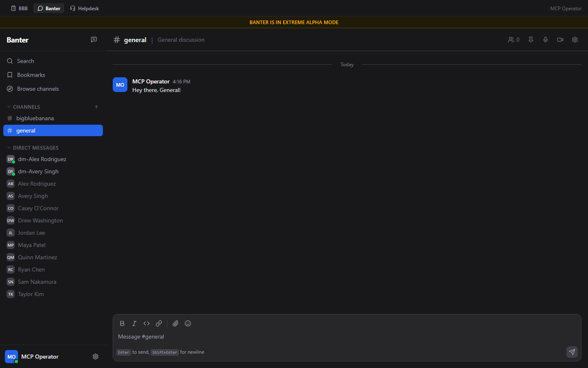
</p>
<p align="center"><em>Banter — channel view with sidebar, message compose, and team member list</em></p>

### Why Not Just Use Slack?

Because Banter shares authentication, database, and deep cross-linking with BigBlueBam. When someone mentions `BBB-247` in a channel, it links directly to the task. When an AI agent triages a helpdesk ticket, it can post the update to `#support-triage`. Sprint reports can be shared to channels with one click. No webhooks, no bridges, no sync lag.

### Features

| Feature | Status | Description |
|---------|--------|-------------|
| **Channels** | Stable | Public and private channels with topics, descriptions, member management |
| **Direct Messages** | Stable | 1:1 and group DMs with presence indicators |
| **Threads** | Stable | Nested conversations on any message |
| **Rich Text** | Stable | Markdown with bold, italic, code, links, images |
| **Reactions** | Stable | Emoji reactions with toggle semantics |
| **Mentions** | Stable | @user mentions with autocomplete and notifications |
| **Search** | Stable | Full-text search across channels with filters (author, date, attachments) |
| **File Sharing** | Stable | Upload and share files with inline image previews |
| **Pins & Bookmarks** | Stable | Pin messages to channels, bookmark for personal reference |
| **Presence** | Stable | Online, idle, DND status with automatic idle detection |
| **Notifications** | Stable | Mention, DM, thread reply, and channel invite notifications |
| **Voice Calls** | Alpha | Voice and video calls via LiveKit SFU |
| **AI Voice Agent** | Placeholder | AI participation in calls (STT/TTS pipeline, requires provider config) |
| **Bam Integration** | Stable | Task references, Share to Banter, activity feed bot |
| **47 MCP Tools** | Stable | Full AI agent access to all messaging features |

### Channel View

<p align="center">
  
</p>

The sidebar shows channels, direct messages, and team members. The message compose area supports markdown formatting, file attachments, emoji picker, and @mention autocomplete. Hover over any message for quick reactions, thread replies, pins, and bookmarks.

<table>
  <tr>
    <td width="50%">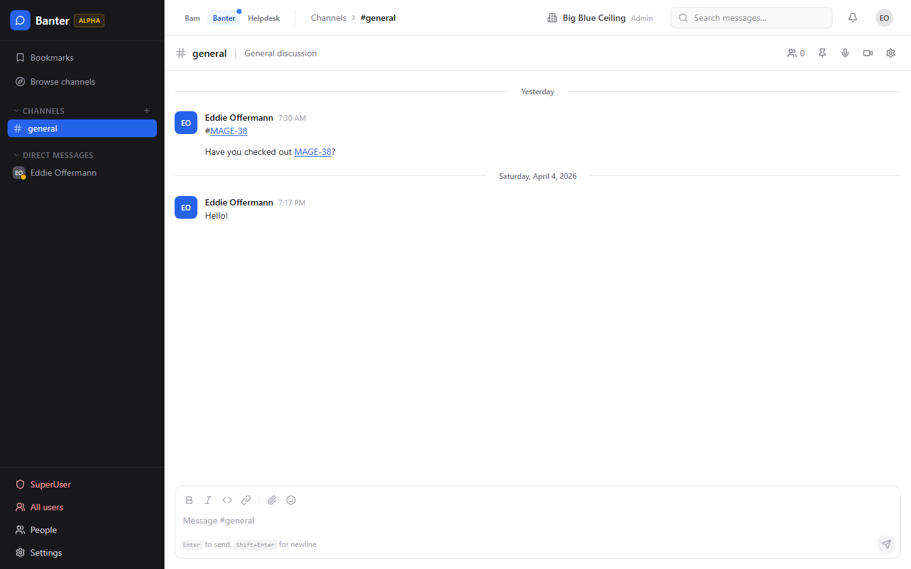</td>
    <td width="50%">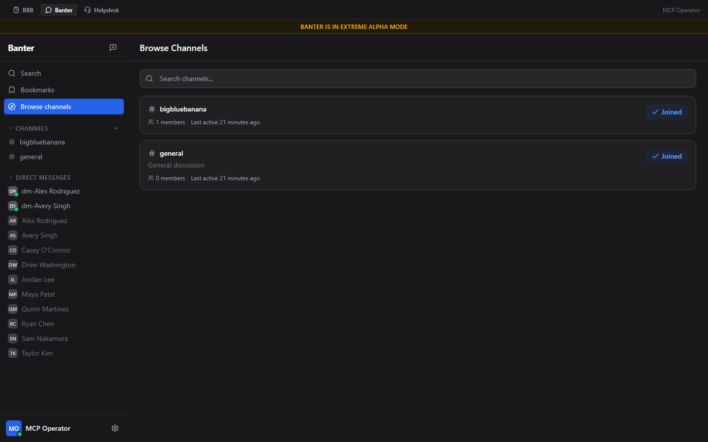</td>
  </tr>
  <tr>
    <td align="center"><em>Search with channel, author, and date filters</em></td>
    <td align="center"><em>Browse and join public channels</em></td>
  </tr>
</table>

### Administration

<p align="center">
  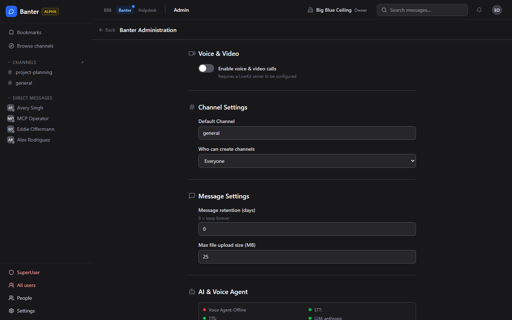
</p>
<p align="center"><em>Admin panel — voice/video configuration, channel settings, AI voice agent providers</em></p>

### Banter MCP Tools

AI agents can interact with Banter through **47 dedicated MCP tools**:

| Category | Tools | What they do |
|----------|-------|-------------|
| **Channels** | `banter_list_channels`, `banter_create_channel`, `banter_update_channel`, `banter_archive_channel`, `banter_join_channel`, `banter_leave_channel` | Channel lifecycle management |
| **Messages** | `banter_post_message`, `banter_edit_message`, `banter_delete_message`, `banter_get_message` | Send and manage messages |
| **Threads** | `banter_reply_in_thread`, `banter_get_thread` | Threaded conversations |
| **Reactions** | `banter_add_reaction`, `banter_remove_reaction` | Emoji reactions |
| **Search** | `banter_search_messages`, `banter_search_channels`, `banter_search_transcripts` | Full-text search |
| **DMs** | `banter_start_dm`, `banter_start_group_dm`, `banter_list_dms` | Direct messaging |
| **Calls** | `banter_start_call`, `banter_join_call`, `banter_end_call`, `banter_invite_agent_to_call`, `banter_get_transcript` | Voice/video call management |
| **Members** | `banter_list_members`, `banter_add_members`, `banter_remove_member`, `banter_update_member_role` | Channel membership |
| **Admin** | `banter_get_settings`, `banter_update_settings`, `banter_list_user_groups` | Organization-level configuration |
| **Pins & Bookmarks** | `banter_pin_message`, `banter_unpin_message`, `banter_bookmark_message` | Message organization |

---

## Helpdesk

BigBlueBam includes a full client-facing helpdesk portal. Customers submit tickets, your team (or your AI agents) responds, and every ticket is linked to a task on the board.

### Client Portal

Customers log into their own portal at `/helpdesk/`, submit tickets with categories and priority, and track responses — all with clean, simple branding separate from the internal tool.

<table>
  <tr>
    <td width="50%">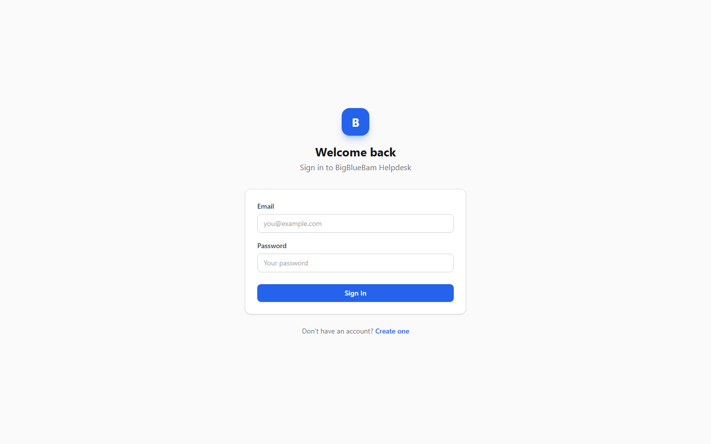</td>
    <td width="50%"></td>
  </tr>
  <tr>
    <td align="center"><em>Helpdesk portal login</em></td>
    <td align="center"><em>Client ticket list with status badges</em></td>
  </tr>
</table>

### Ticket-to-Task Pipeline

When a client submits a ticket, BigBlueBam automatically creates a linked task on your board. Moving the task through phases updates the ticket status. Clients see progress without your team lifting a finger.

<p align="center">
  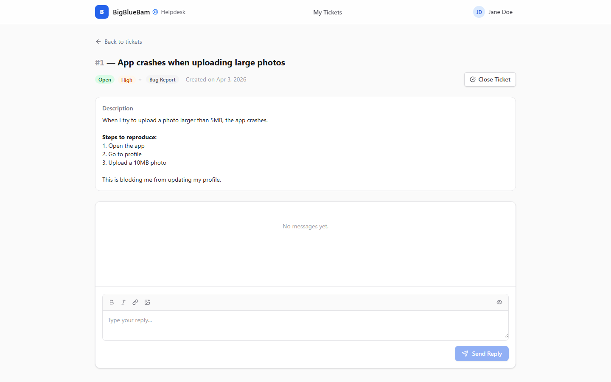
</p>
<p align="center"><em>Ticket detail with description and metadata</em></p>

### Agent Conversations

Team members (or AI agents via MCP) reply directly to tickets. Agent replies are visible to clients. Internal comments stay private. Full threading keeps the conversation organized.

<p align="center">
  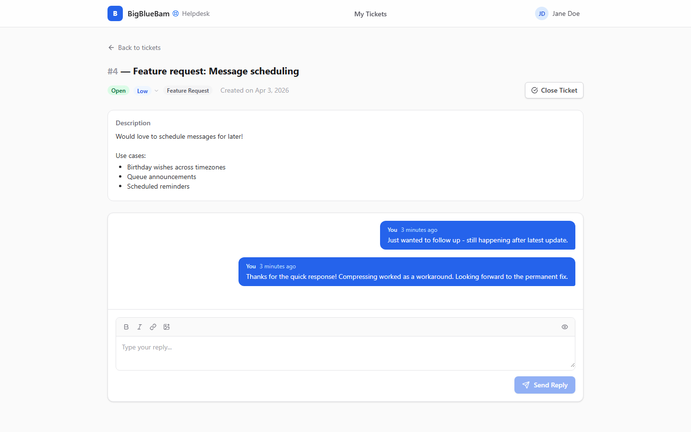
</p>
<p align="center"><em>Client and agent conversation on a helpdesk ticket</em></p>

---

## Beacon

Beacon is the knowledge base platform built into the BigBlueBam suite. It keeps curated, expiry-aware knowledge fresh and discoverable -- by humans and AI agents alike.

Unlike a wiki that silently rots, Beacon treats every article as a living document with a verification lifecycle. Governance policies define how often content must be re-verified; stale Beacons are surfaced automatically through the **Fridge Cleanout** workflow so nothing quietly expires into irrelevance.

<p align="center">
  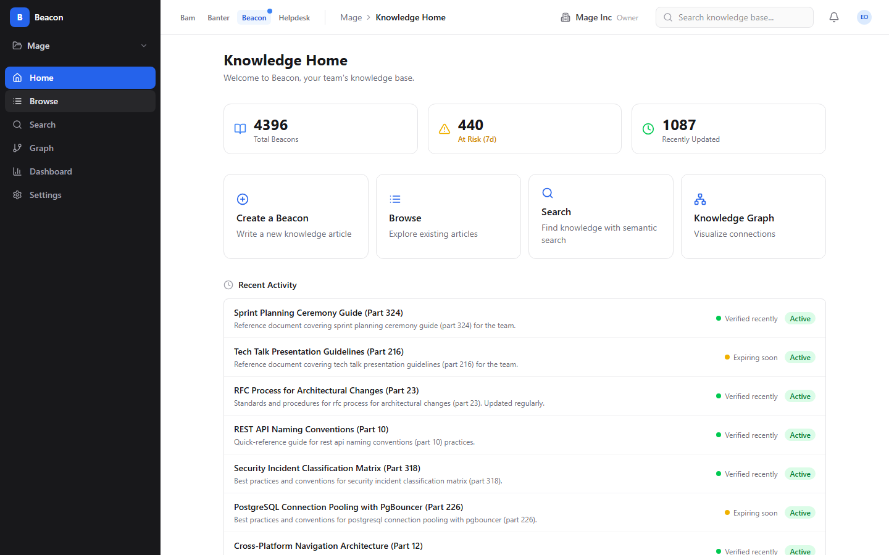
</p>
<p align="center"><em>Knowledge Home -- hub nodes, recent activity, and expiry alerts at a glance</em></p>

### Key Features

| Feature | Description |
|---------|-------------|
| **Semantic + Graph Search** | Hybrid retrieval combining vector similarity (Qdrant), knowledge-graph expansion, and PostgreSQL full-text fallback |
| **Expiry Governance (Fridge Cleanout)** | Hierarchical policies (org > project) define verification intervals, grace periods, and auto-archive rules |
| **Knowledge Graph Explorer** | Visual graph of Beacons connected by typed links (RelatedTo, Supersedes, DependsOn, ConflictsWith, SeeAlso) and implicit tag-affinity edges |
| **Versioned Content** | Every edit creates a new version; full history with diff support |
| **Agent-Native Verification** | AI agents can verify, challenge, publish, and retire Beacons through 29 dedicated MCP tools |
| **Saved Queries** | Named search configurations (private, project, or org-scoped) for reusable retrieval patterns |
| **Hierarchical Policies** | Org-level defaults with project-level overrides; `beacon_policy_resolve` previews the effective merged policy |

<p align="center">
  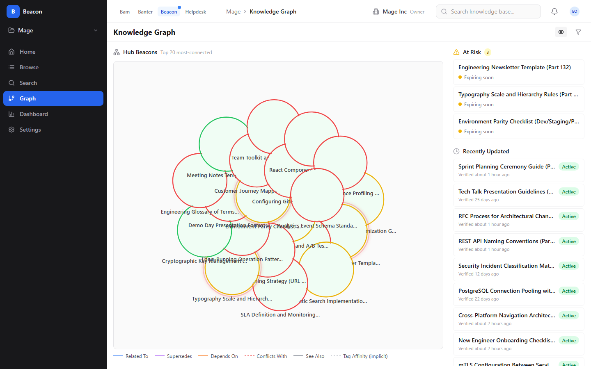
</p>
<p align="center"><em>Knowledge Graph Explorer -- visualize connections between Beacons</em></p>

### Beacon MCP Tools

AI agents interact with Beacon through **29 dedicated MCP tools**:

| Category | Tools | What they do |
|----------|-------|-------------|
| **CRUD** | `beacon_create`, `beacon_list`, `beacon_get`, `beacon_update`, `beacon_retire`, `beacon_publish`, `beacon_verify`, `beacon_challenge`, `beacon_restore`, `beacon_versions`, `beacon_version_get` | Full lifecycle management with versioning |
| **Search** | `beacon_search`, `beacon_suggest`, `beacon_search_context` | Hybrid semantic + keyword + graph search, typeahead, agent-optimized retrieval |
| **Policy** | `beacon_policy_get`, `beacon_policy_set`, `beacon_policy_resolve` | Governance policy management and resolution |
| **Tags & Links** | `beacon_tags_list`, `beacon_tag_add`, `beacon_tag_remove`, `beacon_link_create`, `beacon_link_remove` | Tag management and typed inter-Beacon links |
| **Saved Queries** | `beacon_query_save`, `beacon_query_list`, `beacon_query_get`, `beacon_query_delete` | Reusable search configurations |
| **Graph** | `beacon_graph_neighbors`, `beacon_graph_hubs`, `beacon_graph_recent` | Knowledge graph traversal and exploration |

---

## Brief

Brief is a collaborative document editor built into the BigBlueBam suite. Its rich-text collaborative editor features a formatting toolbar, auto-generated table of contents, and slash commands -- plus real-time co-editing, templates, version history, and a graduation path that lets polished documents become Beacons when they mature into lasting knowledge.

<p align="center">
  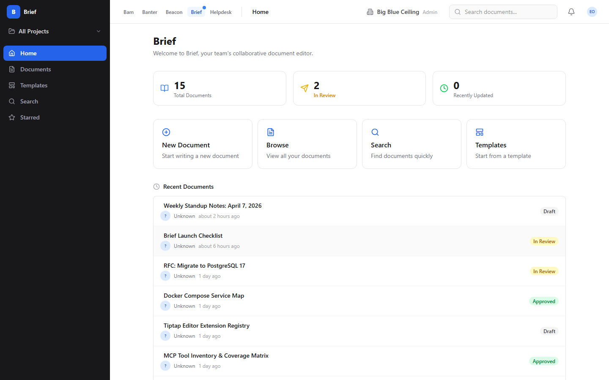
</p>
<p align="center"><em>Brief Home -- recent documents, templates, and quick-create actions</em></p>

### Key Features

| Feature | Description |
|---------|-------------|
| **WYSIWYG Editor** | Tiptap-based rich text with formatting toolbar, heading dropdown, tables, code blocks, task lists, and syntax highlighting |
| **Auto Table of Contents** | Generated in real-time from document headings, clickable to navigate |
| **Collaborative Editing** | Real-time multi-user editing with presence cursors, conflict-free merging, and per-paragraph locking |
| **33 Built-in Templates** | Meeting notes, PRDs, RFCs, post-mortems, onboarding guides, and more across 7 categories |
| **Brief-to-Beacon Graduation** | Promote a finished document to a Beacon with one click -- metadata, tags, and links carry over |
| **Cross-Product Linking** | Reference tasks (`BBB-247`), Banter messages, and Beacons inline with rich previews |
| **Version History** | Every save creates a version; full diff view and one-click restore |
| **Inline Comments** | Highlight any text and leave a comment thread -- resolved threads collapse automatically |
| **Semantic Search** | Find documents by meaning via Qdrant vector search, not just keywords |
| **18 MCP Tools** | AI agents can create, edit, search, comment on, and graduate documents programmatically |

<p align="center">
  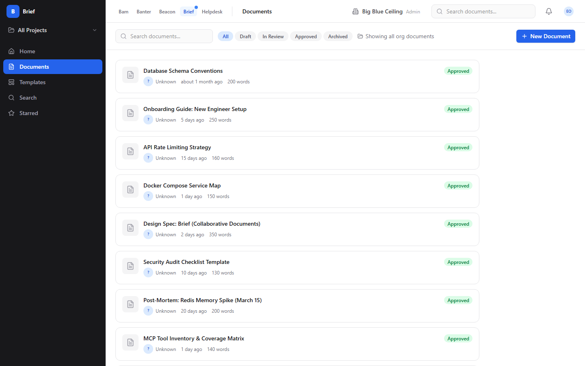
</p>
<p align="center"><em>Document browser -- filter by project, author, template, and status</em></p>

<table>
  <tr>
    <td width="50%">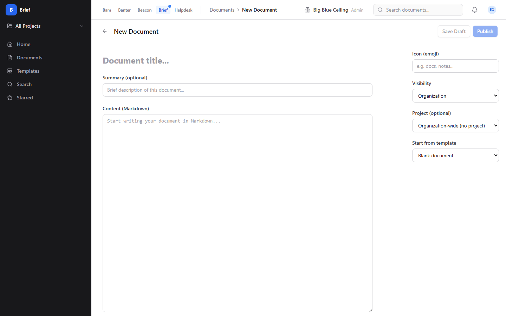</td>
    <td width="50%">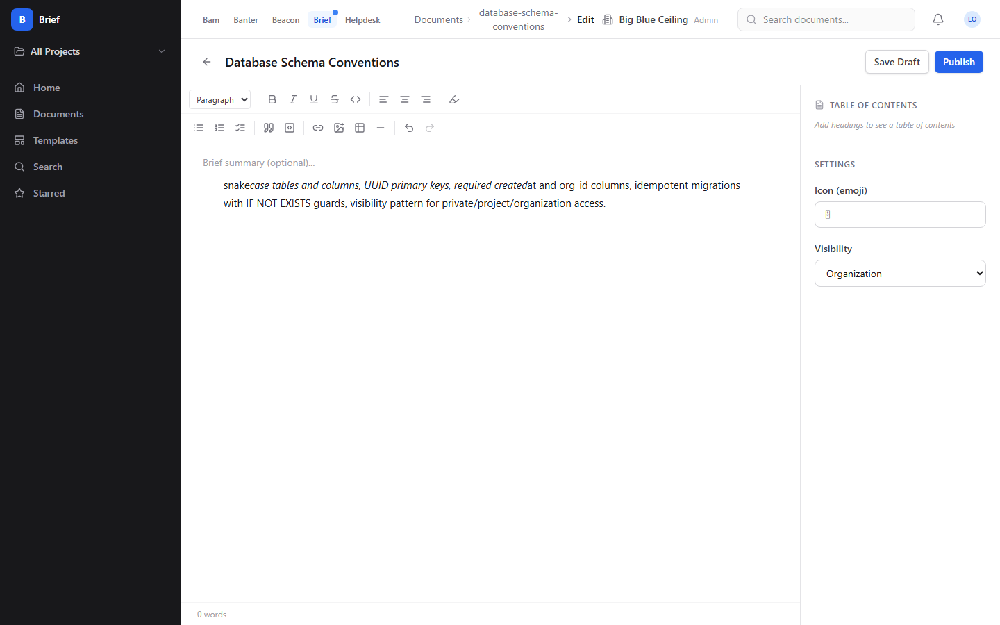</td>
  </tr>
  <tr>
    <td align="center"><em>WYSIWYG editor with formatting toolbar and Table of Contents</em></td>
    <td align="center"><em>Editing an existing document with rich text</em></td>
  </tr>
</table>

<p align="center">
  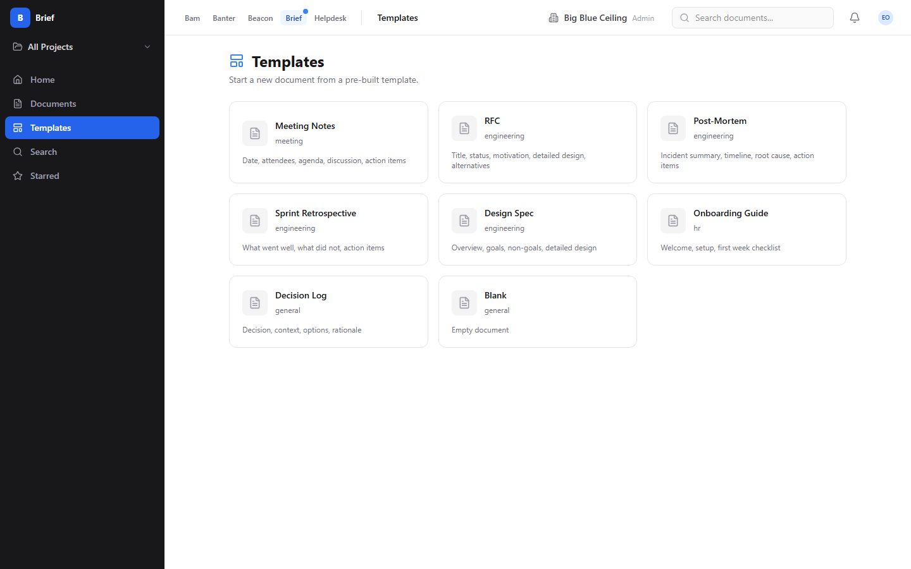
</p>
<p align="center"><em>33 built-in templates across 7 categories — business operations, engineering, strategy, HR, communications, sales, and creative</em></p>

<table>
  <tr>
    <td width="50%">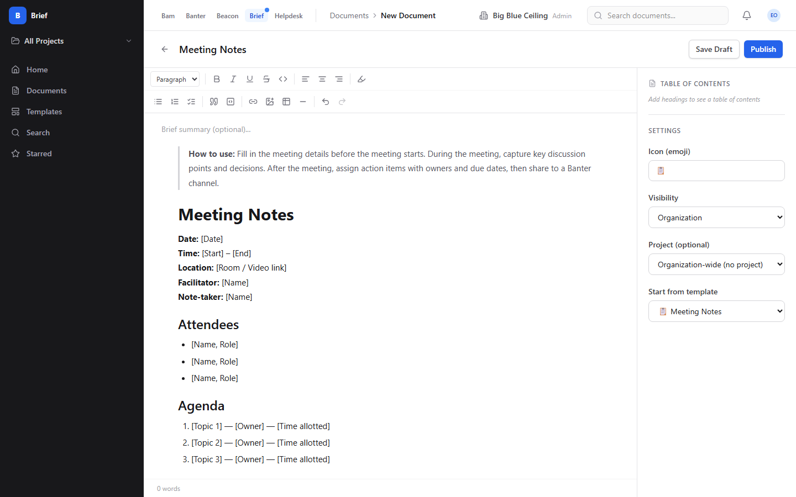</td>
    <td width="50%">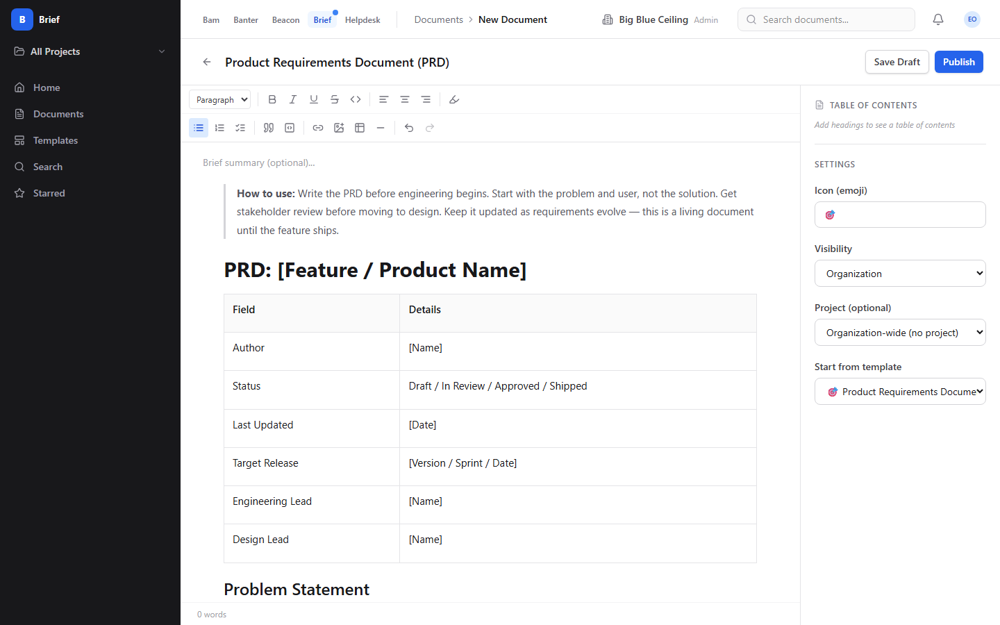</td>
  </tr>
  <tr>
    <td align="center"><em>Meeting Notes template — agenda, attendees, action items with checkboxes</em></td>
    <td align="center"><em>PRD template — metadata table, problem statement, requirements, rollout plan</em></td>
  </tr>
</table>

### Brief MCP Tools

AI agents interact with Brief through **18 dedicated MCP tools**:

| Category | Tools | What they do |
|----------|-------|-------------|
| **CRUD** | `brief_create`, `brief_list`, `brief_get`, `brief_update`, `brief_delete`, `brief_publish`, `brief_archive` | Full document lifecycle management |
| **Collaboration** | `brief_comment_add`, `brief_comment_list`, `brief_comment_resolve` | Inline comment threads |
| **Versions** | `brief_versions`, `brief_version_get`, `brief_version_restore` | Version history and restore |
| **Search** | `brief_search`, `brief_suggest` | Semantic and keyword search, typeahead suggestions |
| **Graduation** | `brief_graduate_to_beacon` | Promote a document to a Beacon with metadata carry-over |
| **Templates** | `brief_template_list`, `brief_template_create` | Template management |

---

## Bolt

Bolt is a visual workflow automation engine built into the BigBlueBam suite. Define trigger→condition→action rules that span every product in the platform, compile down to MCP tool calls, and execute with a full auditable log. No code required -- just wire up events, set conditions, and pick actions from a categorized menu.

<p align="center">
  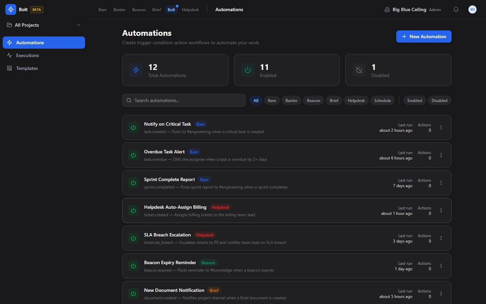
</p>
<p align="center"><em>Automation dashboard -- 12 active rules with trigger badges, enable toggles, and execution history</em></p>

### Key Features

| Feature | Description |
|---------|-------------|
| **Visual Rule Builder** | WHEN→IF→THEN editor with color-coded sections, event catalog dropdown, and grouped action picker |
| **Event-Driven** | 26 events across 6 sources (Bam, Banter, Beacon, Brief, Helpdesk, Schedule) |
| **Condition Engine** | 13 operators (equals, contains, regex, gt/lt, in, between, isEmpty, etc.) with AND/OR grouping |
| **MCP-Native Actions** | Every action is an MCP tool call selected from a categorized menu -- same permissions, same audit trail |
| **Execution Audit Log** | Every run is recorded with trigger context, condition evaluation, action results, and duration |
| **Pre-Built Templates** | 10 starter templates covering common patterns (helpdesk triage, sprint reminders, stale-task alerts) |
| **Rate Limiting & Cooldowns** | Per-rule rate limits and cooldown windows prevent runaway automations |
| **AI-Assisted Authoring** | Describe what you want in plain English; an AI agent drafts the rule for you (requires LLM provider) |
| **Schedule Triggers (cron)** | Time-based triggers using cron expressions for recurring automations |
| **12 MCP Tools** | AI agents can create, manage, and inspect automations programmatically |

<table>
  <tr>
    <td width="50%">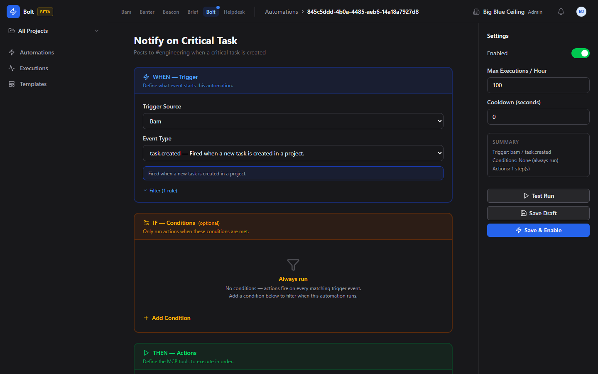</td>
    <td width="50%">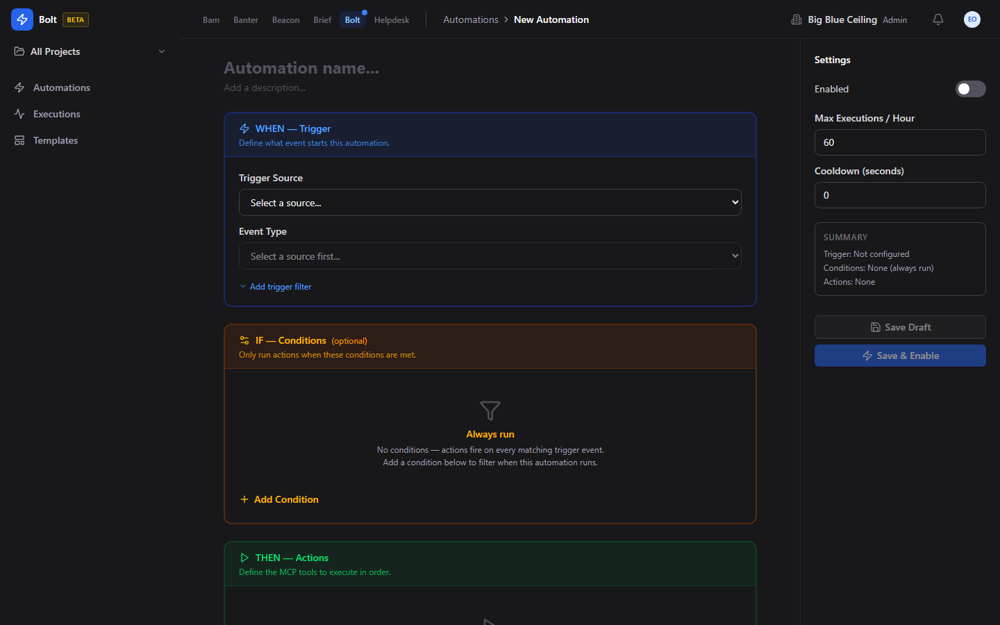</td>
  </tr>
  <tr>
    <td align="center"><em>Editing "Notify on Critical Task" — WHEN/IF/THEN flow with live event catalog</em></td>
    <td align="center"><em>New automation — pick a trigger source and event, add conditions, select actions</em></td>
  </tr>
</table>

<table>
  <tr>
    <td width="50%">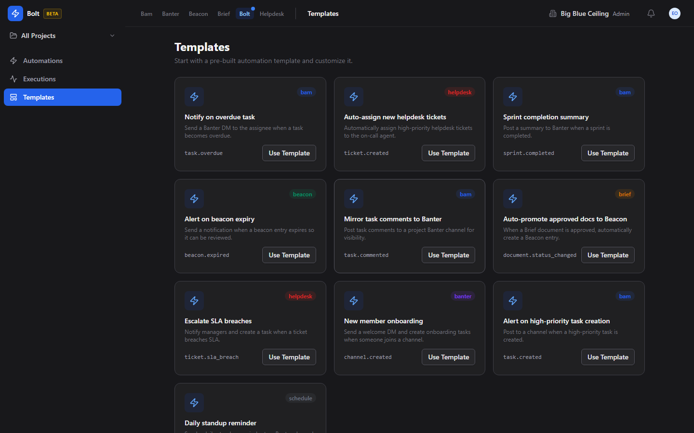</td>
    <td width="50%">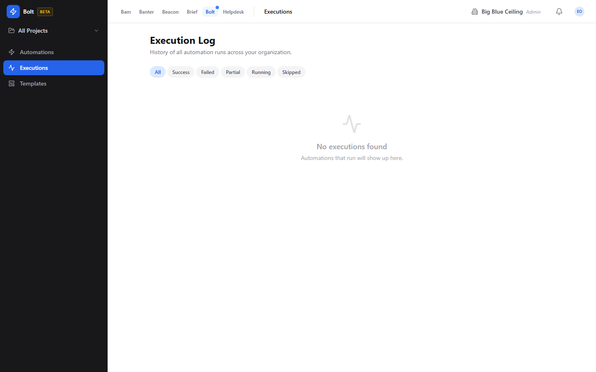</td>
  </tr>
  <tr>
    <td align="center"><em>10 pre-built templates — start from a proven pattern and customize</em></td>
    <td align="center"><em>Execution log — every run traced with status, duration, and step detail</em></td>
  </tr>
</table>

### Bolt MCP Tools

AI agents interact with Bolt through **12 dedicated MCP tools**:

| Category | Tools | What they do |
|----------|-------|-------------|
| **CRUD** | `bolt_list`, `bolt_get`, `bolt_create`, `bolt_update`, `bolt_delete` | Full automation lifecycle management |
| **Control** | `bolt_enable`, `bolt_disable`, `bolt_test` | Enable/disable and test-fire automations |
| **Executions** | `bolt_executions`, `bolt_execution_detail` | Execution history and step-by-step detail |
| **Discovery** | `bolt_events`, `bolt_actions` | Browse available triggers and MCP tool actions |

---

## Bearing

Bearing is the Goals & OKR tracking module in BigBlueBam. It provides hierarchical time-boxed periods (quarters, halves, or custom ranges), measurable key results linked to objectives, and automatic progress computation from linked Bam tasks and epics. Goals are auto-classified as on_track, at_risk, behind, or achieved based on progress versus timeline position, giving leadership real-time visibility into whether the team is on track -- without requiring manual progress updates.

<p align="center">
  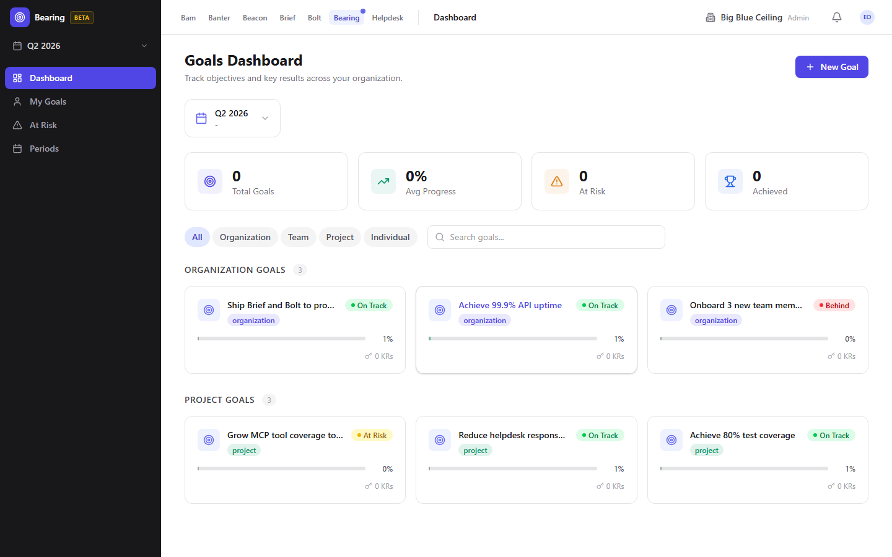
</p>
<p align="center"><em>Goals Dashboard -- summary stats (total, average progress, at risk, achieved) with scope filtering by org, team, or project</em></p>

### Key Features

| Feature | Description |
|---------|-------------|
| **OKR Framework** | Objectives with measurable key results, progress tracking |
| **Period Management** | Quarters, halves, or custom periods with lifecycle (planning → active → completed) |
| **Auto-Progress** | Key results can link to Bam tasks/epics for automatic progress computation |
| **Status Engine** | Goals auto-classified as on_track, at_risk, behind, achieved based on progress vs timeline |
| **Dashboard** | Summary stats (total, avg progress, at risk, achieved) with scope filtering (org/team/project) |
| **Status Updates** | Team members post updates on goal progress with status snapshots |
| **Watchers** | Subscribe to goals for notifications |
| **12 MCP Tools** | AI agents can manage periods, goals, key results, and updates programmatically |

<table>
  <tr>
    <td width="50%">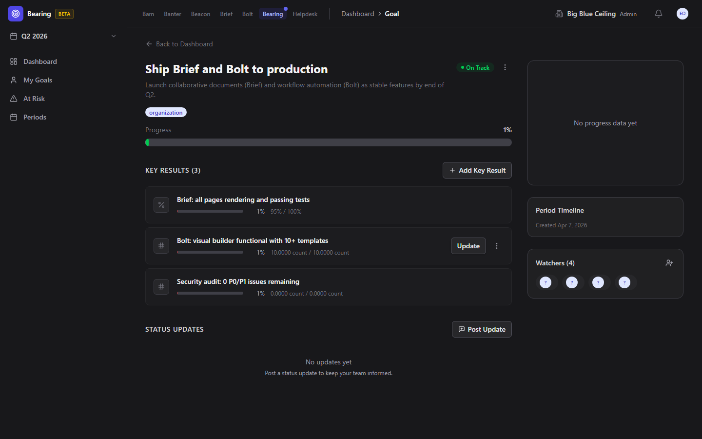</td>
    <td width="50%">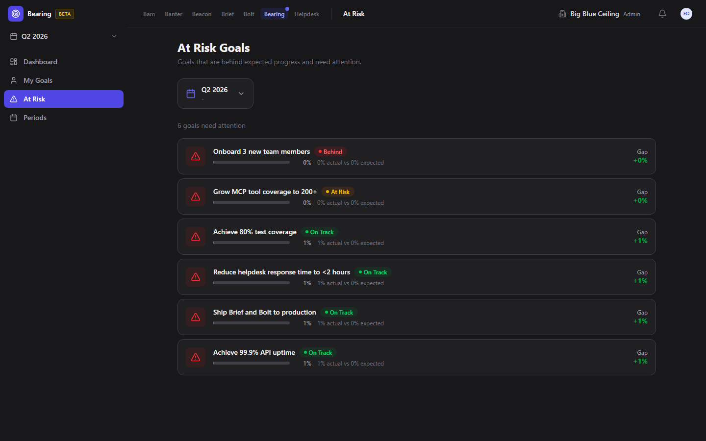</td>
  </tr>
  <tr>
    <td>Goal detail — key results with progress bars, status updates, watchers</td>
    <td>At Risk view — goals behind schedule that need attention</td>
  </tr>
</table>

### Bearing MCP Tools

AI agents interact with Bearing through **12 dedicated MCP tools**:

| Category | Tools | What they do |
|----------|-------|-------------|
| **Periods** | `bearing_periods`, `bearing_period_get` | List/manage time periods, get period with summary stats |
| **Goals** | `bearing_goals`, `bearing_goal_get`, `bearing_goal_create`, `bearing_goal_update` | Full goal lifecycle -- list, detail, create, update |
| **Key Results** | `bearing_kr_create`, `bearing_kr_update`, `bearing_kr_link` | Create and update key results, link KRs to Bam entities |
| **Updates** | `bearing_update_post`, `bearing_report`, `bearing_at_risk` | Post status updates, generate reports, list at-risk goals |

---

## AI Provider Configuration

BigBlueBam features a hierarchical LLM provider configuration system that powers AI features across the suite — including Bolt's AI-assisted automation authoring, future summarization, and content generation features.

### How It Works

Providers are configured at three levels, with the most specific taking precedence:

| Scope | Who Configures | Applies To |
|-------|---------------|-----------|
| **System** | SuperUser | All organizations (fallback default) |
| **Organization** | Org Admin/Owner | All projects in the org |
| **Project** | Project Admin | Only that project |

### Supported Providers

| Provider | Type | Notes |
|----------|------|-------|
| **Anthropic** | `anthropic` | Claude models. Uses default API endpoint. |
| **OpenAI** | `openai` | GPT models. Uses default API endpoint. |
| **OpenAI-Compatible** | `openai_compatible` | Any endpoint implementing the OpenAI Chat Completions API — Azure OpenAI, Together AI, Ollama, vLLM, local LLMs, etc. Requires custom `api_endpoint`. |

### Security

- API keys are **encrypted at rest** using AES-256-GCM with the server's `SESSION_SECRET`
- Keys are **never returned in full** — always redacted to `sk-•••XXXX` (last 4 characters only)
- Scope-based authorization ensures only the right roles can configure each level
- Test Connection verifies credentials work before saving

### Setup

Configure providers in **Settings → AI Providers** in the Bam frontend. If no provider is configured, AI-dependent features (like Bolt's "Describe your automation" dialog) show a helpful message directing admins to the setup page.

---

## Quick Start

### Prerequisites

- [Docker](https://docs.docker.com/get-docker/) and Docker Compose
- [Node.js 22+](https://nodejs.org/) and [pnpm 9+](https://pnpm.io/) (for development only)

### Run with Docker

```bash
# Clone the repo
git clone https://github.com/eoffermann/BigBlueBam.git
cd BigBlueBam

# Set up environment
cp .env.example .env
# Edit .env with your secrets (passwords, session secret)

# Start all services (or use the cross-platform helpers below)
docker compose up -d

# Cross-platform deploy/restart helpers:
#   Mac / Linux: ./scripts/deploy.sh          # up|restart|rebuild|stop|down|logs
#   Windows:     scripts\deploy.bat           # same subcommands
# These detect a private ./site checkout automatically and serve the
# marketing site at the root domain when present; otherwise `/` redirects
# to `/helpdesk/` exactly like before.

# Create your admin account
docker compose exec api node dist/cli.js create-admin \
  --email admin@example.com \
  --password YourPassword123 \
  --name "Admin User" \
  --org "My Organization"
```

Open **http://localhost/b3/** to access BigBlueBam, **http://localhost/banter/** for Banter, **http://localhost/beacon/** for Beacon, **http://localhost/brief/** for Brief, **http://localhost/bolt/** for Bolt, **http://localhost/bearing/** for Bearing, or **http://localhost/helpdesk/** for the helpdesk portal.

<p align="center">
  
</p>
<p align="center"><em>The login page — clean and branded.</em></p>

After login, you land on the project dashboard:

<p align="center">
  
</p>

### Services

All services are accessed through a single nginx container on port 80:

| URL Path | Backend | Description |
|----------|---------|-------------|
| `/` | redirect | Redirects to `/helpdesk/` |
| `/b3/` | nginx | Bam React SPA |
| `/b3/api/` | Fastify `:4000` | Bam REST API |
| `/b3/ws` | Fastify `:4000` | WebSocket (real-time updates) |
| `/banter/` | nginx | Banter team messaging SPA |
| `/banter/api/` | Fastify `:4002` | Banter REST API |
| `/banter/ws` | Fastify `:4002` | Banter WebSocket (real-time messaging) |
| `/helpdesk/` | nginx | Helpdesk portal SPA |
| `/helpdesk/api/` | Fastify `:4001` | Helpdesk API (auth, tickets, messages) |
| `/files/` | MinIO `:9000` | Uploaded files (shared) |
| `/beacon/` | nginx | Beacon knowledge base SPA |
| `/beacon/api/` | Fastify `:4004` | Beacon REST API |
| `/brief/` | nginx | Brief collaborative document editor SPA |
| `/brief/api/` | Fastify `:4005` | Brief REST API |
| `/brief/ws` | Fastify `:4005` | Brief WebSocket (real-time co-editing) |
| `/bolt/` | nginx | Bolt workflow automation SPA |
| `/bolt/api/` | Fastify `:4006` | Bolt REST API |
| `/bearing/` | nginx | Bearing Goals & OKRs SPA |
| `/bearing/api/` | Fastify `:4007` | Bearing REST API |
| `/mcp/` | MCP Server `:3001` | Model Context Protocol (182 tools) |

Infrastructure services (internal, not exposed via nginx):

| Service | Port | Description |
|---------|------|-------------|
| PostgreSQL | `:5432` | Primary database |
| Redis | `:6379` | Cache, PubSub, queues |
| MinIO | `:9000` | S3-compatible file storage |
| Worker | -- | BullMQ background job processor |
| LiveKit | `:7880` | Voice/video SFU (WebRTC media server) |
| Beacon API | `:4004` | Beacon knowledge base REST API |
| Qdrant | `:6333` | Vector search engine (semantic embeddings) |
| Voice Agent | `:4003` | AI voice call participation (Python/FastAPI) |

### Development Mode

```bash
pnpm install
pnpm --filter @bigbluebam/shared build
docker compose -f docker-compose.yml -f docker-compose.dev.yml up
```

### Run Tests

```bash
pnpm test  # 700+ tests across all packages
```

---

## Architecture

```
┌──────────────────────────────────────────────────────────────────────┐
│                       Clients (Browser / AI)                         │
└────────────────────────┬──────────────────────┬──────────────────────┘
                         │ HTTP :80              │ WebRTC
┌────────────────────────▼──────────────────────┐│
│               nginx (single container, :80)    ││
│  /b3/          → Bam SPA (static)               ││
│  /b3/api/      → Fastify API :4000             ││
│  /b3/ws        → WebSocket :4000               ││
│  /banter/      → Banter SPA (static)           ││
│  /banter/api/  → Banter API :4002              ││
│  /banter/ws    → Banter WebSocket :4002        ││
│  /beacon/      → Beacon SPA (static)           ││
│  /beacon/api/  → Beacon API :4004              ││
│  /brief/       → Brief SPA (static)            ││
│  /brief/api/   → Brief API :4005               ││
│  /brief/ws     → Brief WebSocket :4005         ││
│  /bolt/        → Bolt SPA (static)             ││
│  /bolt/api/    → Bolt API :4006                ││
│  /bearing/     → Bearing SPA (static)          ││
│  /bearing/api/ → Bearing API :4007             ││
│  /helpdesk/    → Helpdesk SPA (static)         ││
│  /helpdesk/api/→ Helpdesk API :4001            ││
│  /files/       → MinIO :9000                   ││
│  /mcp/         → MCP Server :3001              ││
└──────┬──────────┬──────────┬───────────────────┘│
       │          │          │                     │
┌──────▼────┐ ┌──▼───────┐ ┌▼──────────┐ ┌──────────┐ ┌───────▼──────┐ ┌──────────┐
│ Bam API   │ │ Banter   │ │ MCP Server│ │ Brief    │ │ Bolt API │ │ LiveKit SFU  │ │ Worker   │
│ :4000     │ │ API :4002│ │ :3001     │ │ API :4005│ │ :4006    │ │ :7880 (voice)│ │ BullMQ   │
│ +WebSocket│ │ +WS      │ │ 182 tools │ │ +WS      │ │          │ │ +voice-agent │ │ jobs     │
└─────┬─────┘ └────┬─────┘ └─────┬─────┘ └────┬─────┘ └──────────────┘ └────┬─────┘
      │             │             │            │                  │
┌─────▼─────────────▼─────────────▼────────────▼───────────────────▼───┐
│  PostgreSQL 16  │  Redis 7        │  MinIO (S3)   │  Qdrant (vectors)    │
│  40+ tables     │  PubSub + cache │  File storage │  Semantic search     │
└──────────────────────┴──────────────────────┴────────────────────────┘
```

### Tech Stack

| Layer | Technology |
|-------|-----------|
| **Frontend** | React 19, TailwindCSS v4, Motion, TanStack Query, Zustand, dnd-kit, Radix UI |
| **API** | Node.js 22, Fastify v5, Drizzle ORM, Zod |
| **Realtime** | WebSocket + Redis PubSub |
| **MCP** | @modelcontextprotocol/sdk (Streamable HTTP + SSE) |
| **Voice/Video** | LiveKit SFU, WebRTC, Python voice agent (STT/TTS) |
| **Database** | PostgreSQL 16, Redis 7, MinIO, Qdrant |
| **Worker** | BullMQ, Nodemailer |
| **Build** | Turborepo, pnpm workspaces, tsup, Vite |
| **Testing** | Vitest (700+ tests) |
| **Deploy** | Docker Compose, multi-stage Dockerfiles |

### Monorepo Structure

```
apps/
  api/              → Fastify REST API + WebSocket (23 route modules)
  frontend/         → React SPA (33 components, 8 pages)
  mcp-server/       → MCP protocol server (182 tools)
  worker/           → BullMQ background jobs (incl. Banter notifications & retention)
  helpdesk-api/     → Helpdesk Fastify API (auth, tickets, messages)
  helpdesk/         → Helpdesk React SPA (client-facing portal)
  banter-api/       → Banter Fastify API + WebSocket (15 route modules, 18 DB tables)
  banter/           → Banter React SPA (14 components, 7 pages)
  beacon-api/       → Beacon Fastify API (knowledge base, search, graph, policies)
  beacon/           → Beacon React SPA (knowledge home, graph explorer, editor)
  brief-api/        → Brief Fastify REST API + WebSocket (8 route modules, 11 DB tables)
  brief/            → Brief React SPA (collaborative editor, templates, version history)
  bolt-api/         → Bolt Fastify REST API (workflow automation, rules, executions)
  bolt/             → Bolt React SPA (visual rule builder, execution log, templates)
  bearing-api/      → Bearing Fastify REST API (goals, key results, progress, reporting)
  bearing/          → Bearing React SPA (goal dashboard, timeline, detail views)
  voice-agent/      → AI voice agent (Python/FastAPI, LiveKit Agents SDK)
packages/
  shared/           → Zod schemas, TypeScript types, constants
infra/
  postgres/         → Database schema (init.sql — 40+ tables)
  nginx/            → Reverse proxy config (single nginx serves all SPAs)
  livekit/          → LiveKit SFU configuration
docs/               → 8 documentation pages with Mermaid diagrams
scripts/            → Utility and seed scripts
```

### Key Numbers

| Metric | Count |
|--------|-------|
| Docker services | 18 |
| MCP tools | 182 (64 Bam + 47 Banter + 29 Beacon + 18 Brief + 12 Bolt + 12 Bearing) |
| Test cases | 700+ |
| API route modules | 46 (23 Bam + 15 Banter + 8 Brief) |
| Database tables | 51+ (25 Bam + 18 Banter + 11 Brief) |
| Frontend components | 47+ (33 Bam + 14 Banter) |
| Documentation pages | 8 |

---

## Documentation

| Document | Description |
|----------|-------------|
| [Getting Started](docs/getting-started.md) | Setup, first run, troubleshooting |
| [Architecture](docs/architecture.md) | System design, data flow, components |
| [Database](docs/database.md) | ER diagrams, table descriptions, indexing |
| [API Reference](docs/api-reference.md) | All REST endpoints with examples |
| [MCP Server](docs/mcp-server.md) | Tools, resources, prompts, configuration |
| [Operations](docs/operations.md) | Updates, backups, scaling, troubleshooting |
| [Deployment](docs/deployment.md) | Docker, Kubernetes, scaling, backup |
| [Development](docs/development.md) | Contributing, testing, code style |
| [Helpdesk Design](BigBlueBam_Helpdesk_Design_Document.md) | Helpdesk ticketing system design |
| [Banter Design](Banter_Design_Document.md) | Team messaging & voice/video design |
| [Beacon Design](Beacon_Design_Document.md) | Knowledge base platform design |

---

## License

MIT -- see [LICENSE](LICENSE).

---

<p align="center">
  Built with <a href="https://claude.ai/code">Claude Code</a>
</p>
