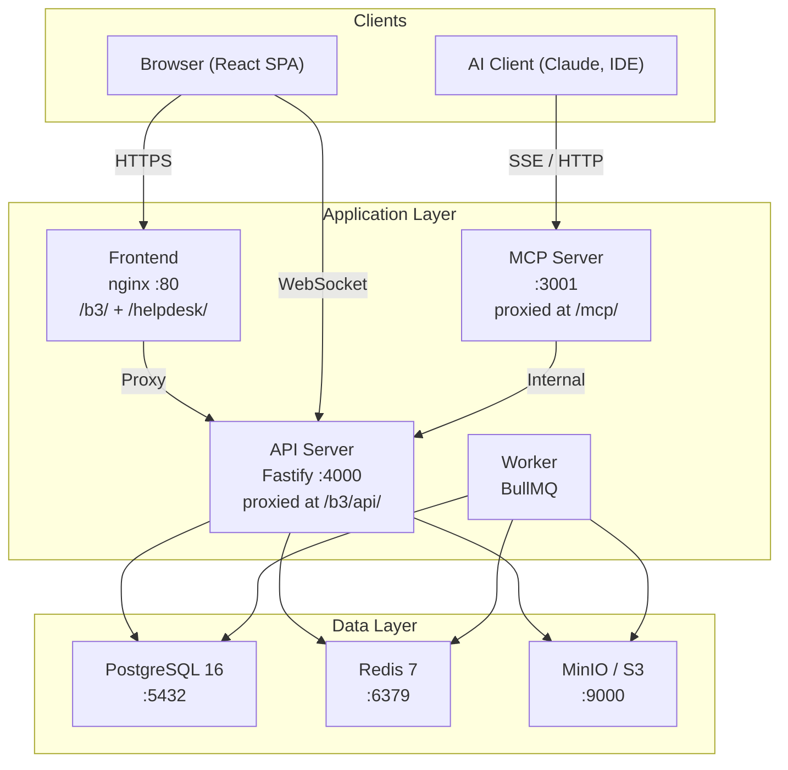

# BigBlueBam Documentation

**BigBlueBam** is a web-based, multi-user Kanban project planning tool with sprint-based task management. It supports multiple concurrent projects with fully configurable phases, task states, custom fields, and carry-forward mechanics. Designed for small-to-medium teams (2--50 users).

---

## Documentation Index

| Document | Description |
|---|---|
| [Getting Started](getting-started.md) | Prerequisites, installation, quick start with Docker, development mode |
| [Architecture](architecture.md) | System design, tech stack, data flow, container layout, client architecture |
| [Database](database.md) | Entity-relationship diagrams, table reference, indexing, migrations |
| [API Reference](api-reference.md) | REST endpoints, authentication, pagination, filtering, error codes |
| [MCP Server](mcp-server.md) | Model Context Protocol integration for AI clients |
| [Operations](operations.md) | **Updating, backups, maintenance, troubleshooting** |
| [Deployment](deployment.md) | Production deployment tiers, scaling, backups, CI/CD, monitoring |
| [Development](development.md) | Developer guide, monorepo workflow, testing, code style, contributing |

---

## Quick Overview



## Key Features

- **Configurable Kanban boards** -- phases, task states, and card fields are all user-defined per project
- **Sprint management** with carry-forward ceremony for incomplete work
- **Real-time collaboration** -- WebSocket-powered live updates across all connected clients
- **MCP integration** -- first-class AI client support via the Model Context Protocol
- **Custom fields** -- define text, number, date, select, and other field types per project
- **Rich reporting** -- velocity charts, burndown/burnup, cumulative flow diagrams, cycle time
- **Docker-native** -- single `docker compose up` to run the full stack

## Tech Stack at a Glance

| Layer | Technologies |
|---|---|
| **Frontend** | React 19, Motion (Framer Motion), TanStack Query, Zustand, dnd-kit, TailwindCSS, Radix UI |
| **API** | Node.js 22, Fastify v5, Drizzle ORM, Zod, Socket.IO, BullMQ |
| **Data** | PostgreSQL 16, Redis 7, MinIO (S3-compatible) |
| **MCP** | `@modelcontextprotocol/sdk`, Streamable HTTP + SSE + stdio |
| **Infrastructure** | Docker Compose, Turborepo, pnpm workspaces |

---

## Repository Structure

```
BigBlueBam/
  apps/
    api/            Fastify REST API + WebSocket (internal :4000, proxied at /b3/api/)
    frontend/       Single nginx container serving BBB at /b3/ and Helpdesk at /helpdesk/ (:80)
    mcp-server/     MCP protocol server (internal :3001, proxied at /mcp/)
    worker/         BullMQ background job processor
    helpdesk-api/   Helpdesk Fastify API (internal :4001, proxied at /helpdesk/api/)
    helpdesk/       Helpdesk React SPA (built assets served by frontend nginx)
  packages/
    shared/         Shared Zod schemas, types, constants
  infra/
    postgres/       Database init scripts
    nginx/          Reverse proxy configuration
    helm/           Kubernetes Helm chart
  docs/             This documentation
```

---

*Built by [Big Blue Ceiling Prototyping & Fabrication, LLC](https://bigblueceiling.com)*
