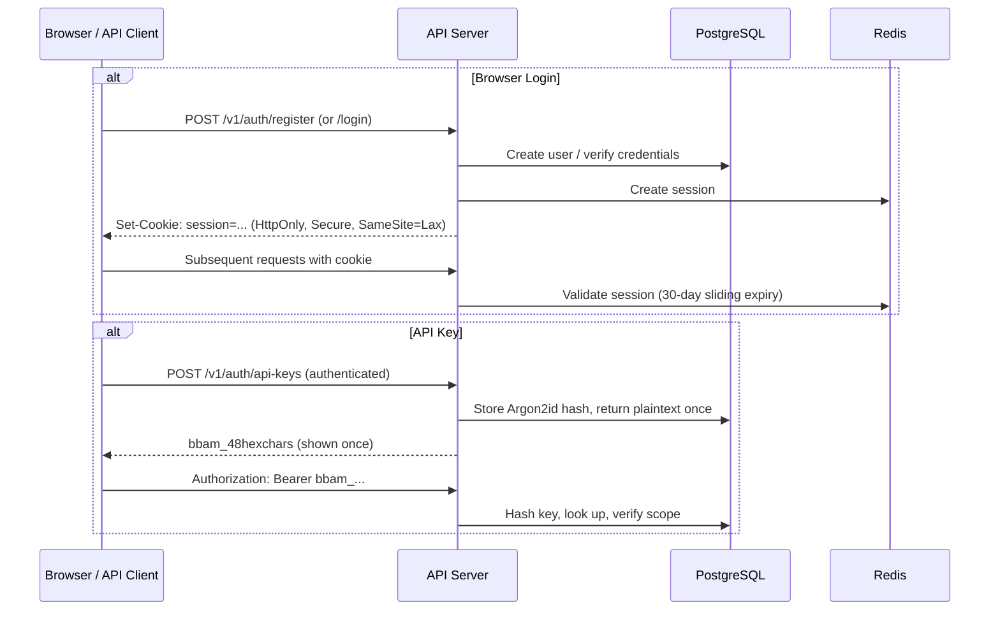

# API Reference

Complete reference for the BigBlueBam REST API.

> For who is allowed to call each endpoint (roles, rank rules, cross-org rules), see [`permissions.md`](./permissions.md).

---

## Base URL

| Environment | Base URL |
|---|---|
| **Self-hosted (Docker)** | `http://localhost/b3/api/v1` |
| **Cloud** | `https://app.bigbluebam.io/b3/api/v1` |

Most endpoints are prefixed with `/v1`. In the default Docker deployment, the API is served at `/b3/api/` via the nginx reverse proxy on port 80. The internal Fastify server runs on port 4000 but is not exposed directly in production.

> **Note:** A small number of endpoints added on the `granular-permissions` branch are currently mounted without the `/v1` prefix, notably `/auth/*`, `/superuser/*`, and the Helpdesk API under `/helpdesk/*`. This inconsistency is tracked for cleanup. Paths in the sections below are written exactly as the server currently serves them.

---

## Authentication

BigBlueBam supports two authentication methods:

| Method | Use Case | Header |
|---|---|---|
| **Session cookie** | Browser clients (set after login) | Cookie: `session=...` + `X-CSRF-Token` header for mutations |
| **API key** | Automation, CI/CD, MCP server, integrations | `Authorization: Bearer bbam_...` |

### Request Headers

| Header | Purpose | Who may send |
|---|---|---|
| `X-Org-Id` | Select which org context the request acts under, for users that belong to multiple orgs. Must be a UUID matching a membership row; malformed values are silently ignored and the user's default org is used. If the user is not a member of the requested org, the request fails with `FORBIDDEN`. | Any authenticated caller with multi-org membership. |
| `X-Impersonate-User` | Instructs the API to handle the request as a different user. Only honored when (a) the caller is a SuperUser, (b) the target is not a SuperUser and is active, and (c) an active impersonation session exists (see `POST /v1/platform/impersonate`). Otherwise silently ignored. | SuperUsers only. |

### Response Headers

| Header | Meaning |
|---|---|
| `X-Impersonating` | Present (value `true`) when the response was produced on behalf of an impersonated user. |
| `X-Impersonator` | The SuperUser ID that initiated the impersonation. Sent alongside `X-Impersonating`. |

### Multi-Org Sessions

- Users may belong to multiple organizations via `organization_memberships`. Session resolution order for the active org: `X-Org-Id` header → user's default membership (`is_default=true`) → first membership by `joined_at` → `users.org_id` fallback.
- Switching orgs via `POST /auth/switch-org` rotates the session cookie (old session destroyed, new `session=` cookie issued) to mitigate session-fixation across context changes.
- SuperUsers can switch their session into any org via `POST /superuser/context/switch`. When this "viewing" context is active, responses reflect the target org even if the SuperUser is not a member of it. Clear with `POST /superuser/context/clear`.

### Auth Flow



### API Keys

- Prefix: `bbam_` followed by 48 hex characters
- Stored as Argon2id hashes (plaintext shown once at creation)
- Scoped to: `read`, `read_write`, or `admin`
- Optionally restricted to specific projects
- Optional expiration date

---

## Request/Response Conventions

### Content Type

All request and response bodies use `application/json` unless otherwise noted.

### Pagination

All list endpoints use cursor-based pagination:

```json
{
  "data": [...],
  "pagination": {
    "next_cursor": "eyJpZCI6Ij...",
    "prev_cursor": "eyJpZCI6Ij...",
    "has_more": true,
    "total_count": 342
  }
}
```

Query parameters: `?cursor=<string>&limit=<int>` (default 50, max 200).

### Filtering

List endpoints accept filters using the pattern `?filter[field]=value`:

```
?filter[priority]=high,critical
?filter[due_date][gte]=2026-04-01&filter[due_date][lte]=2026-04-30
?filter[assignee_id]=unassigned
```

### Sorting

```
?sort=field           (ascending)
?sort=-field          (descending)
?sort=-priority,due_date  (multi-sort)
```

### Field Selection

```
?fields=id,title,assignee,state
```

Returns only the specified fields to reduce payload size.

### Timestamps

All timestamps are ISO 8601 in UTC: `2026-04-02T14:30:00Z`. Clients handle timezone display.

### ETags

All GET responses include `ETag`. Use `If-None-Match` for conditional requests (returns 304 when unchanged).

---

## Error Response Envelope

All errors follow this structure:

```json
{
  "error": {
    "code": "VALIDATION_ERROR",
    "message": "Human-readable description",
    "details": [
      { "field": "title", "issue": "required" }
    ],
    "request_id": "req_abc123"
  }
}
```

### Error Codes

| HTTP Status | Code | Meaning |
|---|---|---|
| 400 | `VALIDATION_ERROR` | Request body or params failed schema validation |
| 401 | `UNAUTHORIZED` | Missing or invalid authentication |
| 403 | `FORBIDDEN` | Authenticated but insufficient permissions |
| 404 | `NOT_FOUND` | Entity does not exist or not accessible |
| 409 | `CONFLICT` | Stale update (optimistic concurrency check failed) |
| 410 | `GONE` | Resource permanently unavailable (e.g., guest invitation expired or already accepted) |
| 422 | `UNPROCESSABLE` | Semantically invalid (e.g., start sprint when one is already active) |
| 429 | `RATE_LIMITED` | Too many requests |
| 500 | `INTERNAL_ERROR` | Server error (includes `request_id` for support) |

Additional codes emitted on specific endpoints: `BAD_REQUEST`, `INVALID_STATE`, `NO_CHANGES`, `AUTHOR_REQUIRED`, `AUTHOR_NOT_FOUND`, `AUTHOR_ORG_MISMATCH`, `TICKET_NOT_SCOPED`, `AGENT_AUTH_DISABLED` (helpdesk agent API).

---

## Rate Limiting

Enforced via Redis sliding window. Headers returned on every response:

- `X-RateLimit-Limit`
- `X-RateLimit-Remaining`
- `X-RateLimit-Reset` (Unix epoch seconds)

| Scope | Limit | Burst |
|---|---|---|
| Per API key | 100 req/min | 20 req/s |
| Per organization | 1,000 req/min | 100 req/s |
| Per IP (unauthenticated) | 20 req/min | 5 req/s |

---

## Endpoint Reference

### Auth Endpoints

#### `POST /auth/register`

Create a new user account and organization.

**Request:**
```json
{
  "email": "eddie@bigblueceiling.com",
  "password": "min-12-chars-required",
  "display_name": "Eddie Offermann",
  "org_name": "Big Blue Ceiling"
}
```

**Response (201):**
```json
{
  "data": {
    "user": {
      "id": "uuid",
      "email": "eddie@bigblueceiling.com",
      "display_name": "Eddie Offermann",
      "role": "owner",
      "org_id": "uuid",
      "is_superuser": false,
      "active_org_id": "uuid"
    },
    "organization": { "id": "uuid", "name": "Big Blue Ceiling", "slug": "big-blue-ceiling" }
  }
}
```

Session cookie is set on the response. `active_org_id` reflects the user's current org context (on register, this equals `org_id`).

Request schema: `registerSchema` in [`packages/shared/src/schemas/auth.ts`](../packages/shared/src/schemas/auth.ts).

#### `POST /auth/login`

Authenticate with email/password.

**Request:**
```json
{
  "email": "eddie@bigblueceiling.com",
  "password": "...",
  "totp_code": "123456"
}
```

The `totp_code` field is only required if the user has 2FA enabled.

**Response (200):**
```json
{
  "data": {
    "user": {
      "id": "uuid",
      "email": "eddie@bigblueceiling.com",
      "display_name": "Eddie Offermann",
      "role": "owner",
      "org_id": "uuid",
      "is_superuser": false,
      "active_org_id": "uuid"
    }
  }
}
```

Session cookie is set.

Request schema: `loginSchema` in [`packages/shared/src/schemas/auth.ts`](../packages/shared/src/schemas/auth.ts).

#### `POST /auth/logout`

Destroy session. Clears cookie.

#### `GET /auth/me`

Return the currently authenticated user with organization context.

**Response (200):**
```json
{
  "data": {
    "id": "uuid",
    "email": "eddie@bigblueceiling.com",
    "display_name": "Eddie Offermann",
    "avatar_url": null,
    "role": "owner",
    "org_id": "uuid",
    "active_org_id": "uuid",
    "is_superuser": false,
    "is_superuser_viewing": false,
    "timezone": "America/Los_Angeles",
    "notification_prefs": { },
    "force_password_change": false,
    "created_at": "2026-01-01T00:00:00Z"
  }
}
```

- `role` is the **resolved per-request role for the user's current active org** — not the legacy `users.role` home-org value. For multi-org users it is the membership role in whichever org the session has switched into.
- `active_org_id` reflects the org context resolved from `sessions.active_org_id` (persisted across requests), the `X-Org-Id` header, or the user's default membership.
- `is_superuser_viewing` is `true` when the caller is a SuperUser viewing an org they are **not** a native member of. The SPA uses it to render the cross-org banner and to label confirmation dialogs ("you will not be demoted").
- `force_password_change` signals that an admin or SuperUser has required a password rotation on next login. The SPA redirects into `/b3/password-change` and refuses to render other routes until the flag clears.

#### `GET /auth/orgs`

List the authenticated user's organization memberships. Used by the org-switcher in the UI.

**Response (200):**
```json
{
  "data": {
    "active_org_id": "uuid",
    "organizations": [
      {
        "org_id": "uuid",
        "name": "Big Blue Ceiling",
        "slug": "big-blue-ceiling",
        "logo_url": null,
        "role": "owner",
        "is_default": true,
        "joined_at": "2026-01-01T00:00:00Z"
      }
    ]
  }
}
```

**Auth:** Session cookie or API key.

#### `POST /auth/switch-org`

Switch the current session's active org context. The session cookie is **rotated** — the old session is destroyed and a new `session=` cookie is issued, and the new session's `active_org_id` is set to the chosen org so every subsequent request (including WebSocket events) runs in that org until the next switch. This endpoint now persists `active_org_id` for **all** users, not only SuperUsers — previously the switch was ephemeral for regular multi-org members. The caller must already be a member of the target org, otherwise `403 FORBIDDEN` is returned.

**Request:**
```json
{ "org_id": "uuid" }
```

**Response (200):**
```json
{
  "data": {
    "active_org_id": "uuid",
    "organization": { "id": "uuid", "name": "...", "slug": "..." },
    "role": "member",
    "is_default": false,
    "cache_bust": "1712250000000"
  }
}
```

**Errors:** `400 VALIDATION_ERROR` (invalid body), `403 FORBIDDEN` (not a member).

**Rate limit:** 10 requests per minute per user.

#### `PATCH /auth/me`

Update profile fields: `display_name`, `avatar_url`, `timezone`, `notification_prefs`.

#### `POST /auth/change-password`

Rotate the authenticated user's own password. Requires the current password as proof-of-possession. On success, every **other** session for the user is destroyed — the caller's current session is preserved. Clears `users.force_password_change` if set.

**Auth:** Session cookie (self-service).

**Rate limit:** 5 requests per minute per user.

**Request:**
```json
{
  "current_password": "existing",
  "new_password": "at-least-12-chars"
}
```

**Response (200):** `{ "data": { "success": true } }`

**Errors:**
- `400 VALIDATION_ERROR` — new password is < 12 chars or missing fields.
- `401 INVALID_CREDENTIALS` — `current_password` did not match.

#### `POST /auth/verify-email/:token`

Public endpoint (no auth). Redeems a verification token issued by an admin-initiated email change (`PATCH /superuser/users/:id/email`). Promotes `pending_email → email`, sets `email_verified = true`, clears the token, and **revokes every session for the affected user** so the next login must use the new address.

**Request:** no body.

**Response (200):**
```json
{ "data": { "email": "new@example.com", "verified": true } }
```

**Errors:**
- `404 NOT_FOUND` — token doesn't exist or has already been consumed.
- `410 TOKEN_EXPIRED` — token is valid but past its 7-day TTL.

---

### API Key Endpoints

#### `GET /auth/api-keys`

List all API keys for the current user. Shows prefix + last 4 characters only.

#### `POST /auth/api-keys`

Create a new API key.

**Request:**
```json
{
  "name": "CI/CD Pipeline",
  "scope": "read_write",
  "project_ids": ["uuid"],
  "expires_at": "2027-04-02T00:00:00Z"
}
```

**Response (201):** Returns the full key **once**. It cannot be retrieved again.

#### `DELETE /auth/api-keys/:id`

Revoke an API key immediately.

---

### Organization Endpoints

#### `GET /org`

Return the current user's organization. Response includes `active_owner_count` and `member_count` so the SPA can render the no-active-owner banner and member badge without a second round-trip.

#### `PATCH /org`

Update organization settings (name, logo, plan settings, defaults). **Requires:** Org Admin.

#### `GET /org/members`

List all organization members with roles.

**Query params:** `?filter[role]=admin&sort=-last_seen_at&limit=20`

#### `POST /org/members/invite`

Send email invitation.

**Request:**
```json
{
  "email": "teeny@bigblueceiling.com",
  "role": "member",
  "project_ids": ["uuid"]
}
```

#### `PATCH /org/members/:user_id`

Update member's organization-level role.

#### `DELETE /org/members/:user_id`

Remove member from organization. Cascades: removes from all projects, reassigns owned tasks to reporter.

---

### Org Member Management

Endpoints that power the **`/b3/people`** admin UI. All routes are mounted at `/org/members/:userId/*` and require a session cookie + `requireOrgRole('admin','owner') + requireScope('admin')`. Every mutation also enforces the **strictly-below rank rule** — `target_rank < caller_rank` — so a peer admin cannot act on another admin. SuperUsers bypass the rank check. Rank-rule violations return `403 FORBIDDEN`; attempts to assign a project from another org return `400 BAD_REQUEST`.

#### `GET /org/members/:userId`

Return the full member detail for a user in the caller's current org, including profile, org role, `is_active`, `disabled_at`/`disabled_by`, `force_password_change`, active session count, project count, and the membership's `version` (integer, monotonic, bumped on every role/active edit — used for optimistic-concurrency by the mutation endpoints).

**Response (200):** `{ "data": { ...member, "version": number } }`. **Errors:** `404 NOT_FOUND`.

#### `PATCH /org/members/:userId/profile`

Edit a member's `display_name` and/or `timezone`.

**Request:** `{ "display_name"?: string, "timezone"?: string }`

**Response (200):** `{ "data": { ...member } }`. **Errors:** `403 FORBIDDEN` (rank), `404 NOT_FOUND`.

#### `PATCH /org/members/:userId/active`

Soft-disable or re-enable a member. Disable stamps `disabled_at = now()` and `disabled_by = <caller_id>` and deletes all their sessions. Enable clears both columns.

**Request:** `{ "is_active": boolean, "version"?: number }` — the optional `version` is the optimistic-concurrency token from the last `GET /org/members/:userId` response. If provided and the server-side version has advanced, the write is rejected with `409 VERSION_CONFLICT`.

**Response (200):** `{ "data": { ...member, "membership_version": number } }`. **Errors:** `403 FORBIDDEN` (rank), `404 NOT_FOUND`, `409 VERSION_CONFLICT` (error `details[0].current_version` is the latest server-side version).

#### `PATCH /org/members/:userId`

Update a member's **org-level** role. Owner promotion is not allowed here — use `transfer-ownership`.

**Request:** `{ "role": "member" | "admin" | "viewer", "version"?: number }` — `version` is the optimistic-concurrency token from the last `GET /org/members/:userId` response (P1-25). When provided, the server compares it against the current row; a mismatch returns `409 VERSION_CONFLICT` so the client can refetch and retry instead of silently clobbering a concurrent admin's edit. When omitted, the server still increments `version` on write so any opted-in caller racing against this one will see the drift.

**Response (200):** `{ "data": { ...user, "membership_version": number } }` — `membership_version` is the NEW version the client should cache for its next PATCH.

**Errors:** `403 FORBIDDEN` (rank), `404 NOT_FOUND`, `409 VERSION_CONFLICT` (error `details[0].current_version` is the latest server-side version).

#### `POST /org/members/:userId/transfer-ownership`

Atomic single-step ownership transfer: promotes the target to `owner` and demotes the calling owner to `admin` in one transaction. Caller must currently be `owner` (or SuperUser).

**Response (200):** `{ "data": { "org_id", "previous_owner_id", "new_owner_id" } }`.

**Errors:**
- `400 BAD_REQUEST` — target is the caller.
- `403 FORBIDDEN` — caller is not the owner.
- `404 NOT_FOUND` — target is not a member of the org.

#### `POST /org/members/:userId/reset-password`

Admin-initiated password reset. If `password` is omitted the server generates a cryptographically random one and returns it in the response (shown once). All sessions for the target are revoked.

**Request:** `{ "password"?: string (12–200 chars) }`

**Response (200):** `{ "data": { "user_id", "email", "password", "generated": bool } }`.

**Rate limit:** 10 requests per minute per caller. **Errors:** `403 FORBIDDEN` (rank), `404 NOT_FOUND`.

#### `POST /org/members/:userId/force-password-change`

Flip `users.force_password_change = true`. The target is redirected to `/b3/password-change` on their next request and cannot use any other route until they rotate their password.

**Response (200):** `{ "data": { ...member } }`. **Errors:** `403 FORBIDDEN` (rank), `404 NOT_FOUND`.

#### `POST /org/members/:userId/sign-out-everywhere`

Delete all sessions for the target. Returns `{ "data": { "revoked": <count> } }`. **Errors:** `403 FORBIDDEN` (rank), `404 NOT_FOUND`.

#### `GET /org/members/:userId/api-keys`

List the target's API keys (metadata only — key values are never returned). Fields: `id`, `name`, `key_prefix`, `scope`, `project_ids`, `last_used_at`, `expires_at`, `created_at`.

#### `POST /org/members/:userId/api-keys`

Mint an API key on behalf of a member. The raw token is returned **once**.

**Request:**
```json
{
  "name": "grafana",
  "scope": "read" | "read_write" | "admin",
  "project_ids"?: ["uuid"],
  "expires_days"?: 1-3650
}
```

**Response (201):** `{ "data": { id, name, scope, project_ids, key, expires_at, ... } }`.

**Errors:** `403 FORBIDDEN` (rank), `404 NOT_FOUND`.

#### `DELETE /org/members/:userId/api-keys/:keyId`

Revoke (hard-delete) one of the target's keys. **Errors:** `403 FORBIDDEN` (rank), `404 NOT_FOUND`.

#### `GET /org/members/:userId/activity`

Paginated `activity_log` entries where `actor_id = :userId` in the caller's org.

**Query params:** `limit` (1–200, default 50), `cursor`.

**Response (200):** `{ "data": [...], "next_cursor": "..." | null }`.

#### `GET /org/members/:userId/projects`

List the target's project memberships **within the caller's current org**. Each row: `{ project_id, project_name, role, joined_at }`.

#### `POST /org/members/:userId/projects`

Bulk-add the target to one or more projects.

**Request:**
```json
{
  "assignments": [
    { "project_id": "uuid", "role": "admin" | "member" | "viewer" }
  ]
}
```

**Response (200):** `{ "data": [ ...created memberships ] }`.

**Errors:**
- `400 BAD_REQUEST` — any `project_id` belongs to a different org (`CrossOrgProjectError`).
- `403 FORBIDDEN` — rank violation.
- `404 NOT_FOUND` — target is not a member of the org.

#### `PATCH /org/members/:userId/projects/:projectId`

Change the target's role on one project. Body: `{ "role": "admin" | "member" | "viewer" }`.

#### `DELETE /org/members/:userId/projects/:projectId`

Remove the target from one project. **Response (200):** `{ "data": { "success": true } }`.

---

### SuperUser User Management

Cross-org user admin for SuperUsers, powering **`/b3/superuser/people`**. Mounted under `/superuser/users/*` (no `/v1` prefix). All endpoints require `requireAuth + requireSuperuser` and are audit-logged to `superuser_audit_log`.

#### `GET /superuser/users`

Cross-org user list with search + filters.

**Query params:**
- `search` — substring match on email or display_name (case-insensitive).
- `is_active=true|false`
- `is_superuser=true|false`
- `limit` — 1–100, default 50.
- `cursor` — opaque base64url.

**Response (200):** `{ "data": [...], "next_cursor": "..." | null }`. Each row includes `id`, `email`, `display_name`, `is_active`, `is_superuser`, `last_seen_at`, `created_at`, and `membership_count`.

#### `GET /superuser/users/:id`

Full user detail including all org memberships (role + is_default per org), API key count, active session count, `force_password_change`, `email_verified`, `pending_email`, `disabled_at`, `disabled_by`.

**Response (200):** `{ "data": { ...user } }`. **Errors:** `404 NOT_FOUND`.

#### `POST /superuser/users/:id/memberships`

Add the user to an arbitrary org.

**Request:** `{ "org_id": "uuid", "role": "owner|admin|member|viewer|guest" }`

**Response (201):** `{ "data": { user_id, org_id, role, is_default: false } }`.

**Errors:** `404 NOT_FOUND` (user or org), `409 CONFLICT` (already a member).

#### `PATCH /superuser/users/:id/memberships/:orgId`

Change the user's role within a specific org. Body: `{ "role": ... }`.

**Response (200):** `{ "data": { user_id, org_id, role, is_default } }`. **Errors:** `404 NOT_FOUND`.

#### `DELETE /superuser/users/:id/memberships/:orgId`

Remove a membership. Refuses to delete the user's **last** membership (which would orphan the account).

**Response (204):** empty body.

**Errors:** `400 LAST_MEMBERSHIP`, `404 NOT_FOUND`.

#### `POST /superuser/users/:id/set-default-org`

Flip `is_default = true` on the `(user, org)` membership row, clearing it on every other membership for the same user.

**Request:** `{ "org_id": "uuid" }`

**Response (200):** `{ "data": { user_id, default_org_id } }`.

**Errors:** `400 NOT_A_MEMBER`.

#### `PATCH /superuser/users/:id/active`

Globally disable or enable a user. Disabling stamps `disabled_at`, `disabled_by = <superuser_id>`, and deletes every session. Enabling clears all three.

**Request:** `{ "is_active": boolean }`

**Response (200):** `{ "data": { user_id, is_active, disabled_at, disabled_by } }`.

**Errors:** `404 NOT_FOUND`.

#### `GET /superuser/users/:id/sessions`

List all active sessions for the user. Each row: `{ id, active_org_id, created_at, last_used_at, ip_address, user_agent, expires_at }`.

#### `DELETE /superuser/users/:id/sessions/:sessionId`

Revoke a single session. **Response (204):** empty body. **Errors:** `404 NOT_FOUND`.

#### `POST /superuser/users/:id/sessions/revoke-all`

Delete every session for the user. **Response (200):** `{ "data": { "revoked": <count> } }`.

#### `PATCH /superuser/users/:id/email`

Initiate an admin-driven email change. Stages the new address in `users.pending_email`, generates an `email_verification_token`, stamps `email_verification_sent_at`, and sends a verification link to the **new** address (old address receives a notice). The change is **not** applied until the user redeems the token via `POST /auth/verify-email/:token`.

**Request:** `{ "new_email": "user@example.com" }`

**Response (200):** `{ "data": { user_id, pending_email, email_sent: boolean } }`.

**Errors:**
- `400 EMAIL_TAKEN` — another user already owns that address.
- `404 NOT_FOUND`.

#### `GET /superuser/users/:id/projects`

List the user's project memberships. Defaults to the SuperUser's currently-viewing org; pass `?scope=all` for every project membership across every org.

**Query params:** `scope=active|all` (default `active`).

**Response (200):** `{ "data": [ { project_id, project_name, org_id, org_name, role, joined_at } ] }`.

#### `GET /superuser/users/:id/login-history`

Paginated login attempts for the user. Feeds the Activity tab's login-history panel.

**Query params:**
- `limit` — 1–200, default 50.
- `cursor` — opaque base64url (sorted by `created_at DESC, id DESC`).
- `success=true|false` — filter by outcome.

**Response (200):**
```json
{
  "data": [
    {
      "id": "uuid",
      "user_id": "uuid",
      "email": "user@example.com",
      "ip_address": "...",
      "user_agent": "...",
      "success": true,
      "failure_reason": null,
      "created_at": "2026-04-04T10:00:00Z"
    }
  ],
  "next_cursor": "..."
}
```

#### `GET /superuser/audit-log`

Filtered SuperUser audit trail. Every row in `superuser_audit_log`, newest first.

**Query params:**
- `target_user_id` — UUID, filter by target.
- `superuser_id` — UUID, filter by actor.
- `action` — exact action string (e.g. `users.sessions.revoke_all`).
- `limit` — 1–200, default 50.
- `cursor`.

**Response (200):** `{ "data": [...], "next_cursor": "..." | null }`.

---

### Project Endpoints

#### `GET /projects`

List projects accessible to the current user.

**Query params:** `?filter[is_archived]=false&sort=-updated_at`

**Response (200):**
```json
{
  "data": [
    {
      "id": "uuid",
      "name": "BigBlueBam",
      "slug": "bigbluebam",
      "icon": "...",
      "color": "#3B82F6",
      "task_id_prefix": "BBB",
      "member_count": 5,
      "open_task_count": 42,
      "active_sprint": { "id": "uuid", "name": "Sprint 12", "end_date": "2026-04-15" },
      "my_role": "admin",
      "updated_at": "2026-04-02T10:00:00Z"
    }
  ],
  "pagination": { "next_cursor": "...", "has_more": true, "total_count": 3 }
}
```

#### `POST /projects`

Create a new project.

**Request:**
```json
{
  "name": "BigBlueBam",
  "slug": "bigbluebam",
  "description": "Project planning tool",
  "icon": "...",
  "color": "#3B82F6",
  "task_id_prefix": "BBB",
  "default_sprint_duration_days": 14,
  "template": "kanban_standard"
}
```

**Templates:** `kanban_standard`, `scrum`, `bug_tracking`, `minimal`, `none`.

#### `GET /projects/:id`

Full project details including settings, member count, active sprint summary.

#### `PATCH /projects/:id`

Update project fields. **Requires:** Project Admin.

#### `DELETE /projects/:id`

Soft-delete (archive) a project. Recoverable for 30 days. **Requires:** Org Admin or Project Admin.

#### `POST /projects/:id/archive` / `POST /projects/:id/unarchive`

Archive or restore a project.

#### `GET /projects/:id/members`

List project members with project-level roles.

#### `POST /projects/:id/members`

Add a member to the project. **Request:** `{ "user_id": "uuid", "role": "member" }`

#### `PATCH /projects/:id/members/:user_id`

Change a member's project role.

#### `DELETE /projects/:id/members/:user_id`

Remove member from project.

---

### Phase Endpoints

#### `GET /projects/:id/phases`

List phases in position order with task counts and WIP status.

**Response (200):**
```json
{
  "data": [
    {
      "id": "uuid",
      "name": "In Progress",
      "color": "#F59E0B",
      "position": 2,
      "wip_limit": 4,
      "current_count": 3,
      "is_start": false,
      "is_terminal": false,
      "auto_state_on_enter": "uuid_or_null"
    }
  ]
}
```

#### `POST /projects/:id/phases`

Create a new phase.

**Request:**
```json
{
  "name": "QA Review",
  "color": "#8B5CF6",
  "position": 3,
  "wip_limit": 5,
  "is_terminal": false,
  "auto_state_on_enter": "uuid"
}
```

#### `PATCH /phases/:id`

Update phase properties.

#### `DELETE /phases/:id`

Delete a phase. Phase must be empty, or include `?migrate_to=<phase_id>` to move tasks first.

#### `POST /projects/:id/phases/reorder`

Bulk reorder phases. **Request:** `{ "phase_ids": ["uuid_a", "uuid_b", "uuid_c"] }`

---

### Sprint Endpoints

#### `GET /projects/:id/sprints`

List all sprints.

**Query params:** `?filter[status]=active,planned&sort=-start_date`

**Response (200):**
```json
{
  "data": [
    {
      "id": "uuid",
      "name": "Sprint 12",
      "goal": "Ship OAuth + profile pages",
      "start_date": "2026-04-01",
      "end_date": "2026-04-15",
      "status": "active",
      "task_count": 18,
      "completed_count": 7,
      "total_points": 55,
      "completed_points": 21,
      "velocity": null
    }
  ]
}
```

#### `POST /projects/:id/sprints`

Create a sprint.

**Request:**
```json
{
  "name": "Sprint 13",
  "goal": "Payment integration",
  "start_date": "2026-04-16",
  "end_date": "2026-04-30"
}
```

#### `GET /sprints/:id`

Sprint details including task breakdown by state.

#### `PATCH /sprints/:id`

Update sprint fields. Only `planned` sprints allow date changes.

#### `POST /sprints/:id/start`

Transition sprint from `planned` to `active`. Fails with 422 if another sprint is already active.

#### `POST /sprints/:id/complete`

Complete the active sprint. Requires carry-forward decisions for all incomplete tasks.

**Request:**
```json
{
  "carry_forward": {
    "target_sprint_id": "uuid",
    "tasks": [
      { "task_id": "uuid", "action": "carry_forward" },
      { "task_id": "uuid", "action": "backlog" },
      { "task_id": "uuid", "action": "cancel" }
    ]
  },
  "retrospective_notes": "Velocity was lower due to unplanned OAuth bug..."
}
```

**Response (200):** Sprint report summary (velocity, completion rate, carry-forward list).

#### `POST /sprints/:id/cancel`

Cancel a planned or active sprint. All tasks move to backlog.

#### `GET /sprints/:id/report`

Sprint report with velocity, burndown, and completion data.

**Response (200):**
```json
{
  "data": {
    "sprint_id": "uuid",
    "velocity": 34,
    "committed_points": 55,
    "completion_rate": 0.72,
    "tasks_completed": 13,
    "tasks_carried_forward": 4,
    "tasks_descoped": 1,
    "scope_changes": { "added_mid_sprint": 3, "removed_mid_sprint": 1 },
    "burndown": [
      { "date": "2026-04-01", "remaining_points": 55 },
      { "date": "2026-04-02", "remaining_points": 52 }
    ],
    "carry_forward_details": [
      { "task_id": "uuid", "human_id": "BBB-88", "title": "...", "carry_count": 2 }
    ]
  }
}
```

---

### Task Endpoints

#### `GET /projects/:id/tasks`

List and search tasks with full filtering and sorting.

**Query params (all optional):**
- `?filter[sprint_id]=uuid` (use `null` for backlog)
- `?filter[phase_id]=uuid`
- `?filter[state_id]=uuid`
- `?filter[assignee_id]=uuid` (`unassigned` for null assignee)
- `?filter[priority]=high,critical`
- `?filter[label_ids]=uuid1,uuid2`
- `?filter[epic_id]=uuid`
- `?filter[due_date][gte]=2026-04-01`
- `?filter[due_date][lte]=2026-04-15`
- `?filter[is_blocked]=true`
- `?filter[carry_forward_count][gte]=1`
- `?search=oauth+login`
- `?sort=-priority,due_date`
- `?fields=id,human_id,title,state,assignee,priority`

#### `GET /projects/:id/board`

Primary board-rendering endpoint. Returns the full board state for the active sprint.

**Query params:** `?sprint_id=uuid` (override sprint), `?swimlane=assignee|epic|priority|label|none`

**Response (200):**
```json
{
  "data": {
    "project": { "id": "...", "name": "...", "task_id_prefix": "BBB" },
    "sprint": { "id": "...", "name": "Sprint 12", "goal": "...", "end_date": "..." },
    "phases": [
      {
        "id": "uuid",
        "name": "In Progress",
        "color": "#F59E0B",
        "position": 2,
        "wip_limit": 4,
        "tasks": [
          {
            "id": "uuid",
            "human_id": "BBB-142",
            "title": "Implement OAuth2 login flow",
            "state": { "id": "uuid", "name": "Active", "color": "#22C55E" },
            "priority": "high",
            "story_points": 5,
            "due_date": "2026-04-15",
            "assignee": { "id": "uuid", "display_name": "Eddie O.", "avatar_url": "..." },
            "labels": [{ "id": "uuid", "name": "Feature", "color": "#3B82F6" }],
            "comment_count": 3,
            "attachment_count": 1,
            "subtask_count": 4,
            "subtask_done_count": 2,
            "carry_forward_count": 1,
            "is_blocked": false,
            "position": 1024.0
          }
        ]
      }
    ],
    "members_online": ["uuid_a", "uuid_b"]
  }
}
```

#### `POST /projects/:id/tasks`

Create a new task.

**Request:**
```json
{
  "title": "Implement OAuth2 login flow",
  "description": "<p>Support Google and GitHub OAuth providers...</p>",
  "phase_id": "uuid",
  "state_id": "uuid",
  "sprint_id": "uuid",
  "assignee_id": "uuid",
  "priority": "high",
  "story_points": 5,
  "time_estimate_minutes": 480,
  "start_date": "2026-04-02",
  "due_date": "2026-04-15",
  "label_ids": ["uuid_a", "uuid_b"],
  "epic_id": "uuid",
  "parent_task_id": "uuid",
  "custom_fields": { "field_uuid_a": "iOS", "field_uuid_b": true }
}
```

**Response (201):** Full task object including generated `human_id`.

#### `GET /tasks/:id`

Full task detail including subtasks, recent comments, and activity.

#### `PATCH /tasks/:id`

Partial update. Supports optimistic concurrency via `If-Match` ETag header. Returns 409 on conflict.

#### `POST /tasks/:id/move`

Move a task to a different phase and/or position.

**Request:**
```json
{
  "phase_id": "uuid",
  "position": 2048.0,
  "sprint_id": "uuid"
}
```

#### `DELETE /tasks/:id`

Soft-delete a task. Moves to 30-day trash. **Requires:** task creator, assignee, or project admin.

#### `POST /tasks/:id/restore`

Restore a soft-deleted task from trash.

#### `POST /tasks/bulk`

Batch operations on multiple tasks.

**Request:**
```json
{
  "task_ids": ["uuid_a", "uuid_b", "uuid_c"],
  "operation": "update",
  "fields": { "assignee_id": "uuid", "sprint_id": "uuid", "priority": "high" }
}
```

---

### Comment Endpoints

#### `GET /tasks/:id/comments`

List comments on a task, newest first.

**Query params:** `?filter[is_system]=false`, `?cursor=...&limit=20`

#### `POST /tasks/:id/comments`

Add a comment. Mentions (`@display_name`) are resolved server-side and trigger notifications.

**Request:**
```json
{
  "body": "<p>Looks good, but we should also handle the token refresh case. @eddie thoughts?</p>"
}
```

#### `PATCH /comments/:id`

Edit a comment (own comments only). Sets `edited_at`.

#### `DELETE /comments/:id`

Delete a comment (own comments or project admin).

---

### Attachment Endpoints

#### `POST /tasks/:id/attachments/presign`

Request a presigned S3 upload URL. Client uploads directly to S3/MinIO.

**Request:**
```json
{
  "filename": "screenshot.png",
  "content_type": "image/png",
  "size_bytes": 245000
}
```

**Response (200):**
```json
{
  "data": {
    "upload_url": "https://s3.amazonaws.com/...",
    "attachment_id": "uuid",
    "expires_at": "2026-04-02T15:00:00Z"
  }
}
```

#### `POST /tasks/:id/attachments/:attachment_id/confirm`

Confirm upload completion. Server verifies the object exists in S3, generates thumbnail if image.

#### `GET /tasks/:id/attachments`

List attachments with download URLs.

#### `DELETE /attachments/:id`

Delete an attachment (uploader or project admin). S3 object removed asynchronously.

---

### Notification Endpoints

#### `GET /me/notifications`

Current user's notification list.

**Query params:** `?filter[is_read]=false`, `?limit=20`

#### `POST /me/notifications/mark-read`

Mark notifications as read.

**Request:** `{ "notification_ids": ["uuid_a", "uuid_b"] }` or `{ "all": true }`

---

### Label Endpoints

#### `GET /projects/:id/labels`

List labels for a project.

#### `POST /projects/:id/labels`

Create a label. **Request:** `{ "name": "Bug", "color": "#EF4444", "description": "..." }`

#### `PATCH /labels/:id`

Update a label.

#### `DELETE /labels/:id`

Delete a label. Removes from all tasks.

---

### Epic Endpoints

#### `GET /projects/:id/epics`

List epics with task counts and progress.

#### `POST /projects/:id/epics`

Create an epic. **Request:** `{ "name": "Auth System", "description": "...", "color": "#8B5CF6", "target_date": "2026-06-01" }`

#### `PATCH /epics/:id`

Update an epic.

#### `DELETE /epics/:id`

Delete an epic. Unlinks tasks (does not delete them).

---

### Custom Field Endpoints

#### `GET /projects/:id/custom-fields`

List custom field definitions for a project.

#### `POST /projects/:id/custom-fields`

Create a custom field definition.

**Request:**
```json
{
  "name": "Platform",
  "field_type": "select",
  "options": [
    { "value": "ios", "label": "iOS", "color": "#000" },
    { "value": "android", "label": "Android", "color": "#3DDC84" },
    { "value": "web", "label": "Web", "color": "#3B82F6" }
  ],
  "is_required": false,
  "is_visible_on_card": true,
  "position": 0
}
```

#### `PATCH /custom-fields/:id`

Update field definition. Changing `field_type` is disallowed if tasks have values (returns 422).

#### `DELETE /custom-fields/:id`

Delete field definition. Removes all stored values across tasks.

---

### Reaction Endpoints

#### `POST /comments/:id/reactions`

Toggle a reaction on a comment. If the reaction already exists for the authenticated user, it is removed. Otherwise it is added.

**Request:**
```json
{
  "emoji": "thumbsup"
}
```

#### `GET /comments/:id/reactions`

List all reactions on a comment, grouped by emoji.

---

### Time Entry Endpoints

#### `POST /tasks/:id/time-entries`

Log time spent on a task.

**Request:**
```json
{
  "minutes": 90,
  "date": "2026-04-02",
  "description": "Implemented login flow"
}
```

#### `GET /tasks/:id/time-entries`

List all time entries for a task.

#### `GET /projects/:id/time-entries`

List time entries across a project. **Query params:** `?from=2026-04-01&to=2026-04-30&user_id=uuid`

---

### Template Endpoints

#### `GET /projects/:id/task-templates`

List task templates for a project.

#### `POST /projects/:id/task-templates`

Create a new task template.

**Request:**
```json
{
  "name": "Bug Report",
  "title_pattern": "[Bug] ",
  "description": "## Steps to reproduce\n\n## Expected behavior\n\n## Actual behavior",
  "priority": "high",
  "phase_id": "uuid",
  "label_ids": ["uuid"],
  "subtask_titles": ["Reproduce", "Fix", "Write test"],
  "story_points": 3
}
```

#### `PATCH /projects/:id/task-templates/:template_id`

Update a template.

#### `DELETE /projects/:id/task-templates/:template_id`

Delete a template.

#### `POST /projects/:id/task-templates/:template_id/apply`

Create a new task from a template, optionally overriding fields.

**Request:**
```json
{
  "overrides": { "title": "Fix login crash on iOS", "assignee_id": "uuid" }
}
```

**Response (201):** Full task object created from the template.

---

### Saved View Endpoints

#### `GET /projects/:id/views`

List saved views for a project (user's own + shared views).

#### `POST /projects/:id/views`

Create a saved view.

**Request:**
```json
{
  "name": "My Critical Tasks",
  "filters": { "priority": "critical", "assignee_id": "uuid" },
  "sort": "-due_date",
  "view_type": "board",
  "swimlane": "assignee",
  "is_shared": false
}
```

#### `PATCH /views/:id`

Update a saved view.

#### `DELETE /views/:id`

Delete a saved view (own views only, or project admin).

---

### Import Endpoints

#### `POST /projects/:id/import/csv`

Import tasks from CSV data.

**Request:**
```json
{
  "rows": [
    { "Title": "Task 1", "Priority": "high", "Phase": "To Do" }
  ],
  "mapping": {
    "Title": "title",
    "Priority": "priority",
    "Phase": "phase"
  }
}
```

**Response (200):** `{ "imported": 15, "skipped": 2, "errors": [...] }`

#### `POST /projects/:id/import/trello`

Import tasks from a Trello board export.

#### `POST /projects/:id/import/jira`

Import tasks from a Jira export.

#### `POST /projects/:id/import/github`

Import GitHub issues as tasks.

**Request:**
```json
{
  "issues": [
    { "number": 42, "title": "Fix bug", "body": "...", "state": "open", "labels": ["bug"], "assignee": "username" }
  ]
}
```

---

### iCal Endpoints

#### `GET /projects/:id/ical`

Export tasks with due dates as an iCal (.ics) feed. Authenticated via API key in query string. Returns `text/calendar` content type.

**Query params:** `?key=bbam_...`

---

### Activity Endpoints

#### `GET /projects/:id/activity`

List activity log entries for a project (audit trail).

**Query params:** `?cursor=...&limit=20`

---

### Reporting Endpoints

#### `GET /projects/:id/reports/velocity`

Sprint-over-sprint velocity data. **Query params:** `?count=10`

#### `GET /projects/:id/reports/burndown`

Burndown chart data. **Query params:** `?sprint_id=uuid`

#### `GET /projects/:id/reports/cfd`

Cumulative flow diagram data. **Query params:** `?from_date=2026-01-01&to_date=2026-04-02`

#### `GET /projects/:id/reports/cycle-time`

Cycle time distribution. **Query params:** `?from=2026-01-01&to=2026-04-02`

#### `GET /projects/:id/reports/overdue`

List all overdue tasks in a project (tasks with `due_date` in the past that are not in a closed state).

#### `GET /projects/:id/reports/workload`

Workload distribution report showing task counts and story points per team member.

#### `GET /projects/:id/reports/status-distribution`

Status distribution report showing task counts per phase and state.

#### `GET /projects/:id/reports/time-tracking`

Time tracking report. **Query params:** `?from=2026-04-01&to=2026-04-30`

---

### Export Endpoints

#### `POST /projects/:id/export`

Trigger an async export job.

**Request:** `{ "format": "json" | "csv" | "pdf_sprint_report", "sprint_id": "uuid" }`

**Response (202):** `{ "job_id": "uuid", "status_url": "/jobs/uuid" }`

#### `GET /jobs/:id`

Poll export job status. When complete, includes `download_url`.

---

### Webhook Endpoints

#### `GET /projects/:id/webhooks`

List registered webhooks.

#### `POST /projects/:id/webhooks`

Register a new webhook.

**Request:**
```json
{
  "url": "https://your-service.com/webhook",
  "events": ["task.created", "task.updated", "task.moved", "sprint.completed", "comment.added"],
  "secret": "your-hmac-secret"
}
```

Delivery: POST with JSON body, signed with `X-BigBlueBam-Signature: sha256=<hmac>`. Retries: 3 attempts with exponential backoff (10s, 60s, 300s). Auto-disabled after 10 consecutive failures.

#### `PATCH /webhooks/:id`

Update webhook URL, events, or secret.

#### `DELETE /webhooks/:id`

Remove webhook.

#### `GET /webhooks/:id/deliveries`

View recent delivery history.

---

### SuperUser Endpoints

Cross-org administrative endpoints that require a platform-level SuperUser. All routes are mounted under `/superuser` (no `/v1` prefix). Every call is recorded to the `superuser_audit_log` table with the caller's IP and user-agent.

**Auth:** Session cookie + `is_superuser = true` on the user row. SuperUsers are not scoped to an org.

Request/response schemas: [`packages/shared/src/schemas/superuser.ts`](../packages/shared/src/schemas/superuser.ts).

#### `GET /superuser/organizations`

List all organizations on the platform with cursor pagination. Results are ordered by `created_at DESC, id DESC`.

**Query params:**
- `cursor` — opaque base64url cursor (from previous `next_cursor`)
- `limit` — 1–200, default 50
- `search` — substring match against org name or slug (case-insensitive)

**Response (200):**
```json
{
  "data": [
    {
      "id": "uuid",
      "name": "Big Blue Ceiling",
      "slug": "big-blue-ceiling",
      "type": null,
      "parent_org_id": null,
      "created_at": "2026-01-01T00:00:00Z",
      "member_count": 12,
      "project_count": 4,
      "task_count": 342,
      "last_activity_at": "2026-04-03T12:00:00Z"
    }
  ],
  "next_cursor": "eyJjcmVhdGVkX2F0Ij..."
}
```

Schema: `superuserListOrgsQuerySchema`, `superuserOrgListResponseSchema`.

#### `GET /superuser/organizations/:id`

Full organization detail including owners, projects with task counts, member counts grouped by role, and the most recent 20 activity-log entries.

**Response (200):**
```json
{
  "id": "uuid",
  "name": "...",
  "slug": "...",
  "type": null,
  "parent_org_id": null,
  "plan": "pro",
  "logo_url": null,
  "settings": { },
  "created_at": "...",
  "updated_at": "...",
  "owners": [{ "id": "uuid", "email": "...", "display_name": "..." }],
  "projects": [{ "id": "uuid", "name": "...", "task_count": 42 }],
  "member_counts_by_role": { "owner": 1, "admin": 2, "member": 9 },
  "recent_activity": [
    { "id": "uuid", "project_id": "uuid", "actor_id": "uuid", "action": "task.created", "created_at": "..." }
  ]
}
```

Schema: `superuserOrgDetailResponseSchema`.

**Errors:** `404 NOT_FOUND` if the org does not exist.

#### `GET /superuser/overview`

Platform-wide counts. Used by the SuperUser dashboard.

**Response (200):**
```json
{
  "total_orgs": 42,
  "total_users": 512,
  "total_active_sessions": 87,
  "total_projects": 110,
  "total_tasks": 8420,
  "total_tickets": 314,
  "total_banter_channels": 56,
  "new_users_7d": 11,
  "new_users_30d": 48,
  "new_orgs_7d": 2,
  "new_orgs_30d": 7
}
```

Schema: `superuserOverviewResponseSchema`.

#### `POST /superuser/context/switch`

Set the SuperUser's current session to view a specific org. Subsequent requests from this session are handled as if the SuperUser were a member of the target org (role defaults to `owner` if no actual membership exists). Does not rotate the session cookie — only updates `sessions.active_org_id`.

**Request:**
```json
{ "org_id": "uuid" }
```

**Response (200):**
```json
{ "active_org_id": "uuid" }
```

**Errors:** `400 VALIDATION_ERROR`, `404 NOT_FOUND` (org not found).

Schema: `superuserSwitchContextSchema`, `superuserSwitchContextResponseSchema`.

#### `POST /superuser/context/clear`

Clear the active-org override on the current session. After this call, the SuperUser returns to their membership-derived default org.

**Response (200):** `{ "ok": true }`

---

### Platform Administration Endpoints

CRUD and impersonation endpoints for cross-org platform administration. Mounted under `/v1/platform`. **Auth:** SuperUser required on all routes except `POST /v1/platform/stop-impersonation` (any authenticated impersonated session).

All mutations write an entry to `superuser_audit_log`.

#### `GET /v1/platform/orgs`

List all organizations (offset paginated).

**Query params:** `?search=<name>&limit=<1-100, default 50>&offset=<int>`

**Response (200):** `{ "data": [{ ...organization, "member_count": n }] }`

#### `POST /v1/platform/orgs`

Create a new organization. Slug is auto-generated from the name.

**Request:** `{ "name": "Acme Corp", "plan": "free" }`

**Response (201):** `{ "data": { ...organization } }`

#### `GET /v1/platform/orgs/:id`

Get full organization details including member count.

**Errors:** `404 NOT_FOUND`.

#### `PATCH /v1/platform/orgs/:id`

Update organization name, plan, or settings. Renaming also updates the slug.

**Request:**
```json
{ "name": "New Name", "plan": "pro", "settings": { "key": "value" } }
```

#### `DELETE /v1/platform/orgs/:id`

Permanently delete an organization and **CASCADE delete** all its users, projects, tasks, and related data. All active sessions for users in the org are invalidated before deletion (P2-24) so that logged-in users lose access immediately.

**Response (200):** `{ "data": { "success": true } }`

#### `GET /v1/platform/orgs/:id/members`

List all users belonging to a specific organization (admin view, includes `is_superuser` and `is_active` fields).

#### `PATCH /v1/platform/users/:id/superuser`

Grant or revoke SuperUser status on a user.

**Request:** `{ "is_superuser": true }`

**Errors:** `400 BAD_REQUEST` if the caller tries to revoke their own SuperUser status; `404 NOT_FOUND` if the user does not exist.

#### `POST /v1/platform/impersonate`

Begin impersonating another user. Creates a time-limited impersonation session (TTL 30 minutes) and inserts a notification on the target user's account warning them their account was accessed.

After calling this endpoint, the SuperUser sends subsequent requests with the `X-Impersonate-User: <target_user_id>` header to act as the target.

**Request:** `{ "user_id": "uuid" }`

**Response (200):** `{ "data": { ...target user } }`

**Errors:**
- `400 BAD_REQUEST` — target is deactivated, or target is itself a SuperUser (cannot chain impersonation).
- `404 NOT_FOUND` — target user does not exist.

#### `POST /v1/platform/stop-impersonation`

End the current impersonation session. Must be called while the request is being handled in an impersonated context (i.e., `X-Impersonate-User` is honored). Marks all active impersonation sessions for the (SuperUser, target) pair as ended.

**Auth:** Any authenticated caller whose request is currently impersonating.

**Response (200):** `{ "data": { "success": true } }`

**Errors:** `400 BAD_REQUEST` if not currently impersonating.

#### `GET /v1/platform/impersonation-sessions`

List all active impersonation sessions across the platform (not ended, not expired).

**Response (200):** rows include `superuser_name`, `superuser_email`, `target_name`, `target_email`, `started_at`, `expires_at`.

#### `GET /v1/platform/audit-log`

SuperUser audit trail, newest first.

**Query params:** `?limit=<1-100, default 50>&offset=<int>`

**Response (200):** Each row includes the action, target refs, details JSON, `ip_address`, and the superuser's email/name.

---

### Guest Invitation Endpoints

External collaborator invitations. Guests are org members with the `guest` role and scoped project/channel access.

**Auth:** `POST /v1/guests/invite`, `GET /v1/guests/invitations`, `DELETE /v1/guests/invitations/:id`, `GET /v1/guests`, `PATCH /v1/guests/:id/scope`, `DELETE /v1/guests/:id` all require **org owner or admin + API key `admin` scope** (if using a key).
`POST /v1/guests/accept/:token` is public (unauthenticated).

#### `POST /v1/guests/invite`

Create a guest invitation. Any pending (un-accepted, un-expired) invitation for the same `(org, email)` tuple is revoked first to prevent scope escalation (P1-31). Returns `409 CONFLICT` if the email already belongs to an active user in the org.

**Request:**
```json
{
  "email": "contractor@example.com",
  "project_ids": ["uuid"],
  "channel_ids": ["banter-channel-id"],
  "expires_in_days": 7
}
```

`expires_in_days` must be 1–90, default 7.

**Response (201):** The invitation row plus `invite_url: "/v1/guests/accept/<token>"`.

> **Note:** The current implementation returns the raw token in the response (knowingly insecure, P1-30). Once SMTP is wired, the token will be delivered to the invitee by email only.

#### `GET /v1/guests/invitations`

List all invitations (pending and historical) for the current org.

**Response (200):** Rows include `email`, `project_ids`, `channel_ids`, `token`, `accepted_at`, `expires_at`, `created_at`.

#### `DELETE /v1/guests/invitations/:id`

Revoke an invitation. Only invitations belonging to the caller's org can be deleted.

**Errors:** `404 NOT_FOUND`.

#### `POST /v1/guests/accept/:token`

Accept an invitation. Creates a guest user account and inserts project memberships atomically in a single transaction. The submitted `email` must match the invitation's target email (P0-12). The atomic UPDATE on `accepted_at` guarantees only one concurrent acceptance wins (P0-15).

**Auth:** None (public). **Rate limit:** 5 attempts per 15 minutes per IP (P1-29, anti-enumeration).

**Request:**
```json
{
  "email": "contractor@example.com",
  "display_name": "Jane Contractor",
  "password": "min-8-chars"
}
```

**Response (201):** The new guest user, including `project_ids` and `channel_ids`.

**Errors:**
- `400 VALIDATION_ERROR` — email does not match the invitation.
- `404 NOT_FOUND` — token does not exist.
- `410 GONE` — invitation already accepted, expired, or raced.

#### `GET /v1/guests`

List all active guest users in the current org.

**Response (200):** Array of `{ id, email, display_name, avatar_url, role, is_active, created_at, last_seen_at }`.

#### `PATCH /v1/guests/:id/scope`

Update a guest's project and channel access. Project memberships are fully replaced; channel IDs are stored on the most recent accepted invitation. The guest is notified via an in-app notification (P2-14).

**Request:**
```json
{ "project_ids": ["uuid"], "channel_ids": ["channel"] }
```

Both fields optional — only provided fields are updated.

**Response (200):** The guest user with resolved `project_ids` and `channel_ids`.

**Errors:** `404 NOT_FOUND` if the user does not exist, is not a guest, or is not in the caller's org.

#### `DELETE /v1/guests/:id`

Deactivate a guest and remove all their project memberships atomically (P2-18).

**Response (200):** `{ "data": { "success": true } }`

**Errors:** `404 NOT_FOUND`.

---

### Helpdesk API (out-of-band)

The Helpdesk API is a separate service mounted under `/helpdesk/api/` with its own authentication (client session cookie `helpdesk_session`, agent shared key). It is summarized here because ticket events cross-broadcast to the B3 task board.

**Base URL:** `http://DOMAIN/helpdesk/api`

#### Client Endpoints (helpdesk user session)

| Method | Path | Notes |
|---|---|---|
| `GET` | `/helpdesk/tickets` | List the caller's own tickets. |
| `POST` | `/helpdesk/tickets` | Create a ticket. Accepts optional `idempotency_key` (≤200 chars) in the body. The server also deduplicates identical `(user, subject, description)` submissions within 1 hour and returns the existing ticket with `200` instead of creating a duplicate. Subject/description are HTML-stripped. |
| `GET` | `/helpdesk/tickets/:id` | Ticket detail with messages (internal notes excluded). Returns `404` for tickets that exist but belong to another customer (intentional anti-enumeration, HB-51). |
| `POST` | `/helpdesk/tickets/:id/messages` | Post a customer reply. If the ticket was `waiting_on_customer`, it is flipped to `open` and broadcast. |
| `POST` | `/helpdesk/tickets/:id/reopen` | Reopen a `resolved` or `closed` ticket. |
| `POST` | `/helpdesk/tickets/:id/update-priority` | Change priority (`low` / `medium` / `high`). |
| `POST` | `/helpdesk/tickets/:id/close` | Customer-side close. Moves the linked BBB task (if any) to its project's terminal phase. |
| `POST` | `/helpdesk/tickets/:id/mark-duplicate` | HB-55. Body: `{ primary_ticket_number: string\|number }`. Marks the current ticket as a duplicate of another ticket **owned by the same customer**, identified by its human-readable `ticket_number` (leading `#` stripped). Sets `duplicate_of`; leaves `merged_at` / `merged_by` NULL (annotation only, no data move). Rejects `PRIMARY_IS_DUPLICATE` (no chains), `PRIMARY_CLOSED`, `VALIDATION_ERROR` (self-merge or malformed number). Returns `404` if the primary is missing or owned by a different customer (anti-enumeration). Emits a `System` ticket message and a `ticket.marked_duplicate` broadcast. |
| `DELETE` | `/helpdesk/tickets/:id/mark-duplicate` | HB-55. Clears `duplicate_of`. Idempotent: succeeds with `duplicate_of: null` even if the ticket was not flagged. Returns `409 CONFLICT` if the ticket has been **agent-merged** (`merged_at IS NOT NULL`) — a real data-move cannot be undone by the customer. |

**Auth rate limits (login/register):** 5 attempts / 15 min per IP.

#### Agent Endpoints (shared `X-Agent-Key` or `Authorization: Bearer <key>`)

Agents authenticate via the `X-Agent-Key` header (timing-safe compared, HB-27). A BBB session cookie alone is **not** sufficient (HB-12) — it is only used downstream for org-scoping and to derive author identity.

| Method | Path | Rate limit | Notes |
|---|---|---|---|
| `GET` | `/tickets` | — | Lists tickets; org-scoped if a BBB session cookie is present alongside the agent key. |
| `GET` | `/tickets/:id` | — | Detail including internal messages. |
| `POST` | `/tickets/:id/messages` | 30/min | Agent reply. Author identity comes from the BBB session; otherwise `author_id` must be supplied and must belong to the same org as the ticket's project (HB-14). |
| `PATCH` | `/tickets/:id` | 60/min | Update `status`, `priority`, `category`. |
| `POST` | `/tickets/:id/close` | 20/min | Agent close. |
| `POST` | `/tickets/:id/merge` | 10/min | HB-55. Body: `{ primary_ticket_id: uuid }`. True merge: moves **all** `ticket_messages` from the source to the primary, sets `source.duplicate_of = primary.id` with `merged_at = now()` / `merged_by = <agent bbb user id>`, closes the source, and drops a `System` note on the primary: `"Merged from ticket #<source_num> by <agent>"`. Response: `{ data: { source_id, primary_id, messages_moved } }`. Rejects `VALIDATION_ERROR` (self-merge), `NOT_FOUND` (missing ticket), `PRIMARY_IS_DUPLICATE` (no chains), `PRIMARY_CLOSED`, `ALREADY_MERGED` (409). Broadcasts `ticket.merged` on the source room and `ticket.merge_received` on the primary room. |

Agent-specific error codes: `AGENT_AUTH_DISABLED` (no key configured), `AUTHOR_REQUIRED`, `AUTHOR_NOT_FOUND`, `AUTHOR_ORG_MISMATCH`, `TICKET_NOT_SCOPED`, `NO_CHANGES`, `INVALID_STATE`.

#### Helpdesk WebSocket — `GET /helpdesk/ws`

Authenticates via the `helpdesk_session` cookie. On connect, the client is auto-subscribed to `helpdesk:user:<user_id>`.

Client-initiated messages (JSON):
- `{ "type": "ping" }` → server replies `{ "type": "pong" }`.
- `{ "type": "subscribe", "room": "ticket:<id>" }` — only permitted if the ticket belongs to the caller. Rejected rooms return `{ "type": "subscribe_error", "data": { "room", "reason": "forbidden" | "invalid_room" } }`.
- `{ "type": "unsubscribe", "room": "ticket:<id>" }`.
- `{ "type": "typing.start" | "typing.stop", "ticket_id": "<id>" }` — throttled server-side to once per 2s per ticket per client; `typing.stop` resets the throttle.

Server-initiated broadcasts relayed from the `bigbluebam:events` Redis pubsub channel into each client's subscribed rooms:
- `ticket.message.created` — payload `{ id, ticket_id, body, author_type, author_name, is_internal?, created_at }`. Internal notes are **not** broadcast to customer sockets.
- `ticket.status.changed` — payload `{ ticket_id, status }`.
- `ticket.updated` — generic broadcast for other ticket mutations.

Close codes: `4001` (authentication required / invalid or expired session).

---

### Health Check

#### `GET /health`

Returns API server health status. Not versioned (no `/v1` prefix).

**Response (200):**
```json
{
  "status": "healthy",
  "version": "1.0.0",
  "uptime_seconds": 86400,
  "checks": {
    "database": "ok",
    "redis": "ok",
    "minio": "ok"
  }
}
```
