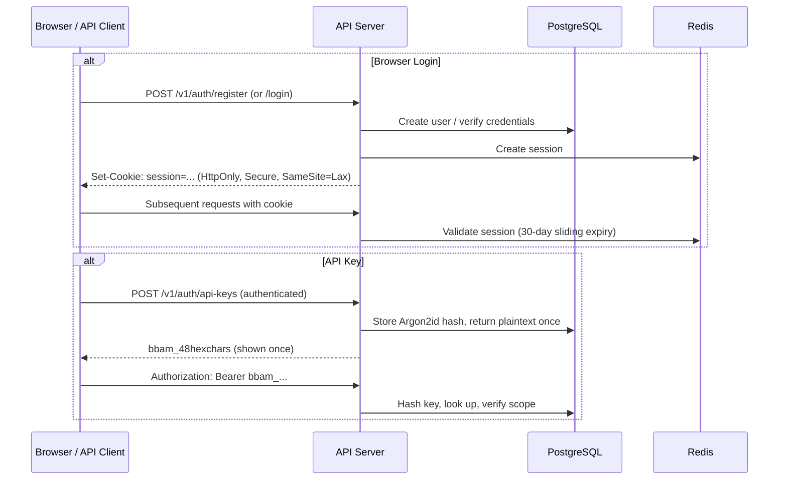

# API Reference

Complete reference for the BigBlueBam REST API.

---

## Base URL

| Environment | Base URL |
|---|---|
| **Self-hosted (Docker)** | `http://localhost:4000/v1` |
| **Cloud** | `https://api.bigbluebam.io/v1` |

All endpoints are prefixed with `/v1`.

---

## Authentication

BigBlueBam supports two authentication methods:

| Method | Use Case | Header |
|---|---|---|
| **Session cookie** | Browser clients (set after login) | Cookie: `session=...` + `X-CSRF-Token` header for mutations |
| **API key** | Automation, CI/CD, MCP server, integrations | `Authorization: Bearer bbam_...` |

### Auth Flow



### API Keys

- Prefix: `bbam_` followed by 48 hex characters
- Stored as Argon2id hashes (plaintext shown once at creation)
- Scoped to: `read`, `read_write`, or `admin`
- Optionally restricted to specific projects
- Optional expiration date

---

## Request/Response Conventions

### Content Type

All request and response bodies use `application/json` unless otherwise noted.

### Pagination

All list endpoints use cursor-based pagination:

```json
{
  "data": [...],
  "pagination": {
    "next_cursor": "eyJpZCI6Ij...",
    "prev_cursor": "eyJpZCI6Ij...",
    "has_more": true,
    "total_count": 342
  }
}
```

Query parameters: `?cursor=<string>&limit=<int>` (default 50, max 200).

### Filtering

List endpoints accept filters using the pattern `?filter[field]=value`:

```
?filter[priority]=high,critical
?filter[due_date][gte]=2026-04-01&filter[due_date][lte]=2026-04-30
?filter[assignee_id]=unassigned
```

### Sorting

```
?sort=field           (ascending)
?sort=-field          (descending)
?sort=-priority,due_date  (multi-sort)
```

### Field Selection

```
?fields=id,title,assignee,state
```

Returns only the specified fields to reduce payload size.

### Timestamps

All timestamps are ISO 8601 in UTC: `2026-04-02T14:30:00Z`. Clients handle timezone display.

### ETags

All GET responses include `ETag`. Use `If-None-Match` for conditional requests (returns 304 when unchanged).

---

## Error Response Envelope

All errors follow this structure:

```json
{
  "error": {
    "code": "VALIDATION_ERROR",
    "message": "Human-readable description",
    "details": [
      { "field": "title", "issue": "required" }
    ],
    "request_id": "req_abc123"
  }
}
```

### Error Codes

| HTTP Status | Code | Meaning |
|---|---|---|
| 400 | `VALIDATION_ERROR` | Request body or params failed schema validation |
| 401 | `UNAUTHORIZED` | Missing or invalid authentication |
| 403 | `FORBIDDEN` | Authenticated but insufficient permissions |
| 404 | `NOT_FOUND` | Entity does not exist or not accessible |
| 409 | `CONFLICT` | Stale update (optimistic concurrency check failed) |
| 422 | `UNPROCESSABLE` | Semantically invalid (e.g., start sprint when one is already active) |
| 429 | `RATE_LIMITED` | Too many requests |
| 500 | `INTERNAL_ERROR` | Server error (includes `request_id` for support) |

---

## Rate Limiting

Enforced via Redis sliding window. Headers returned on every response:

- `X-RateLimit-Limit`
- `X-RateLimit-Remaining`
- `X-RateLimit-Reset` (Unix epoch seconds)

| Scope | Limit | Burst |
|---|---|---|
| Per API key | 100 req/min | 20 req/s |
| Per organization | 1,000 req/min | 100 req/s |
| Per IP (unauthenticated) | 20 req/min | 5 req/s |

---

## Endpoint Reference

### Auth Endpoints

#### `POST /auth/register`

Create a new user account and organization.

**Request:**
```json
{
  "email": "eddie@bigblueceiling.com",
  "password": "min-12-chars-required",
  "display_name": "Eddie Offermann",
  "org_name": "Big Blue Ceiling"
}
```

**Response (201):**
```json
{
  "data": {
    "user": { "id": "uuid", "email": "eddie@bigblueceiling.com", "display_name": "Eddie Offermann", "org_id": "uuid" },
    "organization": { "id": "uuid", "name": "Big Blue Ceiling", "slug": "big-blue-ceiling" },
    "session": { "token": "...", "expires_at": "2026-05-02T00:00:00Z" }
  }
}
```

#### `POST /auth/login`

Authenticate with email/password.

**Request:**
```json
{
  "email": "eddie@bigblueceiling.com",
  "password": "...",
  "totp_code": "123456"
}
```

The `totp_code` field is only required if the user has 2FA enabled.

**Response (200):** Session cookie set. Returns user object.

#### `POST /auth/login/oauth`

Initiate OAuth2 flow. Returns redirect URL.

**Request:** `{ "provider": "google" | "github" | "microsoft" }`

#### `POST /auth/logout`

Destroy session. Clears cookie.

#### `POST /auth/forgot-password`

Send password reset email. **Request:** `{ "email": "..." }`

#### `POST /auth/reset-password`

Complete password reset. **Request:** `{ "token": "...", "new_password": "..." }`

#### `POST /auth/magic-link`

Send passwordless login link. **Request:** `{ "email": "..." }`

#### `GET /auth/me`

Return the currently authenticated user with organization context.

#### `PATCH /auth/me`

Update profile fields: `display_name`, `avatar_url`, `timezone`, `notification_prefs`.

#### `POST /auth/me/2fa/enable`

Begin TOTP setup. Returns QR code URI and secret.

#### `POST /auth/me/2fa/verify`

Confirm TOTP setup with a valid code.

#### `DELETE /auth/me/2fa`

Disable 2FA. Requires current password.

---

### API Key Endpoints

#### `GET /auth/api-keys`

List all API keys for the current user. Shows prefix + last 4 characters only.

#### `POST /auth/api-keys`

Create a new API key.

**Request:**
```json
{
  "name": "CI/CD Pipeline",
  "scope": "read_write",
  "project_ids": ["uuid"],
  "expires_at": "2027-04-02T00:00:00Z"
}
```

**Response (201):** Returns the full key **once**. It cannot be retrieved again.

#### `DELETE /auth/api-keys/:id`

Revoke an API key immediately.

---

### Organization Endpoints

#### `GET /org`

Return the current user's organization.

#### `PATCH /org`

Update organization settings (name, logo, plan settings, defaults). **Requires:** Org Admin.

#### `GET /org/members`

List all organization members with roles.

**Query params:** `?filter[role]=admin&sort=-last_seen_at&limit=20`

#### `POST /org/members/invite`

Send email invitation.

**Request:**
```json
{
  "email": "teeny@bigblueceiling.com",
  "role": "member",
  "project_ids": ["uuid"]
}
```

#### `PATCH /org/members/:user_id`

Update member's organization-level role.

#### `DELETE /org/members/:user_id`

Remove member from organization. Cascades: removes from all projects, reassigns owned tasks to reporter.

---

### Project Endpoints

#### `GET /projects`

List projects accessible to the current user.

**Query params:** `?filter[is_archived]=false&sort=-updated_at`

**Response (200):**
```json
{
  "data": [
    {
      "id": "uuid",
      "name": "BigBlueBam",
      "slug": "bigbluebam",
      "icon": "...",
      "color": "#3B82F6",
      "task_id_prefix": "BBB",
      "member_count": 5,
      "open_task_count": 42,
      "active_sprint": { "id": "uuid", "name": "Sprint 12", "end_date": "2026-04-15" },
      "my_role": "admin",
      "updated_at": "2026-04-02T10:00:00Z"
    }
  ],
  "pagination": { "next_cursor": "...", "has_more": true, "total_count": 3 }
}
```

#### `POST /projects`

Create a new project.

**Request:**
```json
{
  "name": "BigBlueBam",
  "slug": "bigbluebam",
  "description": "Project planning tool",
  "icon": "...",
  "color": "#3B82F6",
  "task_id_prefix": "BBB",
  "default_sprint_duration_days": 14,
  "template": "kanban_standard"
}
```

**Templates:** `kanban_standard`, `scrum`, `bug_tracking`, `minimal`, `none`.

#### `GET /projects/:id`

Full project details including settings, member count, active sprint summary.

#### `PATCH /projects/:id`

Update project fields. **Requires:** Project Admin.

#### `DELETE /projects/:id`

Soft-delete (archive) a project. Recoverable for 30 days. **Requires:** Org Admin or Project Admin.

#### `POST /projects/:id/archive` / `POST /projects/:id/unarchive`

Archive or restore a project.

#### `GET /projects/:id/members`

List project members with project-level roles.

#### `POST /projects/:id/members`

Add a member to the project. **Request:** `{ "user_id": "uuid", "role": "member" }`

#### `PATCH /projects/:id/members/:user_id`

Change a member's project role.

#### `DELETE /projects/:id/members/:user_id`

Remove member from project.

---

### Phase Endpoints

#### `GET /projects/:id/phases`

List phases in position order with task counts and WIP status.

**Response (200):**
```json
{
  "data": [
    {
      "id": "uuid",
      "name": "In Progress",
      "color": "#F59E0B",
      "position": 2,
      "wip_limit": 4,
      "current_count": 3,
      "is_start": false,
      "is_terminal": false,
      "auto_state_on_enter": "uuid_or_null"
    }
  ]
}
```

#### `POST /projects/:id/phases`

Create a new phase.

**Request:**
```json
{
  "name": "QA Review",
  "color": "#8B5CF6",
  "position": 3,
  "wip_limit": 5,
  "is_terminal": false,
  "auto_state_on_enter": "uuid"
}
```

#### `PATCH /phases/:id`

Update phase properties.

#### `DELETE /phases/:id`

Delete a phase. Phase must be empty, or include `?migrate_to=<phase_id>` to move tasks first.

#### `POST /projects/:id/phases/reorder`

Bulk reorder phases. **Request:** `{ "phase_ids": ["uuid_a", "uuid_b", "uuid_c"] }`

---

### Sprint Endpoints

#### `GET /projects/:id/sprints`

List all sprints.

**Query params:** `?filter[status]=active,planned&sort=-start_date`

**Response (200):**
```json
{
  "data": [
    {
      "id": "uuid",
      "name": "Sprint 12",
      "goal": "Ship OAuth + profile pages",
      "start_date": "2026-04-01",
      "end_date": "2026-04-15",
      "status": "active",
      "task_count": 18,
      "completed_count": 7,
      "total_points": 55,
      "completed_points": 21,
      "velocity": null
    }
  ]
}
```

#### `POST /projects/:id/sprints`

Create a sprint.

**Request:**
```json
{
  "name": "Sprint 13",
  "goal": "Payment integration",
  "start_date": "2026-04-16",
  "end_date": "2026-04-30"
}
```

#### `GET /sprints/:id`

Sprint details including task breakdown by state.

#### `PATCH /sprints/:id`

Update sprint fields. Only `planned` sprints allow date changes.

#### `POST /sprints/:id/start`

Transition sprint from `planned` to `active`. Fails with 422 if another sprint is already active.

#### `POST /sprints/:id/complete`

Complete the active sprint. Requires carry-forward decisions for all incomplete tasks.

**Request:**
```json
{
  "carry_forward": {
    "target_sprint_id": "uuid",
    "tasks": [
      { "task_id": "uuid", "action": "carry_forward" },
      { "task_id": "uuid", "action": "backlog" },
      { "task_id": "uuid", "action": "cancel" }
    ]
  },
  "retrospective_notes": "Velocity was lower due to unplanned OAuth bug..."
}
```

**Response (200):** Sprint report summary (velocity, completion rate, carry-forward list).

#### `POST /sprints/:id/cancel`

Cancel a planned or active sprint. All tasks move to backlog.

#### `GET /sprints/:id/report`

Sprint report with velocity, burndown, and completion data.

**Response (200):**
```json
{
  "data": {
    "sprint_id": "uuid",
    "velocity": 34,
    "committed_points": 55,
    "completion_rate": 0.72,
    "tasks_completed": 13,
    "tasks_carried_forward": 4,
    "tasks_descoped": 1,
    "scope_changes": { "added_mid_sprint": 3, "removed_mid_sprint": 1 },
    "burndown": [
      { "date": "2026-04-01", "remaining_points": 55 },
      { "date": "2026-04-02", "remaining_points": 52 }
    ],
    "carry_forward_details": [
      { "task_id": "uuid", "human_id": "BBB-88", "title": "...", "carry_count": 2 }
    ]
  }
}
```

---

### Task Endpoints

#### `GET /projects/:id/tasks`

List and search tasks with full filtering and sorting.

**Query params (all optional):**
- `?filter[sprint_id]=uuid` (use `null` for backlog)
- `?filter[phase_id]=uuid`
- `?filter[state_id]=uuid`
- `?filter[assignee_id]=uuid` (`unassigned` for null assignee)
- `?filter[priority]=high,critical`
- `?filter[label_ids]=uuid1,uuid2`
- `?filter[epic_id]=uuid`
- `?filter[due_date][gte]=2026-04-01`
- `?filter[due_date][lte]=2026-04-15`
- `?filter[is_blocked]=true`
- `?filter[carry_forward_count][gte]=1`
- `?search=oauth+login`
- `?sort=-priority,due_date`
- `?fields=id,human_id,title,state,assignee,priority`

#### `GET /projects/:id/board`

Primary board-rendering endpoint. Returns the full board state for the active sprint.

**Query params:** `?sprint_id=uuid` (override sprint), `?swimlane=assignee|epic|priority|label|none`

**Response (200):**
```json
{
  "data": {
    "project": { "id": "...", "name": "...", "task_id_prefix": "BBB" },
    "sprint": { "id": "...", "name": "Sprint 12", "goal": "...", "end_date": "..." },
    "phases": [
      {
        "id": "uuid",
        "name": "In Progress",
        "color": "#F59E0B",
        "position": 2,
        "wip_limit": 4,
        "tasks": [
          {
            "id": "uuid",
            "human_id": "BBB-142",
            "title": "Implement OAuth2 login flow",
            "state": { "id": "uuid", "name": "Active", "color": "#22C55E" },
            "priority": "high",
            "story_points": 5,
            "due_date": "2026-04-15",
            "assignee": { "id": "uuid", "display_name": "Eddie O.", "avatar_url": "..." },
            "labels": [{ "id": "uuid", "name": "Feature", "color": "#3B82F6" }],
            "comment_count": 3,
            "attachment_count": 1,
            "subtask_count": 4,
            "subtask_done_count": 2,
            "carry_forward_count": 1,
            "is_blocked": false,
            "position": 1024.0
          }
        ]
      }
    ],
    "members_online": ["uuid_a", "uuid_b"]
  }
}
```

#### `POST /projects/:id/tasks`

Create a new task.

**Request:**
```json
{
  "title": "Implement OAuth2 login flow",
  "description": "<p>Support Google and GitHub OAuth providers...</p>",
  "phase_id": "uuid",
  "state_id": "uuid",
  "sprint_id": "uuid",
  "assignee_id": "uuid",
  "priority": "high",
  "story_points": 5,
  "time_estimate_minutes": 480,
  "start_date": "2026-04-02",
  "due_date": "2026-04-15",
  "label_ids": ["uuid_a", "uuid_b"],
  "epic_id": "uuid",
  "parent_task_id": "uuid",
  "custom_fields": { "field_uuid_a": "iOS", "field_uuid_b": true }
}
```

**Response (201):** Full task object including generated `human_id`.

#### `GET /tasks/:id`

Full task detail including subtasks, recent comments, and activity.

#### `PATCH /tasks/:id`

Partial update. Supports optimistic concurrency via `If-Match` ETag header. Returns 409 on conflict.

#### `POST /tasks/:id/move`

Move a task to a different phase and/or position.

**Request:**
```json
{
  "phase_id": "uuid",
  "position": 2048.0,
  "sprint_id": "uuid"
}
```

#### `DELETE /tasks/:id`

Soft-delete a task. Moves to 30-day trash. **Requires:** task creator, assignee, or project admin.

#### `POST /tasks/:id/restore`

Restore a soft-deleted task from trash.

#### `POST /tasks/bulk`

Batch operations on multiple tasks.

**Request:**
```json
{
  "task_ids": ["uuid_a", "uuid_b", "uuid_c"],
  "operation": "update",
  "fields": { "assignee_id": "uuid", "sprint_id": "uuid", "priority": "high" }
}
```

---

### Comment Endpoints

#### `GET /tasks/:id/comments`

List comments on a task, newest first.

**Query params:** `?filter[is_system]=false`, `?cursor=...&limit=20`

#### `POST /tasks/:id/comments`

Add a comment. Mentions (`@display_name`) are resolved server-side and trigger notifications.

**Request:**
```json
{
  "body": "<p>Looks good, but we should also handle the token refresh case. @eddie thoughts?</p>"
}
```

#### `PATCH /comments/:id`

Edit a comment (own comments only). Sets `edited_at`.

#### `DELETE /comments/:id`

Delete a comment (own comments or project admin).

---

### Attachment Endpoints

#### `POST /tasks/:id/attachments/presign`

Request a presigned S3 upload URL. Client uploads directly to S3/MinIO.

**Request:**
```json
{
  "filename": "screenshot.png",
  "content_type": "image/png",
  "size_bytes": 245000
}
```

**Response (200):**
```json
{
  "data": {
    "upload_url": "https://s3.amazonaws.com/...",
    "attachment_id": "uuid",
    "expires_at": "2026-04-02T15:00:00Z"
  }
}
```

#### `POST /tasks/:id/attachments/:attachment_id/confirm`

Confirm upload completion. Server verifies the object exists in S3, generates thumbnail if image.

#### `GET /tasks/:id/attachments`

List attachments with download URLs.

#### `DELETE /attachments/:id`

Delete an attachment (uploader or project admin). S3 object removed asynchronously.

---

### Notification Endpoints

#### `GET /me/notifications`

Current user's notification list.

**Query params:** `?filter[is_read]=false`, `?limit=20`

#### `POST /me/notifications/mark-read`

Mark notifications as read.

**Request:** `{ "notification_ids": ["uuid_a", "uuid_b"] }` or `{ "all": true }`

---

### Label Endpoints

#### `GET /projects/:id/labels`

List labels for a project.

#### `POST /projects/:id/labels`

Create a label. **Request:** `{ "name": "Bug", "color": "#EF4444", "description": "..." }`

#### `PATCH /labels/:id`

Update a label.

#### `DELETE /labels/:id`

Delete a label. Removes from all tasks.

---

### Epic Endpoints

#### `GET /projects/:id/epics`

List epics with task counts and progress.

#### `POST /projects/:id/epics`

Create an epic. **Request:** `{ "name": "Auth System", "description": "...", "color": "#8B5CF6", "target_date": "2026-06-01" }`

#### `PATCH /epics/:id`

Update an epic.

#### `DELETE /epics/:id`

Delete an epic. Unlinks tasks (does not delete them).

---

### Custom Field Endpoints

#### `GET /projects/:id/custom-fields`

List custom field definitions for a project.

#### `POST /projects/:id/custom-fields`

Create a custom field definition.

**Request:**
```json
{
  "name": "Platform",
  "field_type": "select",
  "options": [
    { "value": "ios", "label": "iOS", "color": "#000" },
    { "value": "android", "label": "Android", "color": "#3DDC84" },
    { "value": "web", "label": "Web", "color": "#3B82F6" }
  ],
  "is_required": false,
  "is_visible_on_card": true,
  "position": 0
}
```

#### `PATCH /custom-fields/:id`

Update field definition. Changing `field_type` is disallowed if tasks have values (returns 422).

#### `DELETE /custom-fields/:id`

Delete field definition. Removes all stored values across tasks.

---

### Reaction Endpoints

#### `POST /comments/:id/reactions`

Toggle a reaction on a comment. If the reaction already exists for the authenticated user, it is removed. Otherwise it is added.

**Request:**
```json
{
  "emoji": "thumbsup"
}
```

#### `GET /comments/:id/reactions`

List all reactions on a comment, grouped by emoji.

---

### Time Entry Endpoints

#### `POST /tasks/:id/time-entries`

Log time spent on a task.

**Request:**
```json
{
  "minutes": 90,
  "date": "2026-04-02",
  "description": "Implemented login flow"
}
```

#### `GET /tasks/:id/time-entries`

List all time entries for a task.

#### `GET /projects/:id/time-entries`

List time entries across a project. **Query params:** `?from=2026-04-01&to=2026-04-30&user_id=uuid`

---

### Template Endpoints

#### `GET /projects/:id/task-templates`

List task templates for a project.

#### `POST /projects/:id/task-templates`

Create a new task template.

**Request:**
```json
{
  "name": "Bug Report",
  "title_pattern": "[Bug] ",
  "description": "## Steps to reproduce\n\n## Expected behavior\n\n## Actual behavior",
  "priority": "high",
  "phase_id": "uuid",
  "label_ids": ["uuid"],
  "subtask_titles": ["Reproduce", "Fix", "Write test"],
  "story_points": 3
}
```

#### `PATCH /projects/:id/task-templates/:template_id`

Update a template.

#### `DELETE /projects/:id/task-templates/:template_id`

Delete a template.

#### `POST /projects/:id/task-templates/:template_id/apply`

Create a new task from a template, optionally overriding fields.

**Request:**
```json
{
  "overrides": { "title": "Fix login crash on iOS", "assignee_id": "uuid" }
}
```

**Response (201):** Full task object created from the template.

---

### Saved View Endpoints

#### `GET /projects/:id/views`

List saved views for a project (user's own + shared views).

#### `POST /projects/:id/views`

Create a saved view.

**Request:**
```json
{
  "name": "My Critical Tasks",
  "filters": { "priority": "critical", "assignee_id": "uuid" },
  "sort": "-due_date",
  "view_type": "board",
  "swimlane": "assignee",
  "is_shared": false
}
```

#### `PATCH /views/:id`

Update a saved view.

#### `DELETE /views/:id`

Delete a saved view (own views only, or project admin).

---

### Import Endpoints

#### `POST /projects/:id/import/csv`

Import tasks from CSV data.

**Request:**
```json
{
  "rows": [
    { "Title": "Task 1", "Priority": "high", "Phase": "To Do" }
  ],
  "mapping": {
    "Title": "title",
    "Priority": "priority",
    "Phase": "phase"
  }
}
```

**Response (200):** `{ "imported": 15, "skipped": 2, "errors": [...] }`

#### `POST /projects/:id/import/trello`

Import tasks from a Trello board export.

#### `POST /projects/:id/import/jira`

Import tasks from a Jira export.

#### `POST /projects/:id/import/github`

Import GitHub issues as tasks.

**Request:**
```json
{
  "issues": [
    { "number": 42, "title": "Fix bug", "body": "...", "state": "open", "labels": ["bug"], "assignee": "username" }
  ]
}
```

---

### iCal Endpoints

#### `GET /projects/:id/ical`

Export tasks with due dates as an iCal (.ics) feed. Authenticated via API key in query string. Returns `text/calendar` content type.

**Query params:** `?key=bbam_...`

---

### Activity Endpoints

#### `GET /projects/:id/activity`

List activity log entries for a project (audit trail).

**Query params:** `?cursor=...&limit=20`

---

### Reporting Endpoints

#### `GET /projects/:id/reports/velocity`

Sprint-over-sprint velocity data. **Query params:** `?count=10`

#### `GET /projects/:id/reports/burndown`

Burndown chart data. **Query params:** `?sprint_id=uuid`

#### `GET /projects/:id/reports/cfd`

Cumulative flow diagram data. **Query params:** `?from_date=2026-01-01&to_date=2026-04-02`

#### `GET /projects/:id/reports/cycle-time`

Cycle time distribution. **Query params:** `?from=2026-01-01&to=2026-04-02`

#### `GET /projects/:id/reports/overdue`

List all overdue tasks in a project (tasks with `due_date` in the past that are not in a closed state).

#### `GET /projects/:id/reports/workload`

Workload distribution report showing task counts and story points per team member.

#### `GET /projects/:id/reports/status-distribution`

Status distribution report showing task counts per phase and state.

#### `GET /projects/:id/reports/time-tracking`

Time tracking report. **Query params:** `?from=2026-04-01&to=2026-04-30`

---

### Export Endpoints

#### `POST /projects/:id/export`

Trigger an async export job.

**Request:** `{ "format": "json" | "csv" | "pdf_sprint_report", "sprint_id": "uuid" }`

**Response (202):** `{ "job_id": "uuid", "status_url": "/jobs/uuid" }`

#### `GET /jobs/:id`

Poll export job status. When complete, includes `download_url`.

---

### Webhook Endpoints

#### `GET /projects/:id/webhooks`

List registered webhooks.

#### `POST /projects/:id/webhooks`

Register a new webhook.

**Request:**
```json
{
  "url": "https://your-service.com/webhook",
  "events": ["task.created", "task.updated", "task.moved", "sprint.completed", "comment.added"],
  "secret": "your-hmac-secret"
}
```

Delivery: POST with JSON body, signed with `X-BigBlueBam-Signature: sha256=<hmac>`. Retries: 3 attempts with exponential backoff (10s, 60s, 300s). Auto-disabled after 10 consecutive failures.

#### `PATCH /webhooks/:id`

Update webhook URL, events, or secret.

#### `DELETE /webhooks/:id`

Remove webhook.

#### `GET /webhooks/:id/deliveries`

View recent delivery history.

---

### Health Check

#### `GET /health`

Returns API server health status. Not versioned (no `/v1` prefix).

**Response (200):**
```json
{
  "status": "healthy",
  "version": "1.0.0",
  "uptime_seconds": 86400,
  "checks": {
    "database": "ok",
    "redis": "ok",
    "minio": "ok"
  }
}
```
