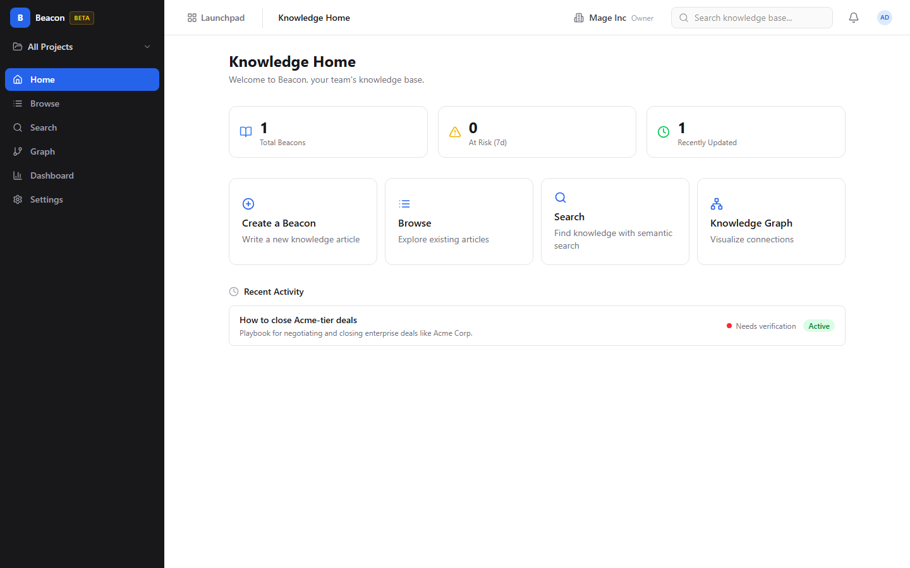
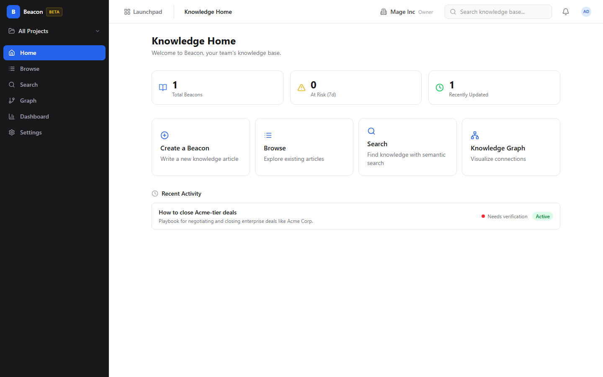

# Beacon (Knowledge Base)

A knowledge base with semantic search and a visual knowledge graph.

- Write and organize team documentation with rich text and version history
- Find answers instantly with AI-powered semantic search
- Explore connections between articles through an interactive knowledge graph

## See It in Action

---

Part of the [BigBlueBam](/) productivity suite.
