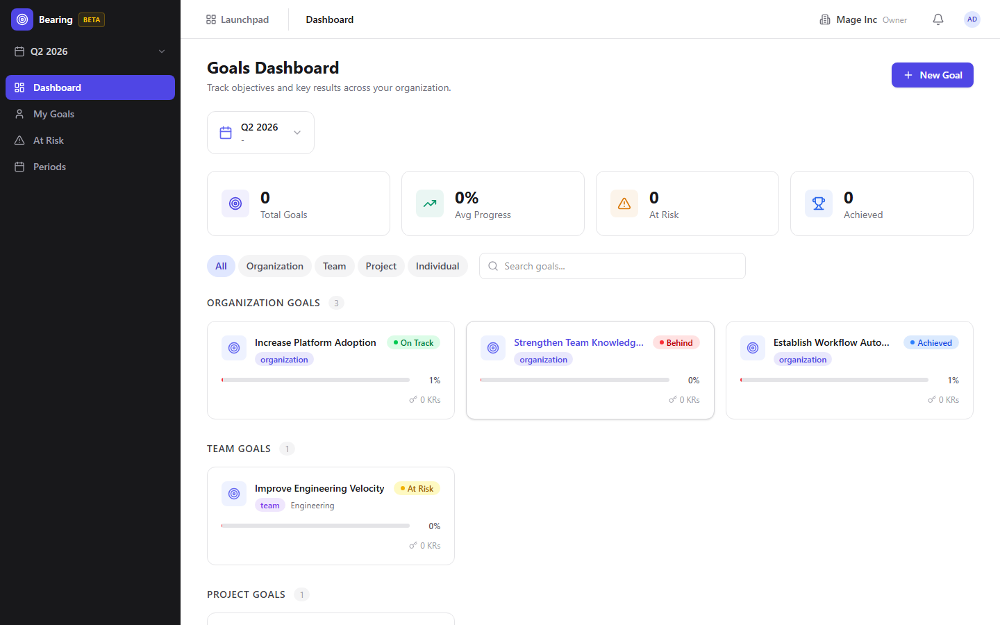

# Bearing (Goals & OKRs) Guide

# Bearing - Goals & OKRs

Bearing is BigBlueBam's goal tracking app for setting objectives, key results, and measuring progress across teams and time periods.

## Key Features

- **Goal Hierarchy** with objectives, key results, and progress rollup from child to parent goals
- **Time Periods** for organizing goals into quarters, halves, or custom date ranges
- **At-Risk Dashboard** that highlights goals falling behind their expected trajectory
- **My Goals** view that shows each team member their personal goal assignments and progress
- **Progress Tracking** with manual updates, percentage completion, and metric-based key results

## Integrations

Bearing goals can reference Bam project velocity and task completion rates as progress signals. Bolt automations can fire when goals reach milestones or fall into at-risk status. Goal summaries appear in Bench analytics dashboards.

## Getting Started

Open Bearing from the Launchpad. Create a time period (such as Q2 2026), then add objectives with measurable key results. Assign owners to each key result and update progress regularly. The at-risk dashboard flags goals that need attention.

## Walkthrough

### Dashboard

### Goal Detail

### Timeline

### Reports

## MCP Tools

# bearing MCP Tools

| Tool | Description | Parameters |
|------|-------------|------------|
| `bearing_at_risk` | Quick check: list all at-risk or behind goals across the organization. | none |
| `bearing_goal_create` | Create a new OKR goal within a period.  | `period_id`, `title`, `scope`, `project_id`, `team_name`, `icon`, `color`, `owner_id` |
| `bearing_goal_get` | Get a single goal with its key results and progress details. | `id` |
| `bearing_goal_update` | Update an existing goal. Provide only the fields to change.  | `id`, `title`, `scope`, `owner_id`, `icon`, `color` |
| `bearing_goals` | List OKR goals with optional filters by period, scope, owner, and status. | `period_id`, `scope`, `owner_id`, `status`, `limit` |
| `bearing_kr_create` | Create a key result under a goal.  | `goal_id`, `title`, `metric_type`, `target_value`, `start_value`, `unit`, `direction`, `progress_mode`, `owner_id` |
| `bearing_kr_link` | Link a key result to a Bam entity (epic, project, or task query) for automatic progress tracking.  | `key_result_id`, `link_type`, `target_type`, `target_id`, `metadata` |
| `bearing_kr_update` | Update a key result value or metadata. When current_value is provided, also records a value check-in.  | `id`, `current_value`, `title`, `target_value` |
| `bearing_period_get` | Get a single OKR period with aggregated stats. | `id` |
| `bearing_periods` | List OKR periods with optional filters by status and year. | `status`, `year` |
| `bearing_report` | Generate a period summary, at-risk, or owner report. | `report_type`, `period_id`, `user_id`, `format` |
| `bearing_update_post` | Post a status update on a goal.  | `goal_id`, `status`, `body` |

## Related Apps

- [Bam (Project Management)](../bam/guide.md)
- [Bench (Analytics)](../bench/guide.md)
- [Bolt (Workflow Automation)](../bolt/guide.md)
