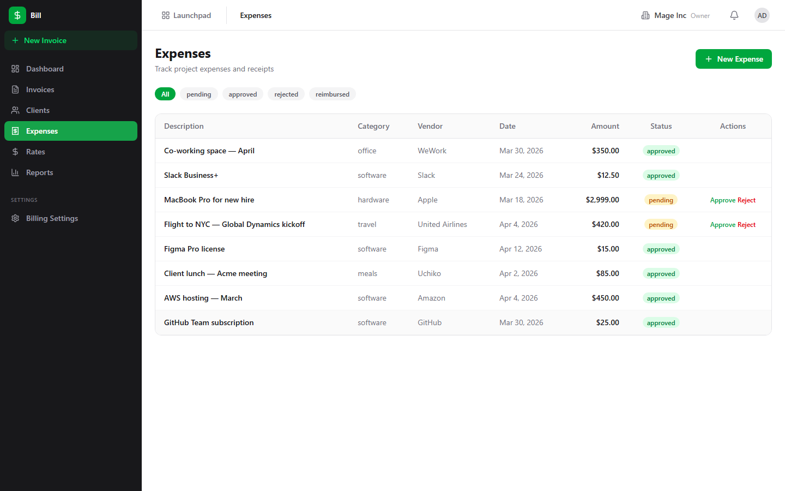
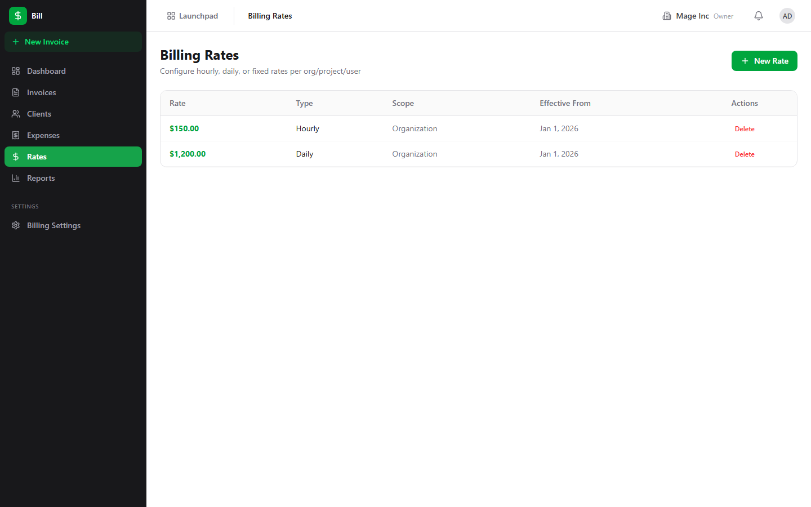
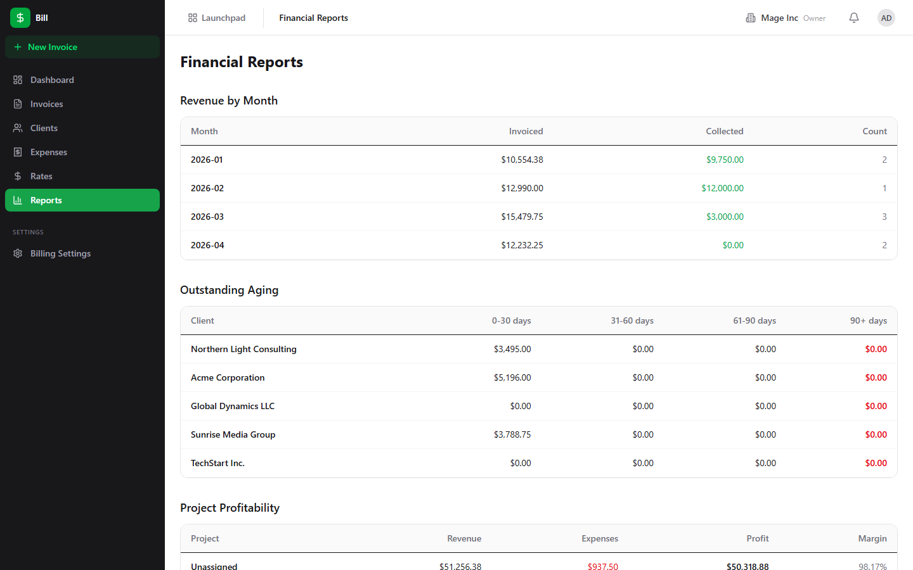
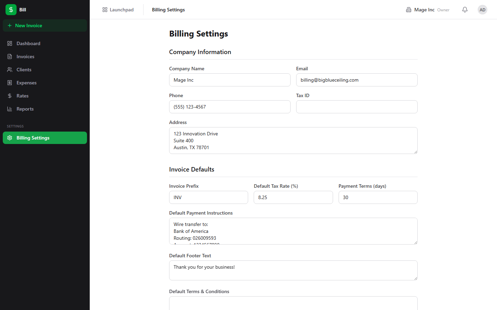

# Bill (Invoicing) Guide

# Bill - Invoicing & Billing

Bill is BigBlueBam's invoicing and billing app for creating invoices, tracking expenses, managing client accounts, and generating financial reports.

## Key Features

- **Invoice Creation** with line items, tax rates, discounts, and due date tracking
- **Invoice from Time Entries** that pulls tracked hours from Bam tasks into billable line items
- **Client Management** with contact details, billing addresses, and invoice history
- **Expense Tracking** for logging costs against clients or projects
- **Rate Configuration** for setting hourly, daily, or fixed rates per project or team member
- **Financial Reports** with revenue, outstanding, and overdue invoice summaries

## Integrations

Bill connects to Bam time entries to generate invoices from tracked work. Bolt automations can trigger when invoices become overdue. Public invoice pages allow clients to view and pay invoices without logging in.

## Getting Started

Open Bill from the Launchpad. Set up your rates and create a client. Then create an invoice manually or generate one from time entries logged in Bam. Track payment status on the dashboard and use reports to monitor outstanding balances.

## Walkthrough

### Invoice List

### Invoice New

### Clients

### Expenses

### Rates

### Reports

### Settings

## MCP Tools

# bill MCP Tools

| Tool | Description | Parameters |
|------|-------------|------------|
| `bill_add_line_item` | Add a line item to a draft invoice. | `invoice_id`, `quantity`, `unit_price`, `unit` |
| `bill_create_expense` | Log a new expense, optionally linked to a project. | `amount`, `category`, `vendor`, `project_id`, `billable` |
| `bill_create_invoice` | Create a new blank draft invoice for a billing client. | `client_id`, `project_id`, `tax_rate`, `notes` |
| `bill_create_invoice_from_deal` | Generate a draft invoice from a Bond CRM deal, pulling deal value and contact info.  | `deal_id`, `client_id` |
| `bill_create_invoice_from_time` | Generate an invoice from Bam time entries for a project and date range. | `project_id`, `client_id`, `date_from`, `date_to` |
| `bill_finalize_invoice` | Finalize a draft invoice — assigns an invoice number and locks edits. | `invoice_id` |
| `bill_get_invoice` | Get full invoice detail including line items and payments. | `invoice_id` |
| `bill_get_overdue` | List all overdue invoices with days overdue and amount due. | none |
| `bill_get_profitability` | Get project profitability: invoiced revenue vs. logged expenses per project. | none |
| `bill_get_revenue_summary` | Get revenue summary by month, showing total invoiced and collected. | `date_from`, `date_to` |
| `bill_list_clients` | List billing clients for the organization, with optional fuzzy search across name, email, and linked Bond company name. Returns id, name, email, company_id, company_name, currency (org default), and default_payment_terms_days — the resolver surface every  | `search` |
| `bill_list_expenses` | List expenses, optionally filtered by project, category, or status. | `project_id`, `category`, `status` |
| `bill_list_invoices` | List invoices, optionally filtered by status, client, project, or date range. | `status`, `client_id`, `project_id`, `date_from`, `date_to` |
| `bill_record_payment` | Record a payment against an invoice. | `invoice_id`, `amount`, `payment_method`, `reference` |
| `bill_resolve_rate` | Resolve the effective billing rate for a given project + user + date. | `project_id`, `user_id`, `date` |
| `bill_send_invoice` | Mark invoice as sent (triggers email delivery if configured). | `invoice_id` |
