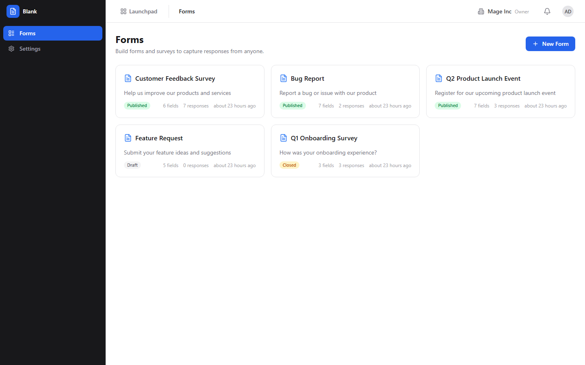
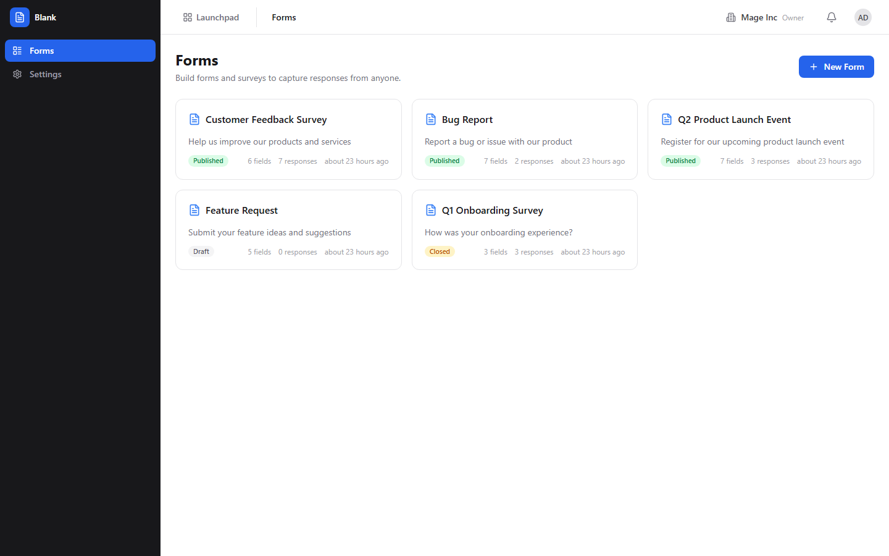
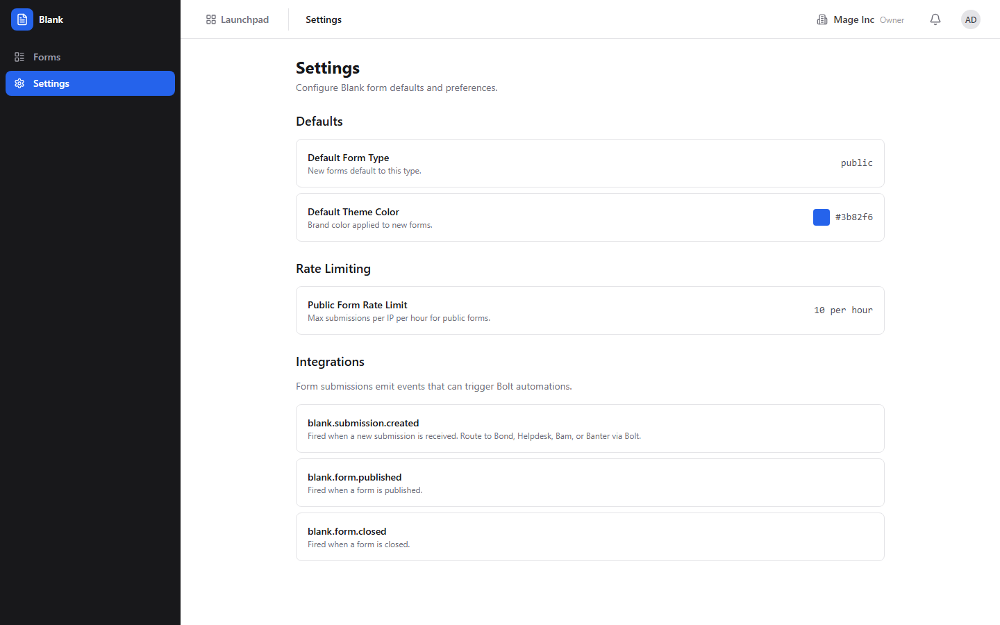

# Blank (Forms) Guide

# Blank - Forms & Surveys

Blank is BigBlueBam's form builder for creating surveys, feedback forms, registration pages, and data collection workflows with a visual drag-and-drop editor.

## Key Features

- **Form Builder** with drag-and-drop field placement, conditional logic, and multi-page forms
- **Field Types** including text, number, email, select, multi-select, date, file upload, rating, and signature
- **Public Form Pages** that work without authentication for external respondents
- **Response Viewer** with filtering, export, and individual response detail
- **Form Analytics** with completion rates, drop-off analysis, and response volume over time
- **Form Settings** for controlling submission limits, notification emails, and redirect URLs

## Integrations

Blank form submissions can trigger Bolt automations for workflow routing. Responses can feed into Bond contact records or Bam task creation. Form analytics are available in Bench dashboards.

## Getting Started

Open Blank from the Launchpad. Create a new form in the builder, add fields, configure validation rules, and publish it. Share the public form URL with respondents. Review submissions in the response viewer and analyze trends in the analytics tab.

## Walkthrough

### Form List

### Form Builder

### Form Preview

### Settings

## MCP Tools

# blank MCP Tools

| Tool | Description | Parameters |
|------|-------------|------------|
| `blank_create_form` | Create a new form with optional inline field definitions. | `slug`, `form_type`, `fields`, `field_key`, `label`, `field_type`, `required`, `options`, `scale_min`, `scale_max`, `scale_min_label`, `scale_max_label` |
| `blank_export_submissions` | Export all submissions for a form as CSV data. | `form_id` |
| `blank_generate_form` | AI generates a form from a natural-language description. Returns a form specification that can be passed to blank_create_form. | none |
| `blank_get_form` | Get a form definition with all its fields. | `id` |
| `blank_get_form_analytics` | Get response aggregation data for a form, including per-field breakdowns, submission trends, and summary statistics. | `form_id` |
| `blank_get_submission` | Get a specific submission with all response data. | `id` |
| `blank_list_forms` | List available forms for the current organization. Supports filtering by status and project. | `status`, `project_id` |
| `blank_list_submissions` | List submissions for a form. Returns paginated results. | `form_id`, `cursor`, `limit` |
| `blank_publish_form` | Publish a draft form, making it available for submissions. | `id` |
| `blank_summarize_responses` | Get analytics data for a form including response counts, field breakdowns, and trends. Useful for AI summarization of form results. | `form_id` |
| `blank_update_form` | Update form metadata or settings. | `id`, `form_type`, `accept_responses`, `theme_color` |
