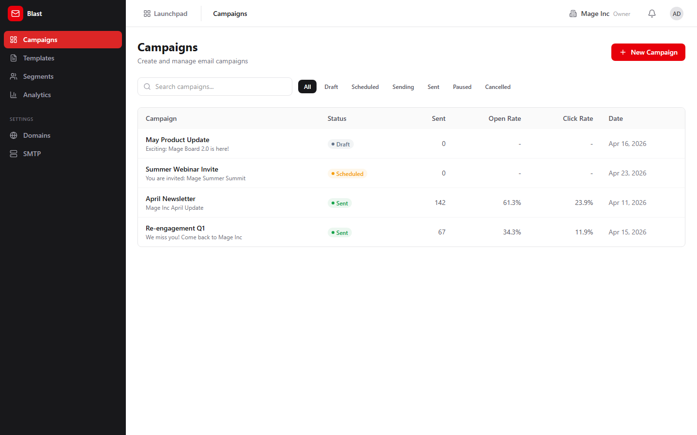
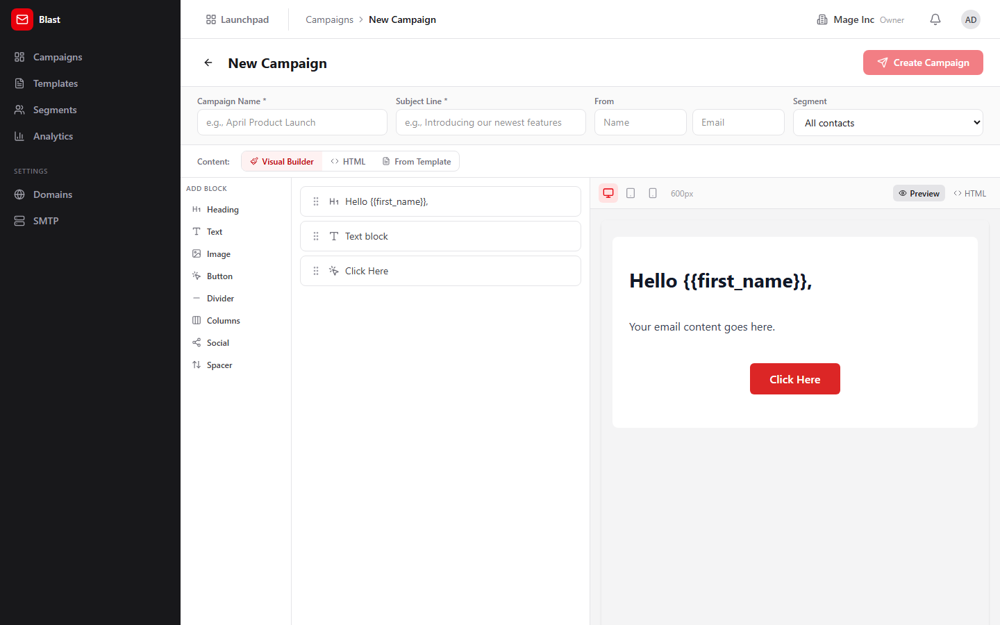
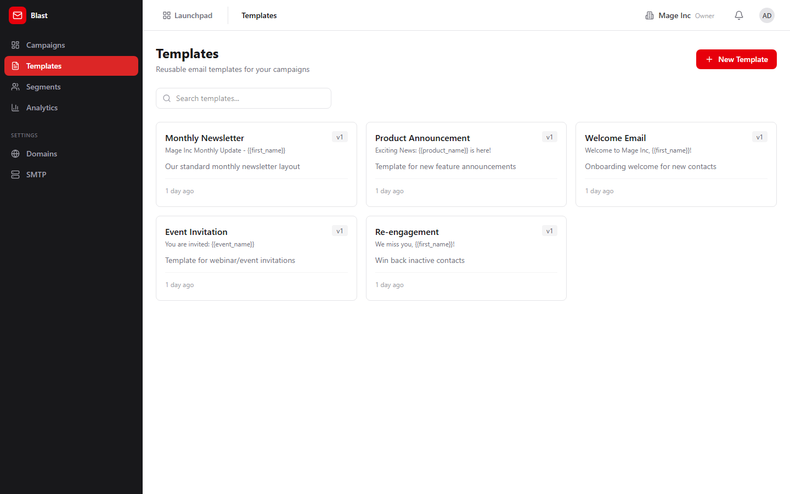
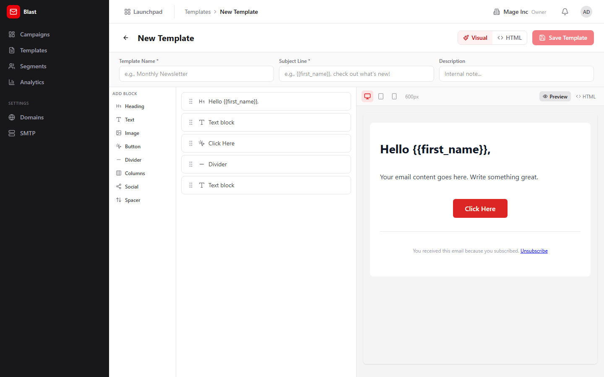
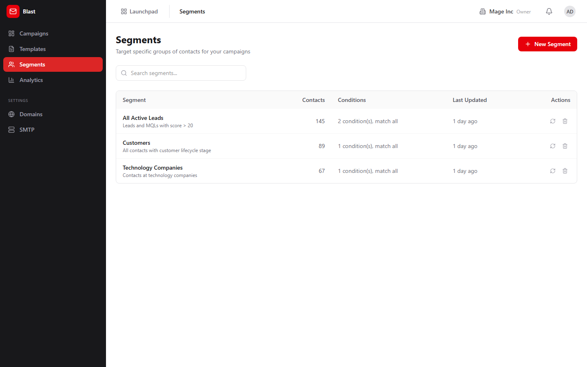
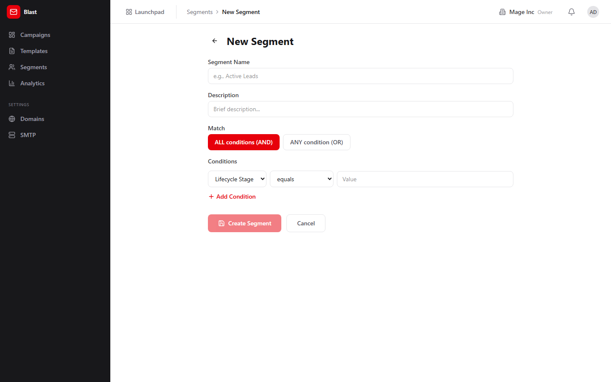
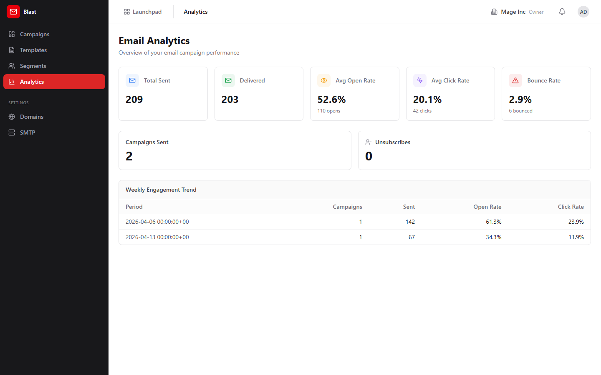

# Blast (Email Campaigns) Guide

# Blast - Email Campaigns

Blast is BigBlueBam's email campaign manager for creating, sending, and analyzing bulk email communications with a visual template editor and audience segmentation.

## Key Features

- **Campaign Manager** with draft, scheduled, sent, and archived states plus A/B testing support
- **Visual Template Editor** for designing responsive HTML emails with drag-and-drop blocks
- **Segment Builder** that filters contacts by attributes, tags, activity, and custom conditions
- **Analytics Dashboard** with open rates, click-through rates, bounce rates, and unsubscribe tracking
- **Domain Settings** for configuring DKIM, SPF, and custom sending domains
- **SMTP Configuration** for bring-your-own email infrastructure

## Integrations

Blast pulls contact lists from Bond CRM for targeting. Campaign events (opens, clicks, unsubscribes) flow back to Bond activity timelines. Bolt automations can trigger on campaign events. Open pixel tracking and click redirects are served via dedicated short-path endpoints (/t/ and /unsub/).

## Getting Started

Open Blast from the Launchpad. Configure your SMTP settings and sending domain first. Then create a template using the visual editor, build a segment to target your audience, and create a campaign. Preview and test before scheduling or sending.

## Walkthrough

### Campaigns

### Campaign New

### Templates

### Template Editor

### Segments

### Segment Builder

### Analytics

## MCP Tools

# blast MCP Tools

| Tool | Description | Parameters |
|------|-------------|------------|
| `blast_check_unsubscribed` | Check if an email address is on the organization unsubscribe list. | `email` |
| `blast_create_segment` | Define a segment from Bond contact filter criteria. | `filter_criteria`, `conditions`, `field`, `op`, `value`, `match` |
| `blast_create_template` | Create a new email template from HTML and subject line. | `subject_template`, `html_body`, `template_type` |
| `blast_draft_campaign` | Create a campaign in draft status with template, segment, and schedule.  | `subject`, `html_body`, `template_id`, `segment_id`, `from_name`, `from_email` |
| `blast_draft_email_content` | AI-generate email subject and body from a brief description and tone. | `tone`, `audience` |
| `blast_get_campaign` | Get campaign detail and delivery stats.  | `id` |
| `blast_get_campaign_analytics` | Get engagement metrics for a sent campaign: open rate, click rate, click map, delivery breakdown.  | `id` |
| `blast_get_engagement_summary` | Get org-level engagement trends: total sent, avg open rate, avg click rate, unsubscribe rate. | none |
| `blast_get_template` | Get email template content and builder state by ID. | `id` |
| `blast_list_segments` | List contact segments with cached recipient counts. | `search`, `limit` |
| `blast_list_templates` | List available email templates with optional type filter and search. | `template_type`, `search`, `limit` |
| `blast_preview_segment` | Preview the first 50 matching contacts for a segment. | `id` |
| `blast_send_campaign` | Send a campaign immediately. Requires human approval by default.  | `id`, `require_human_approval` |
| `blast_suggest_subject_lines` | Generate 5 subject line variants for A/B comparison. | `topic`, `tone` |

## Related Apps

- [Bench (Analytics)](../bench/guide.md)
- [Bolt (Workflow Automation)](../bolt/guide.md)
- [Bond (CRM)](../bond/guide.md)
