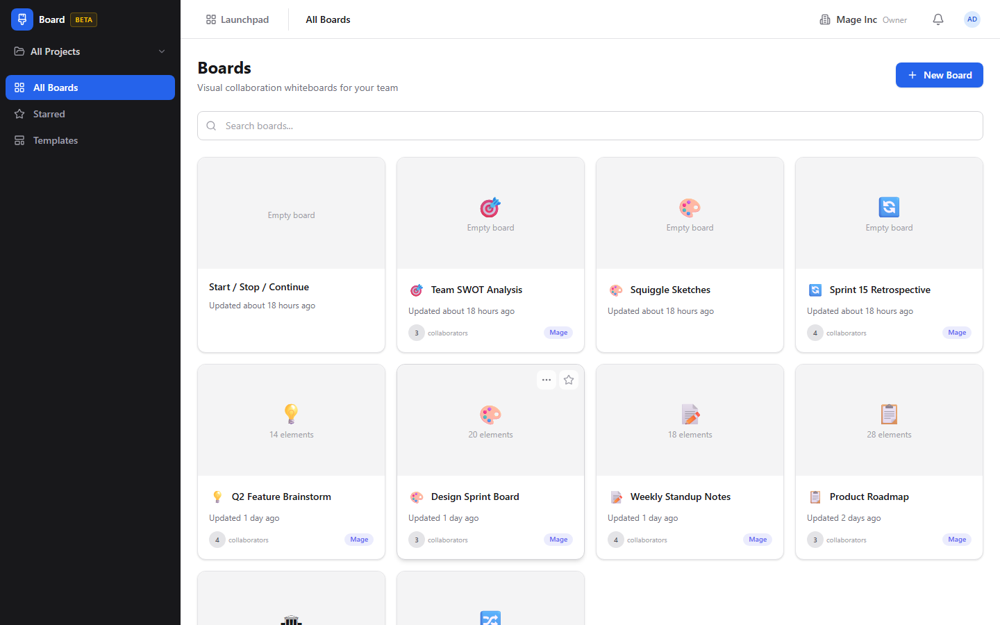
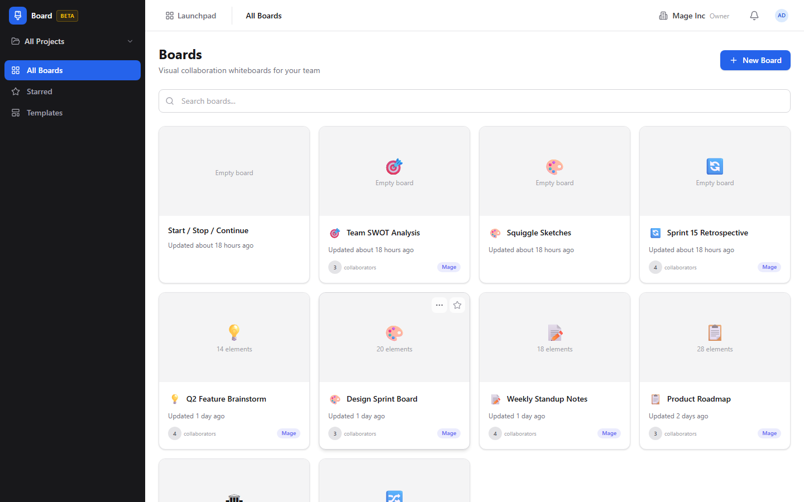

# Board (Visual Collaboration) Guide

# Board - Visual Collaboration

Board is BigBlueBam's infinite canvas whiteboard for real-time visual collaboration, brainstorming, diagramming, and team workshops.

## Key Features

- **Infinite Canvas** with shapes, sticky notes, connectors, freehand drawing, and text blocks
- **Real-Time Collaboration** with live cursors, presence indicators, and WebSocket-powered sync
- **Templates** for common workshop formats like retrospectives, brainstorms, and architecture diagrams
- **Version History** with snapshots that let you review and restore previous board states
- **Starred Boards** for quick access to frequently used canvases
- **Audio Conferencing** for talking while you whiteboard together

## Integrations

Board rooms share authentication with all BigBlueBam apps. Shapes can link to Bam tasks, Brief documents, or Bond deals. Bolt automations can create boards from templates when certain events fire. Board thumbnails appear in Banter message previews.

## Getting Started

Open Board from the Launchpad. Create a new board or pick a template. The canvas supports zoom, pan, and multi-select. Invite collaborators by sharing the board URL. Use the toolbar to add shapes, connectors, and sticky notes. Press ? for keyboard shortcuts.

## Walkthrough

### List

### Canvas

### Templates

## MCP Tools

# board MCP Tools

| Tool | Description | Parameters |
|------|-------------|------------|
| `board_add_sticky` | Add a sticky note to a board.  | `board_id`, `text`, `x`, `y`, `color` |
| `board_add_text` | Add a text element to a board.  | `board_id`, `text`, `x`, `y` |
| `board_archive` | Archive a board (soft delete).  | `id` |
| `board_create` | Create a new visual collaboration board.  | `project_id`, `template_id`, `background`, `visibility` |
| `board_export` | Export a board as SVG or PNG.  | `id`, `format` |
| `board_get` | Get board metadata by ID. | `id` |
| `board_list` | List boards with optional filters and pagination. | `project_id`, `visibility`, `cursor`, `limit` |
| `board_promote_to_tasks` | Promote sticky notes to Bam tasks in a project.  | `board_id`, `element_ids`, `project_id`, `phase_id` |
| `board_read_elements` | Read all elements on a board. Returns structured data with positions, text, and types.  | `id` |
| `board_read_frames` | Read frames with their contained elements from a board. | `id` |
| `board_read_stickies` | Read only sticky note elements from a board. | `id` |
| `board_search` | Search across board element text content. | `query`, `project_id` |
| `board_summarize` | Get a board summary grouped by frames, including element counts and text content.  | `id` |
| `board_update` | Update board metadata. Provide only the fields to change.  | `id`, `background`, `visibility`, `locked`, `icon` |

## Related Apps

- [Bam (Project Management)](../bam/guide.md)
- [Bolt (Workflow Automation)](../bolt/guide.md)
- [Bond (CRM)](../bond/guide.md)
