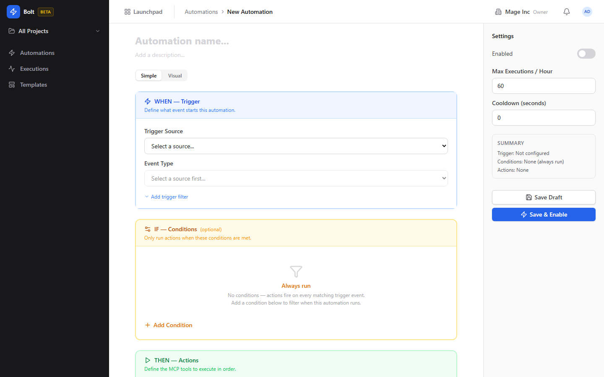
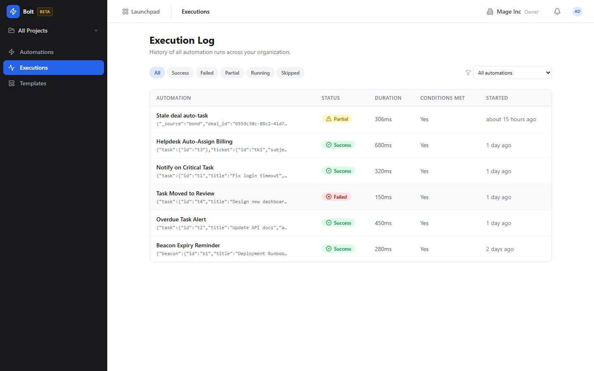
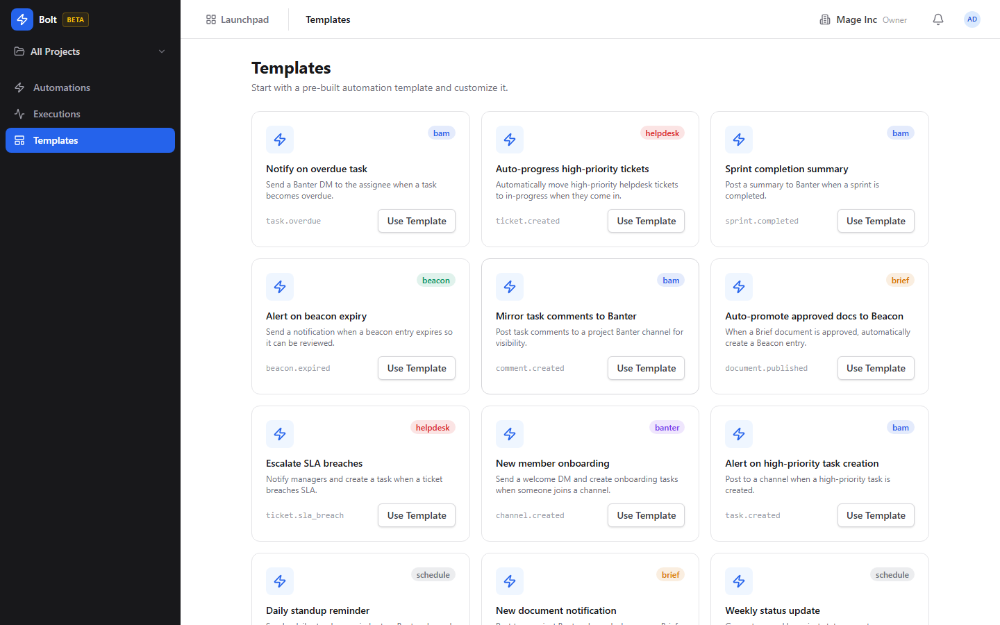

# Bolt (Workflow Automation) Guide

# Bolt - Workflow Automation

Bolt is BigBlueBam's workflow automation engine for building event-driven rules that connect actions across all BigBlueBam apps without writing code.

## Key Features

- **Visual Rule Builder** with a node-graph editor for defining trigger, condition, and action chains
- **Event Catalog** covering events from Bam (task state changes), Bond (deal stage moves), Blast (email opens), and more
- **Execution Log** with detailed per-step traces showing inputs, outputs, timing, and error details
- **Template Browser** with pre-built automation patterns for common workflows (e.g., "notify channel when deal closes")
- **Conditional Logic** with branching, filters, and variable interpolation between steps

## Integrations

Bolt is the integration hub of BigBlueBam. It listens to events from every app (Bam, Bond, Blast, Bearing, Brief, Board, Banter, and others) and can perform actions across them: creating tasks, posting messages, updating deal fields, sending emails, and more. The event-driven architecture means automations fire in near real-time.

## Getting Started

Open Bolt from the Launchpad. Browse templates for inspiration or start a new automation from scratch. Pick a trigger event, add conditions to filter which events should proceed, then chain action nodes for what should happen. Test your automation, then activate it. Monitor executions in the execution log.

## Walkthrough

### Automations

### Editor

### Detail

### Executions

### Templates

## MCP Tools

# bolt MCP Tools

| Tool | Description | Parameters |
|------|-------------|------------|
| `bolt_actions` | List available MCP tools that can be used as automation actions. | none |
| `bolt_create` | Create a new workflow automation with trigger, conditions, and actions. | `project_id`, `trigger_source`, `trigger_event`, `trigger_filter`, `conditions`, `actions`, `max_executions_per_hour`, `cooldown_seconds`, `enabled` |
| `bolt_delete` | Delete a workflow automation. | `id` |
| `bolt_disable` | Disable a workflow automation. | `id` |
| `bolt_enable` | Enable a workflow automation. | `id` |
| `bolt_events` | List available trigger events, optionally filtered by source. | `source` |
| `bolt_execution_detail` | Get detailed information about a single execution, including action results. | `id` |
| `bolt_executions` | List execution history for an automation. | `automation_id`, `status`, `limit` |
| `bolt_get` | Get a single automation with its conditions and actions. | `id` |
| `bolt_get_automation_by_name` | Resolve an automation by its name within the caller\ | none |
| `bolt_list` | List workflow automations with optional filters and pagination. | `project_id`, `trigger_source`, `enabled`, `cursor`, `limit` |
| `bolt_test` | Test-fire an automation with a simulated event payload. | `id`, `event` |
| `bolt_update` | Update an existing automation. Provide only the fields to change. | `id`, `trigger_source`, `trigger_event`, `trigger_filter`, `conditions`, `actions`, `enabled` |

## Related Apps

- [Bam (Project Management)](../bam/guide.md)
- [Banter (Team Messaging)](../banter/guide.md)
- [Beacon (Knowledge Base)](../beacon/guide.md)
- [Bearing (Goals & OKRs)](../bearing/guide.md)
- [Bill (Invoicing)](../bill/guide.md)
- [Blank (Forms)](../blank/guide.md)
- [Blast (Email Campaigns)](../blast/guide.md)
- [Board (Visual Collaboration)](../board/guide.md)
- [Bond (CRM)](../bond/guide.md)
- [Book (Scheduling)](../book/guide.md)
- [Brief (Documents)](../brief/guide.md)
- [Helpdesk (Support Portal)](../helpdesk/guide.md)
