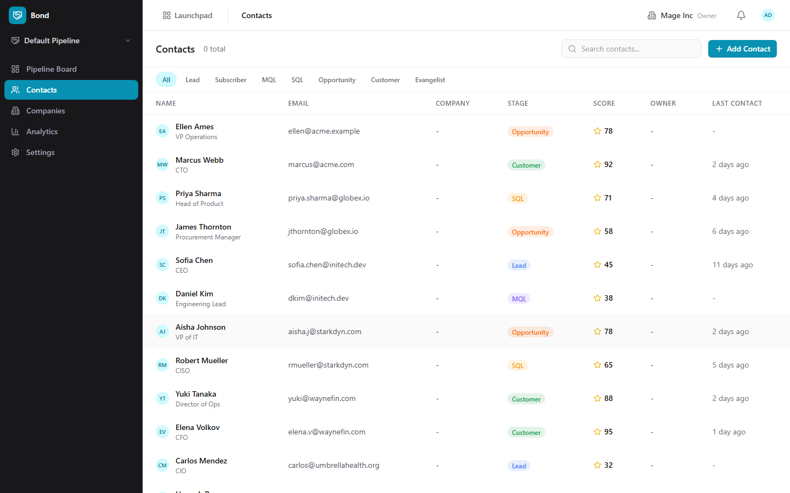
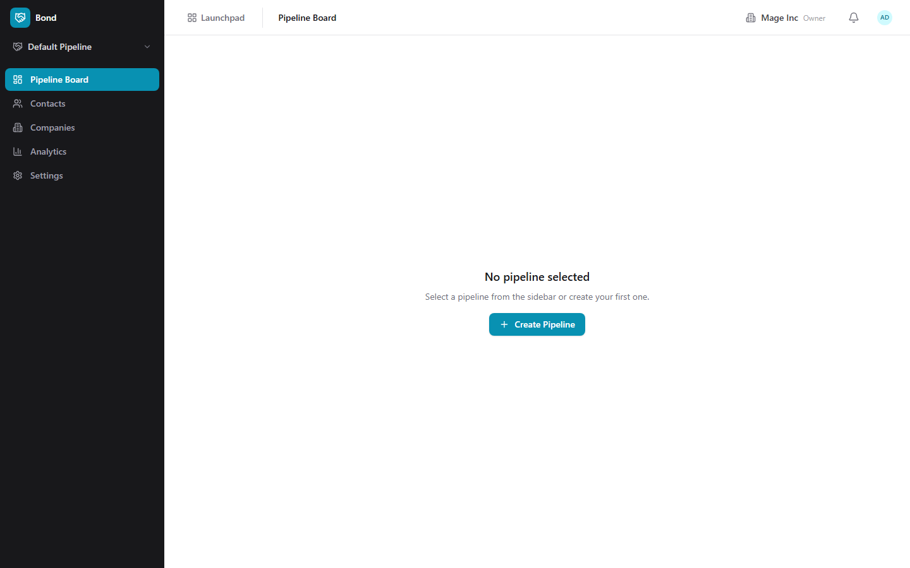
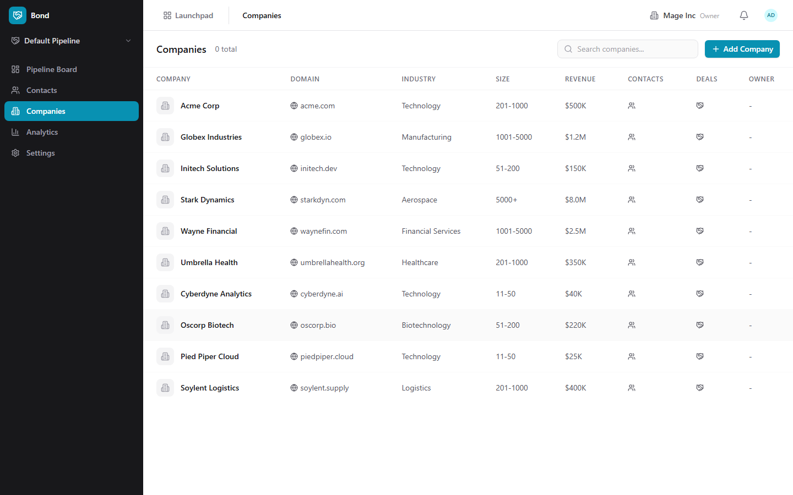

# Bond (CRM) Guide

# Bond - CRM

Bond is BigBlueBam's customer relationship management app for tracking contacts, companies, deals, and sales pipeline activity.

## Key Features

- **Pipeline Board** with drag-and-drop deal cards across customizable pipeline stages
- **Contact and Company Management** with detailed profiles, activity timelines, and relationship mapping
- **Deal Tracking** with value, probability, expected close date, and stage-based rotting detection
- **Analytics** with pipeline value, conversion rates, deal velocity, and revenue forecasting
- **Custom Fields** and lead scoring rules configurable per pipeline
- **Stale Deal Detection** that flags deals stuck in a stage beyond a configurable threshold

## Integrations

Bond contacts feed into Blast email campaign segments. Deal events trigger Bolt automations (e.g., notify the team when a deal closes). Activity timelines show cross-product context from Banter messages and Bam tasks. Bench dashboards can query Bond data for sales reporting.

## Getting Started

Open Bond from the Launchpad. You start on the pipeline board. Create your first pipeline with stages (e.g., Lead, Qualified, Proposal, Closed Won), then add contacts, companies, and deals. Drag deals between stages as they progress. Use the analytics page to track pipeline health and deal velocity.

## Walkthrough

### Pipeline

### Contacts

### Deal Detail

### Analytics

### Companies

## MCP Tools

# bond MCP Tools

| Tool | Description | Parameters |
|------|-------------|------------|
| `bond_close_deal_lost` | Mark a deal as lost. Sets closed_at, close_reason, and optionally the competitor who won. Emits a deal.lost event for Bolt automations.  | `id`, `close_reason`, `lost_to_competitor` |
| `bond_close_deal_won` | Mark a deal as won. Sets closed_at, moves to the won stage, and emits a deal.won event for Bolt automations.  | `id`, `close_reason` |
| `bond_create_company` | Create a new CRM company. | `domain`, `industry`, `size_bucket`, `annual_revenue`, `phone`, `website`, `address_line1`, `address_line2`, `city`, `state_region`, `postal_code`, `country`, `owner_id`, `custom_fields` |
| `bond_create_contact` | Create a new CRM contact with identity, classification, and optional company association.  | `first_name`, `last_name`, `email`, `phone`, `title`, `lifecycle_stage`, `lead_source`, `owner_id`, `company_id`, `address_line1`, `address_line2`, `city`, `state_region`, `postal_code`, `country`, `custom_fields` |
| `bond_create_deal` | Create a new deal in a pipeline.  | `pipeline_id`, `stage_id`, `value`, `currency`, `expected_close_date`, `probability_pct`, `owner_id`, `company_id`, `contact_ids`, `custom_fields` |
| `bond_get_company` | Get full company detail including associated contacts, deals, and recent activities. | `id` |
| `bond_get_contact` | Get full contact detail including associated companies, deals, and recent activities. | `id` |
| `bond_get_deal` | Get full deal detail including associated contacts, activities, and stage change history. | `id` |
| `bond_get_forecast` | Get revenue forecast from weighted pipeline value, broken into 30/60/90 day buckets based on expected close dates. | `pipeline_id` |
| `bond_get_pipeline_summary` | Get pipeline summary with deal count, total value, and weighted value per stage. | `pipeline_id` |
| `bond_get_stale_deals` | List deals that have exceeded the rotting threshold for their current pipeline stage. Useful for stale deal follow-up automations. | `pipeline_id`, `owner_id`, `limit` |
| `bond_list_companies` | Search and filter CRM companies with pagination. | `search`, `industry`, `size_bucket`, `owner_id`, `sort`, `cursor`, `limit` |
| `bond_list_contacts` | Search and filter CRM contacts with pagination. Supports lifecycle stage, owner, company, lead score range, and custom field filters. | `lifecycle_stage`, `owner_id`, `company_id`, `lead_source`, `lead_score_min`, `lead_score_max`, `search`, `sort`, `cursor`, `limit` |
| `bond_list_deals` | Search and filter CRM deals with pagination. Supports pipeline, stage, owner, value range, and stale flag filters. | `pipeline_id`, `stage_id`, `owner_id`, `company_id`, `contact_id`, `value_min`, `value_max`, `expected_close_before`, `expected_close_after`, `is_open`, `sort`, `cursor`, `limit` |
| `bond_log_activity` | Log an activity (note, call, email, meeting, task, etc.) against a contact, deal, or both.  | `activity_type`, `contact_id`, `deal_id`, `company_id`, `subject`, `body`, `performed_at`, `metadata` |
| `bond_merge_contacts` | Merge duplicate contacts. The target contact absorbs the source contact\ | `target_id`, `source_id` |
| `bond_move_deal_stage` | Move a deal to a new pipeline stage. Records stage history and emits a deal.stage_changed event for Bolt automations.  | `id`, `stage_id` |
| `bond_score_lead` | Trigger lead score recalculation for a specific contact. Evaluates all enabled scoring rules and updates the cached lead_score on the contact. | `contact_id` |
| `bond_search_contacts` | Full-text search across contact name, email, and phone. Returns contacts ranked by lead score. | `query`, `limit` |
| `bond_update_company` | Update an existing company. Provide only the fields to change. | `id`, `domain`, `industry`, `size_bucket`, `annual_revenue`, `phone`, `website`, `address_line1`, `address_line2`, `city`, `state_region`, `postal_code`, `country`, `owner_id`, `custom_fields` |
| `bond_update_contact` | Update an existing contact. Provide only the fields to change.  | `id`, `first_name`, `last_name`, `email`, `phone`, `title`, `lifecycle_stage`, `lead_source`, `owner_id`, `address_line1`, `address_line2`, `city`, `state_region`, `postal_code`, `country`, `custom_fields` |
| `bond_update_deal` | Update an existing deal. Provide only the fields to change.  | `id`, `value`, `currency`, `expected_close_date`, `probability_pct`, `owner_id`, `company_id`, `custom_fields` |

## Related Apps

- [Bench (Analytics)](../bench/guide.md)
- [Blank (Forms)](../blank/guide.md)
- [Blast (Email Campaigns)](../blast/guide.md)
- [Board (Visual Collaboration)](../board/guide.md)
- [Bolt (Workflow Automation)](../bolt/guide.md)
- [Book (Scheduling)](../book/guide.md)
