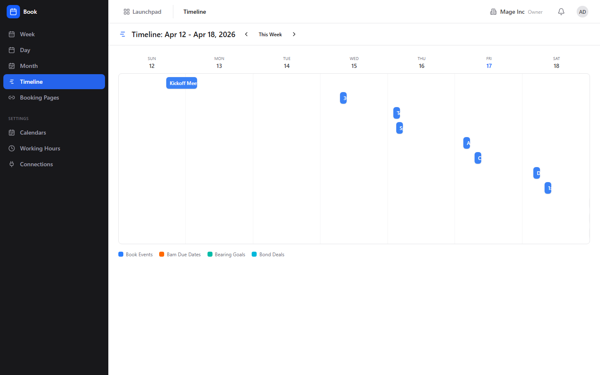
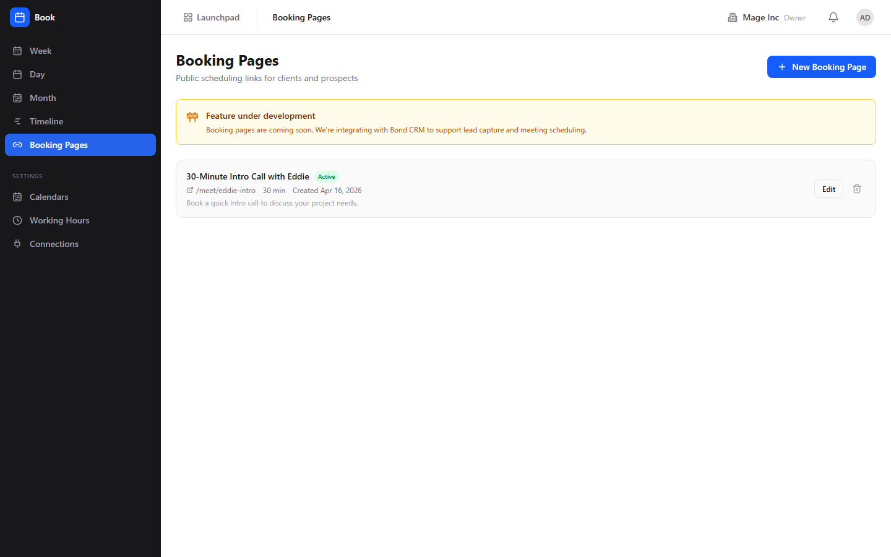
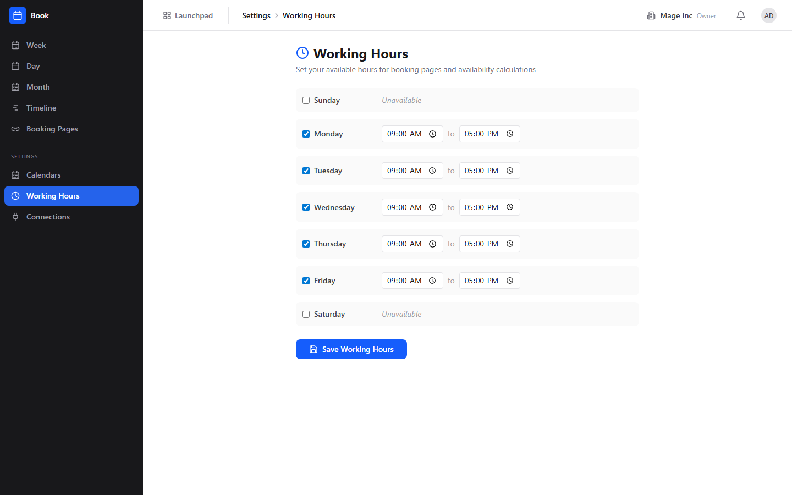

# Book (Scheduling) Guide

# Book - Scheduling & Calendar

Book is BigBlueBam's scheduling and calendar app for managing events, booking pages, and team availability with week, day, month, and timeline views.

## Key Features

- **Calendar Views** in week, day, month, and timeline layouts with drag-to-create and drag-to-resize events
- **Booking Pages** that generate public scheduling links for external contacts to book time with you
- **Working Hours** configuration for each team member to define availability windows
- **Calendar Connections** for syncing with external calendars (Google Calendar, Outlook) via OAuth
- **Event Detail** with attendees, location, video link, notes, and recurrence rules

## Integrations

Book booking pages can be linked from Bond contact records for scheduling sales calls. Bolt automations can trigger when events are created or cancelled. Meeting pages are served via a public /meet/ endpoint that works without authentication.

## Getting Started

Open Book from the Launchpad. Set your working hours in settings, then optionally connect an external calendar. Create events on the calendar or set up a booking page to share with external contacts. Use the timeline view to see team-wide availability at a glance.

## Walkthrough

### Week View

### Month View

### Day View

### Timeline

### Booking Pages

### Working Hours

## MCP Tools

# book MCP Tools

| Tool | Description | Parameters |
|------|-------------|------------|
| `book_cancel_event` | Cancel a calendar event (sets status to cancelled).  | `id` |
| `book_create_booking_page` | Create a public booking page (scheduling link). | `slug`, `title`, `duration_minutes` |
| `book_create_event` | Create a calendar event with optional attendees.  | `calendar_id`, `title`, `start_at`, `end_at`, `location`, `meeting_url`, `all_day`, `attendees`, `email`, `user_id` |
| `book_find_meeting_time` | AI-assisted: find optimal meeting times for a set of attendees. Returns up to 3 suggested slots. Each entry in  | `user_ids`, `duration_minutes`, `start_date`, `end_date` |
| `book_get_availability` | Get available time slots for a user in a date range.  | `user_id`, `start_date`, `end_date` |
| `book_get_team_availability` | Get available time slots for multiple users to find common free times. Each entry in  | `user_ids`, `start_date`, `end_date` |
| `book_get_timeline` | Get aggregated cross-product timeline with Book events, Bam tasks, sprints, and more. | `start_date`, `end_date` |
| `book_list_events` | List calendar events in a date range, optionally filtered by calendar IDs. | `start_after`, `start_before`, `calendar_ids`, `limit` |
| `book_rsvp_event` | Accept, decline, or mark tentative for a calendar event on behalf of the current user.  | `event_id`, `response_status` |
| `book_update_event` | Update an existing calendar event.  | `id`, `title`, `start_at`, `end_at`, `location`, `status` |
