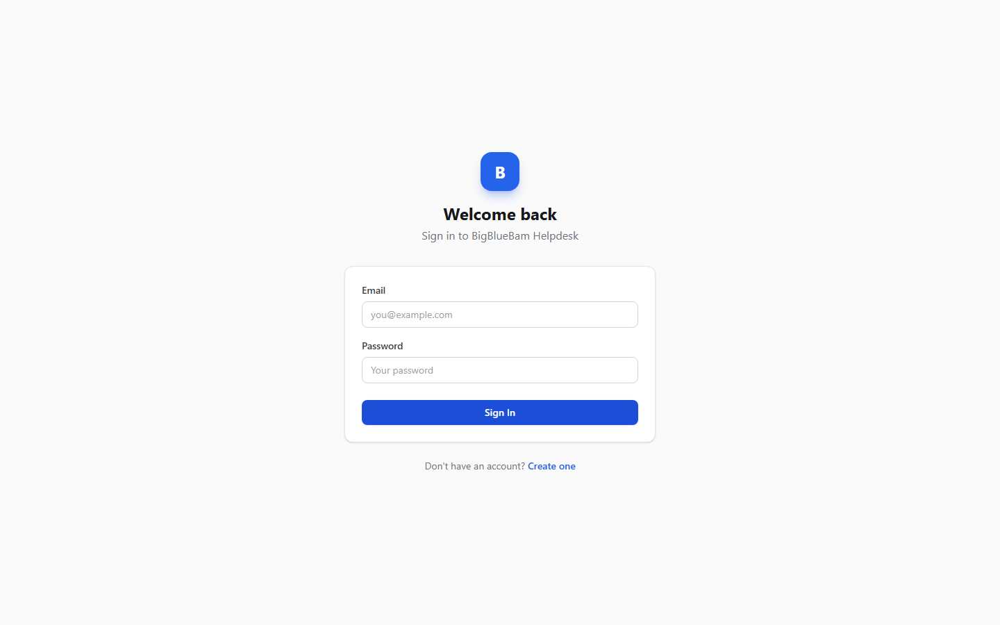
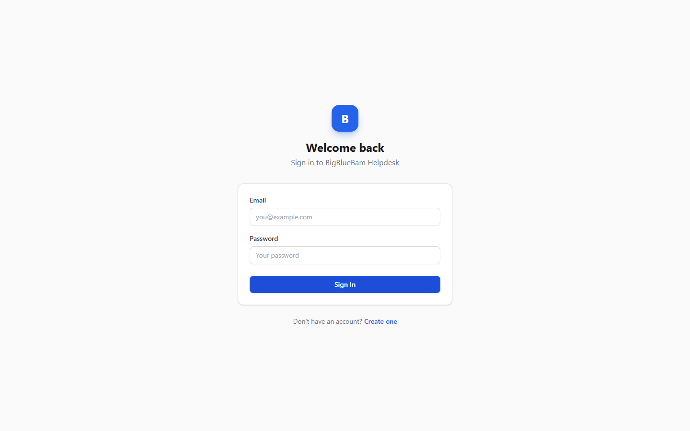

# Helpdesk (Support Portal) Guide

# Helpdesk - Support Portal

Helpdesk is BigBlueBam's customer-facing support portal where end users submit and track support tickets, and agents manage conversations through to resolution.

## Key Features

- **Ticket Submission** with categories, priority levels, file attachments, and rich text descriptions
- **Conversation Threading** with back-and-forth messaging between the submitter and support agents
- **Multi-Tenant Routing** with path-based org and project scoping (/helpdesk/org-slug/project-slug/)
- **Email Verification** for new users submitting tickets without a BigBlueBam account
- **Browser Notifications** for real-time updates when agents respond to tickets
- **Offline Support** with mutation retry and an offline banner for unreliable connections

## Integrations

Helpdesk tickets appear in the Bam agent queue for internal teams using the main project management app. Bolt automations can trigger on ticket status changes. The Helpdesk API shares the BigBlueBam authentication system so agents use their existing credentials.

## Getting Started

End users navigate to the Helpdesk URL for their organization (e.g., /helpdesk/your-org/). From there they can create an account or log in, then submit a ticket describing their issue. Agents see incoming tickets in the queue and respond through the conversation thread. Ticket status flows from open through in-progress to resolved.

## Walkthrough

### Portal

### Ticket List

### New Ticket

### Ticket Detail

### Knowledge Base

## MCP Tools

# helpdesk MCP Tools

| Tool | Description | Parameters |
|------|-------------|------------|
| `get_ticket` | Get detailed information about a helpdesk ticket including messages | `ticket_id` |
| `helpdesk_get_public_settings` | Get public helpdesk settings (no auth required). Returns email verification requirement, categories, and welcome message. | none |
| `helpdesk_get_settings` | Get full helpdesk configuration. Requires admin authentication — the caller\ | none |
| `helpdesk_get_ticket_by_number` | Resolve a helpdesk ticket by its human-readable ticket number (e.g. 1234 or #1234). Leading  | `number` |
| `helpdesk_search_tickets` | Fuzzy search helpdesk tickets by subject and body within the caller\ | `query`, `status`, `assignee_id` |
| `helpdesk_set_default_project` | Set the default project for incoming helpdesk tickets for a specific organization. Identifies the org by slug (e.g.  | `org_slug`, `project_slug` |
| `helpdesk_update_settings` | Update helpdesk settings. Requires admin authentication. | `categories`, `welcome_message`, `require_email_verification`, `allowed_email_domains` |
| `list_tickets` | List helpdesk tickets with optional filters | `status`, `assignee_id`, `client_id`, `cursor`, `limit` |
| `reply_to_ticket` | Send a message on a helpdesk ticket (public reply or internal note) | `ticket_id`, `body`, `is_internal` |
| `update_ticket_status` | Update the status of a helpdesk ticket | `ticket_id`, `status` |
