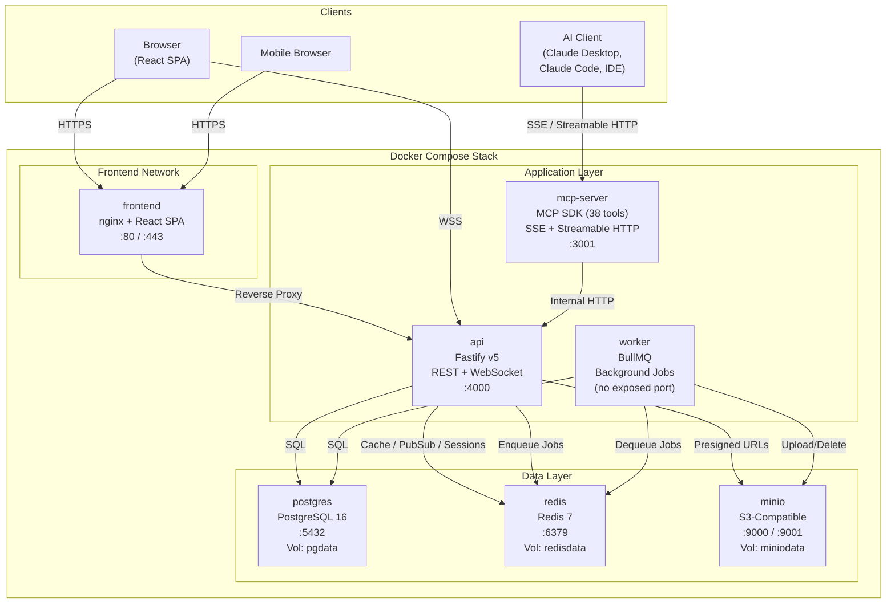
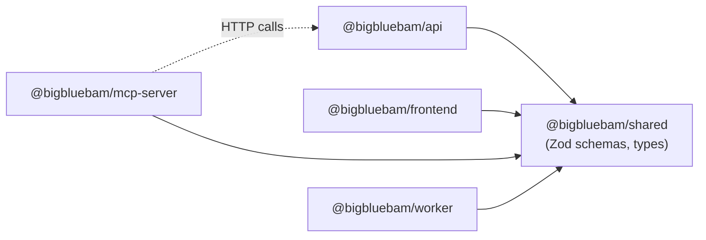
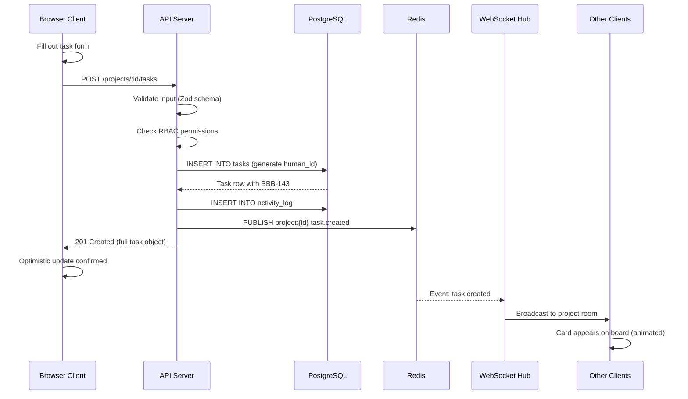
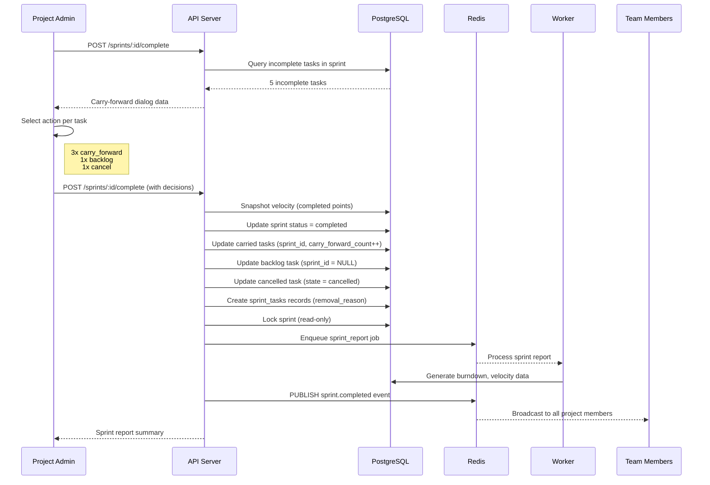
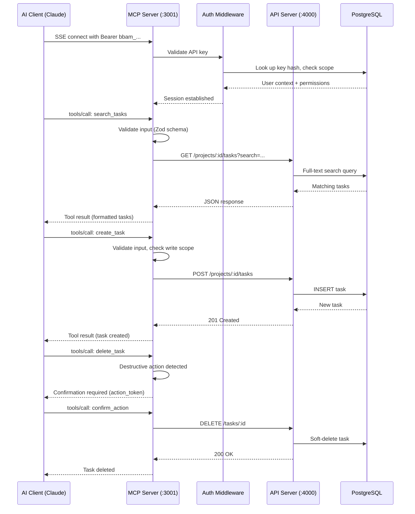
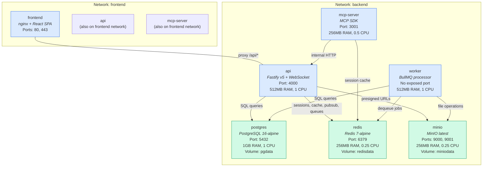
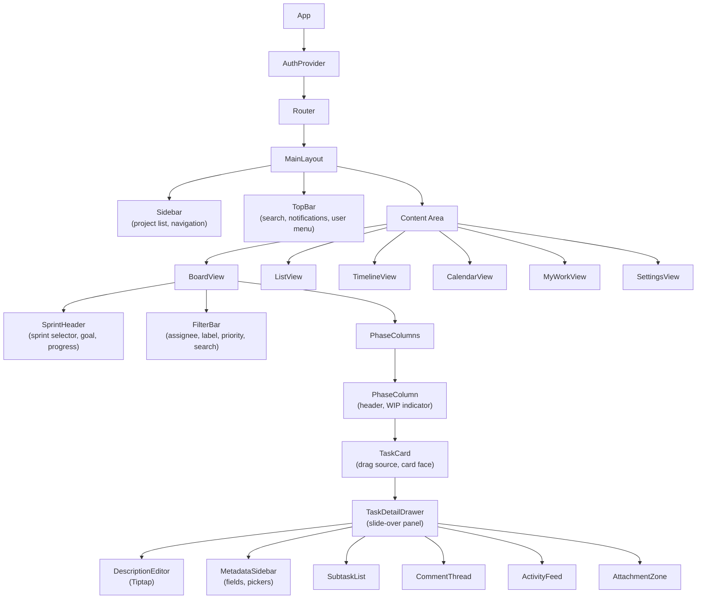
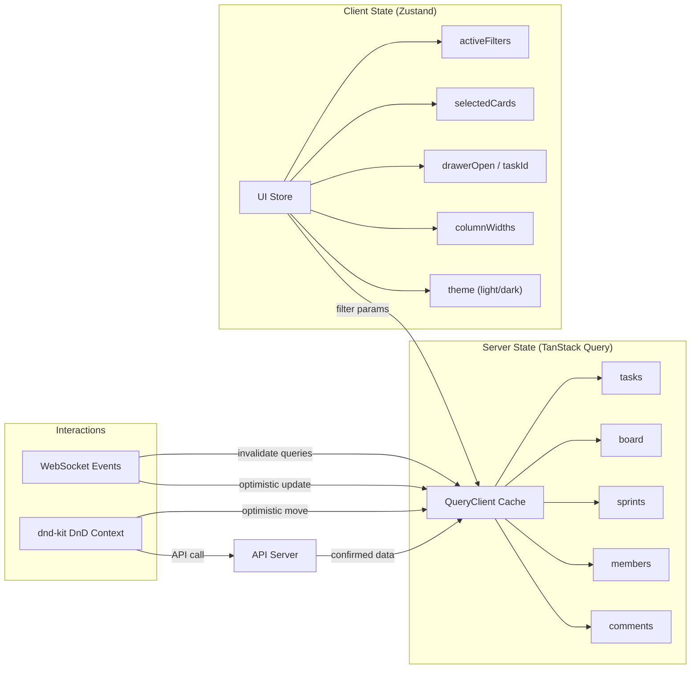
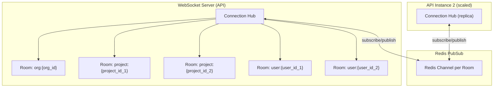

# Architecture Overview

BigBlueBam is a Docker-native monorepo application with a clear separation between application services (stateless, horizontally scalable) and data services (stateful, vertically scalable or replaceable with managed cloud equivalents).

---

## High-Level System Architecture



---

## Monorepo Structure

BigBlueBam uses **Turborepo** for task orchestration and **pnpm workspaces** for dependency management.

```
BigBlueBam/
|-- apps/
|   |-- api/              Fastify REST API + WebSocket server (~63 source files)
|   |   |-- src/
|   |   |   |-- routes/       23 route files grouped by domain
|   |   |   |-- services/     Business logic layer (auth, org, project, task, activity, realtime)
|   |   |   |-- db/
|   |   |   |   |-- schema/   24 Drizzle table definitions
|   |   |   |   +-- migrations/
|   |   |   |-- middleware/   Auth (authorize.ts), error handling
|   |   |   |-- plugins/      Fastify plugin registrations
|   |   |   |-- utils/        Shared utilities
|   |   |   |-- cli.ts        CLI commands (create-admin)
|   |   |   |-- server.ts     Entry point
|   |   |   +-- migrate.ts    Migration runner
|   |   |-- Dockerfile
|   |   +-- package.json
|   |
|   |-- frontend/         React SPA (~55 source files)
|   |   |-- src/
|   |   |   |-- components/
|   |   |   |   |-- auth/       Login/register forms
|   |   |   |   |-- board/      Board view, phase columns, task cards, filter bar, swimlanes, saved views
|   |   |   |   |-- common/     Reusable UI: Button, Dialog, DatePicker, CommandPalette, KeyboardShortcutsOverlay
|   |   |   |   |-- import/     Import dialog (CSV, Trello, Jira, GitHub)
|   |   |   |   |-- layout/     AppLayout, Sidebar
|   |   |   |   |-- tasks/      Task detail drawer, create dialog, template manager/picker
|   |   |   |   +-- views/      Calendar, List, Timeline, Workload views
|   |   |   |-- hooks/        useKeyboardShortcuts, useProjects, useRealtime, useSprints, useTasks, useReducedMotion
|   |   |   |-- stores/       Zustand stores (auth, board)
|   |   |   |-- pages/        Dashboard, Board, MyWork, Settings, AuditLog, Login, Register
|   |   |   |-- lib/          Utilities, constants
|   |   |   +-- app.tsx       Root component
|   |   |-- Dockerfile
|   |   +-- package.json
|   |
|   |-- mcp-server/       Model Context Protocol server (38 tools)
|   |   |-- src/
|   |   |   |-- tools/        10 tool modules (project, board, sprint, task, comment, member, report, import, template, utility)
|   |   |   |-- resources/    7 MCP resource providers
|   |   |   |-- prompts/      4 prompt templates (sprint planning, standup, retro, task breakdown)
|   |   |   |-- middleware/    API client, rate limiter
|   |   |   +-- server.ts     Entry point
|   |   |-- Dockerfile
|   |   +-- package.json
|   |
|   +-- worker/           Background job processor
|       |-- src/
|       |   |-- jobs/         Job handlers (email, notification, export, sprint-close)
|       |   |-- utils/
|       |   +-- worker.ts     Entry point
|       |-- Dockerfile
|       +-- package.json
|
|-- packages/
|   +-- shared/           Shared code between all apps
|       |-- src/
|       |   |-- schemas/      Zod validation schemas
|       |   |-- types/        TypeScript type definitions
|       |   +-- constants/    Shared constants and enums
|       +-- package.json
|
|-- infra/
|   |-- postgres/         init.sql for database setup
|   |-- nginx/            nginx.conf, TLS certificates
|   +-- helm/             Kubernetes Helm chart
|       +-- bigbluebam/
|
|-- scripts/                  Utility scripts (seed-frndo.js)
|-- docker-compose.yml        Production stack (7 services + 1 migration one-shot)
|-- docker-compose.dev.yml    Development overrides
|-- turbo.json                Turborepo pipeline config
|-- pnpm-workspace.yaml       Workspace definitions
|-- biome.json                Formatter/linter config
+-- package.json              Root scripts
```

### Dependency Graph



---

## Tech Stack Rationale

### Frontend

| Technology | Why |
|---|---|
| **React 19** | Concurrent rendering, transitions API, massive ecosystem, strong TypeScript support |
| **Motion (v11+)** | Spring-physics animations, layout animations for card reflow, drag gesture support |
| **TanStack Query v5** | Server state cache with optimistic updates, background refetching, infinite queries |
| **Zustand** | Minimal client-side state management without boilerplate (UI state, filter state) |
| **dnd-kit** | Accessible drag-and-drop with sortable lists and multi-container support |
| **TailwindCSS v4** | Utility-first CSS, design token support, fast iteration |
| **Radix UI** | Unstyled, accessible primitives (dialogs, dropdowns, tooltips) |
| **Tiptap** | ProseMirror-based rich text editor for task descriptions and comments |
| **React Hook Form + Zod** | Performant forms with shared validation schemas from `@bigbluebam/shared` |

### Backend

| Technology | Why |
|---|---|
| **Node.js 22 LTS** | TypeScript-native, shared language with frontend, large ecosystem |
| **Fastify v5** | High performance, schema-based validation, plugin architecture, excellent DX |
| **Drizzle ORM** | Type-safe, SQL-first ORM with excellent migration tooling |
| **Zod** | Runtime validation shared with frontend via `@bigbluebam/shared` |
| **Socket.IO / WebSocket** | Room-based real-time broadcasting with Redis PubSub for horizontal scaling |
| **BullMQ** | Redis-backed job queue for background processing (email, exports, analytics) |

### Data Layer

| Technology | Why |
|---|---|
| **PostgreSQL 16** | Row-level security, JSONB for custom fields, partitioning for activity logs, full-text search |
| **Redis 7** | Session store, cache, pub/sub backbone, BullMQ queue backend |
| **MinIO** | S3-compatible object storage, drop-in replacement for AWS S3/Cloudflare R2 |

---

## Data Flow Diagrams

### User Creates a Task



### Sprint Close with Carry-Forward Ceremony



### MCP Tool Call Flow



---

## Container Architecture



### Docker Networks

| Network | Services | Purpose |
|---|---|---|
| `frontend` | frontend, api, mcp-server | External-facing services |
| `backend` | api, mcp-server, worker, postgres, redis, minio | Internal service communication |

### Volumes

| Volume | Service | Contains |
|---|---|---|
| `pgdata` | postgres | Database files |
| `redisdata` | redis | AOF persistence |
| `miniodata` | minio | Uploaded attachments, avatars |

---

## Client Architecture

### React Component Hierarchy



---

## State Management

BigBlueBam separates client state (UI concerns) from server state (API data).



### How It Works

1. **TanStack Query** manages all API data. Queries are keyed by endpoint and parameters. Data is cached, background-refetched, and garbage-collected automatically.

2. **Zustand** stores hold UI-only state: which filters are active, which cards are selected, whether the detail drawer is open, column widths, and theme preference.

3. **Optimistic updates**: When a user drags a card, TanStack Query immediately updates the cache (card moves visually). The API call fires in the background. On success, the cache is updated with server-confirmed data. On failure, the cache rolls back and the card snaps back with a spring animation.

4. **WebSocket events** trigger query invalidation. When another user creates a task, the `task.created` event causes TanStack Query to refetch the board data, and the new card appears with an entrance animation.

---

## Real-Time Architecture

### WebSocket Rooms



### Event Flow

When a user performs an action:

1. The API handles the REST request and writes to the database.
2. The API publishes an event to Redis PubSub on the appropriate channel (e.g., `project:{id}`).
3. All API instances subscribed to that channel receive the event.
4. Each API instance broadcasts the event to all WebSocket clients in the matching room.
5. Clients receive the event and update their local state (TanStack Query cache invalidation or direct cache update).

### Event Types

| Event | Room | Payload |
|---|---|---|
| `task.created` | `project:{id}` | Full task object |
| `task.updated` | `project:{id}` | Task ID + changed fields (delta) |
| `task.moved` | `project:{id}` | Task ID, old phase, new phase, new position |
| `task.deleted` | `project:{id}` | Task ID |
| `task.reordered` | `project:{id}` | Phase ID + ordered task IDs |
| `comment.added` | `project:{id}` | Comment object |
| `sprint.status_changed` | `project:{id}` | Sprint ID + new status |
| `phase.updated` | `project:{id}` | Phase object |
| `user.presence` | `project:{id}` | User ID + status (online/idle/offline) |
| `notification` | `user:{id}` | Notification object |

### Conflict Resolution

- **Field updates**: Last-write-wins with `updated_at` stale check. If the server detects a stale update (client's `updated_at` does not match), it returns HTTP 409. The client refetches and re-applies.
- **Board position conflicts**: When two users move cards simultaneously, the server determines the final position order and broadcasts an authoritative `task.reordered` event. Both clients reconcile with an animated reflow.
- **Presence indicators**: User avatars appear on task cards currently being edited by another user, with a colored ring and tooltip.
