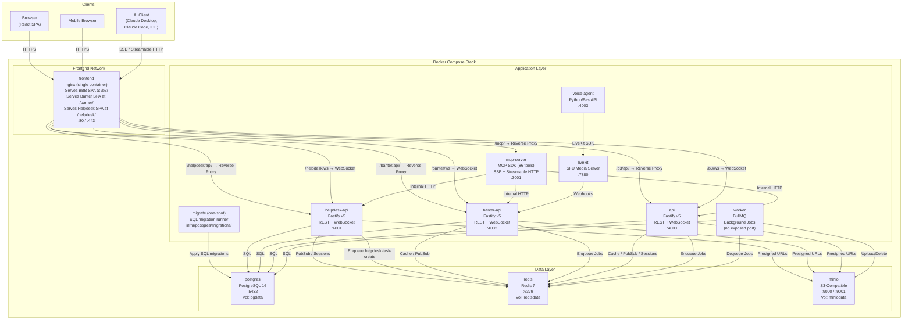
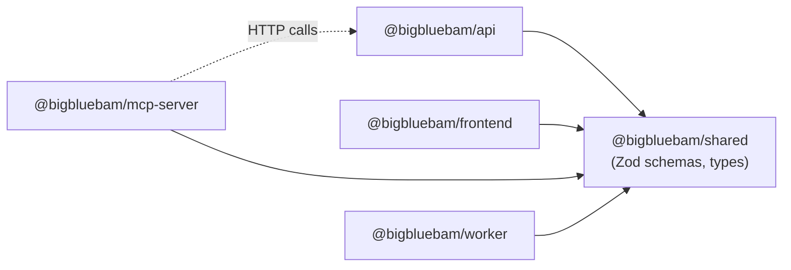
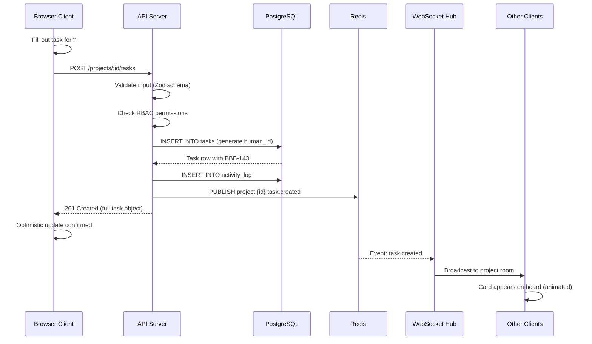
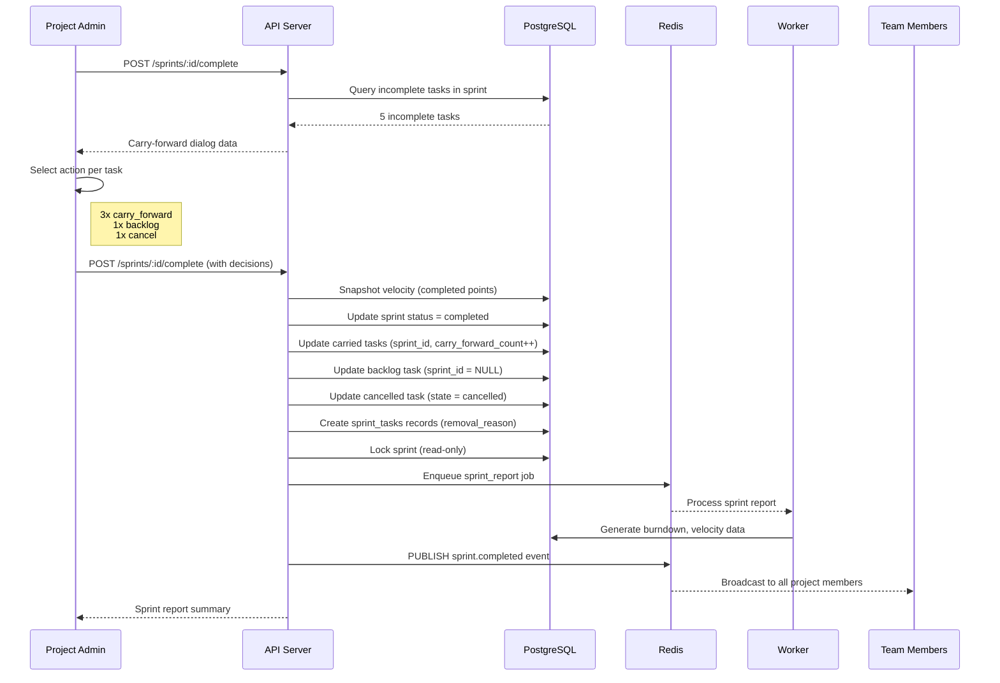
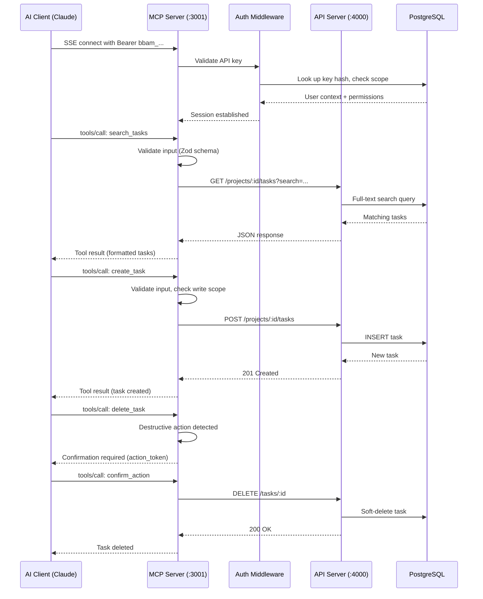
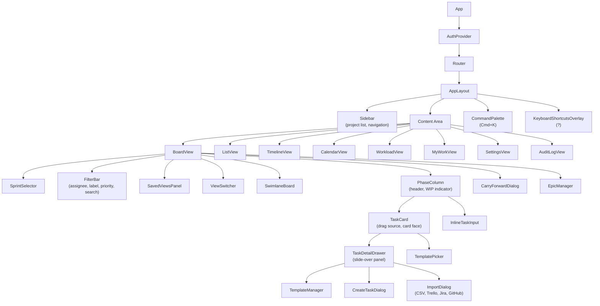
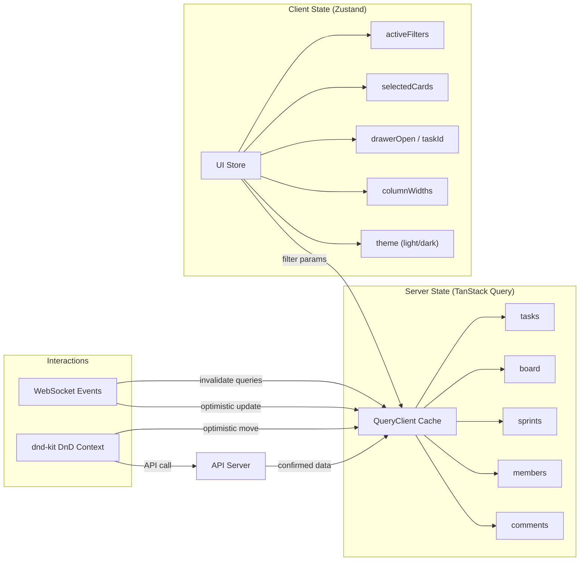
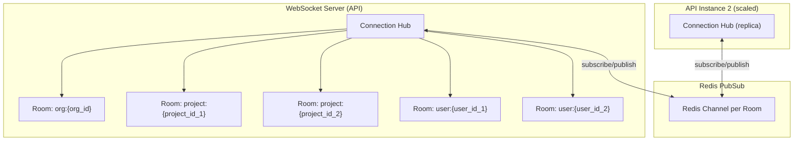
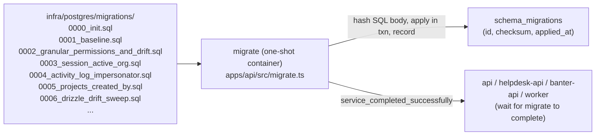

# Architecture Overview

BigBlueBam is a Docker-native monorepo application with a clear separation between application services (stateless, horizontally scalable) and data services (stateful, vertically scalable or replaceable with managed cloud equivalents).

---

## High-Level System Architecture



---

## Monorepo Structure

BigBlueBam uses **Turborepo** for task orchestration and **pnpm workspaces** for dependency management.

```
BigBlueBam/
|-- apps/
|   |-- api/              Fastify REST API + WebSocket server (~63 source files)
|   |   |-- src/
|   |   |   |-- routes/       23 route files grouped by domain (*.routes.ts)
|   |   |   |-- services/     Business logic (auth, org, project, task, activity, realtime)
|   |   |   |-- db/
|   |   |   |   |-- schema/   24 Drizzle table definitions (one file per table)
|   |   |   |   +-- migrations/
|   |   |   |-- middleware/   authorize.ts, error-handler.ts
|   |   |   |-- plugins/      Fastify plugins (auth, redis, websocket)
|   |   |   |-- utils/        Shared utilities
|   |   |   |-- cli.ts        CLI commands (create-admin --email --password --name --org)
|   |   |   |-- server.ts     Entry point
|   |   |   +-- migrate.ts    Migration runner
|   |   |-- Dockerfile
|   |   +-- package.json
|   |
|   |-- frontend/         React SPA (~55 source files)
|   |   |-- src/
|   |   |   |-- components/
|   |   |   |   |-- auth/       Login/register forms
|   |   |   |   |-- board/      Board view, phase columns, task cards, filter bar, swimlanes, saved views
|   |   |   |   |-- common/     Reusable UI: Button, Dialog, DatePicker, CommandPalette, KeyboardShortcutsOverlay
|   |   |   |   |-- import/     Import dialog (CSV, Trello, Jira, GitHub)
|   |   |   |   |-- layout/     AppLayout, Sidebar
|   |   |   |   |-- tasks/      Task detail drawer, create dialog, template manager/picker
|   |   |   |   +-- views/      Calendar, List, Timeline, Workload views
|   |   |   |-- hooks/        useKeyboardShortcuts, useProjects, useRealtime, useSprints, useTasks, useReducedMotion
|   |   |   |-- stores/       Zustand stores (auth, board)
|   |   |   |-- pages/        Dashboard, Board, MyWork, Settings, AuditLog, Login, Register
|   |   |   |-- lib/          Utilities, constants
|   |   |   +-- app.tsx       Root component
|   |   |-- Dockerfile
|   |   +-- package.json
|   |
|   |-- banter-api/       Banter team messaging API (~45 source files)
|   |   |-- src/
|   |   |   |-- routes/       15 route files (channel, dm, message, thread, reaction, pin, bookmark, preference, file, admin, user-group, search, call, webhook, internal)
|   |   |   |-- services/     Realtime, LiveKit token, voice agent client, notification queue, activity feed, audit
|   |   |   |-- db/
|   |   |   |   +-- schema/   18 Drizzle table definitions (banter_ prefix)
|   |   |   |-- plugins/      Auth (shared session), Redis
|   |   |   |-- ws/           WebSocket handler (typing, presence, room subscription)
|   |   |   +-- server.ts     Entry point
|   |   |-- Dockerfile
|   |   +-- package.json
|   |
|   |-- banter/           Banter React SPA (~39 source files)
|   |   |-- src/
|   |   |   |-- components/
|   |   |   |   |-- calls/      CallPanel, IncomingCallOverlay, VideoGrid, AgentTextSidebar, TranscriptView, HuddleBanner
|   |   |   |   |-- channels/   ChannelSettings
|   |   |   |   |-- common/     UserProfilePopover
|   |   |   |   |-- messages/   MessageTimeline, MessageItem, MessageCompose, TypingIndicator
|   |   |   |   |-- sidebar/    BanterSidebar
|   |   |   |   +-- threads/    ThreadPanel
|   |   |   |-- hooks/        useCall, useChannels, useMessages, usePresence, useRealtime, useTyping, useUnread
|   |   |   |-- stores/       Zustand stores (auth, channel — incl. call state, drafts)
|   |   |   |-- pages/        ChannelView, ChannelBrowser, Search, Bookmarks, Preferences, Admin
|   |   |   |-- lib/          API client, markdown renderer, WebSocket manager, utilities
|   |   |   +-- app.tsx       Root component with client-side routing
|   |   +-- package.json
|   |
|   |-- voice-agent/      AI voice agent (Python/FastAPI)
|   |   |-- src/
|   |   |   +-- api.py        Spawn/despawn endpoints, health check
|   |   |-- Dockerfile
|   |   +-- requirements.txt
|   |
|   |-- mcp-server/       Model Context Protocol server (86 tools)
|   |   |-- src/
|   |   |   |-- tools/        12 tool modules (project, board, sprint, task, comment, member, report, import, template, utility, helpdesk, banter)
|   |   |   |-- resources/    MCP resource providers (BBB + Banter)
|   |   |   |-- prompts/      8 prompt templates (sprint planning, standup, retro, task breakdown + 4 Banter prompts)
|   |   |   |-- middleware/    API client, rate limiter, audit logger
|   |   |   +-- server.ts     Entry point
|   |   |-- Dockerfile
|   |   +-- package.json
|   |
|   |-- worker/           Background job processor
|   |   |-- src/
|   |   |   |-- jobs/         7 job handlers (email, notification, export, sprint-close, banter-notification, banter-retention, helpdesk-task-create)
|   |   |   |-- utils/
|   |   |   +-- worker.ts     Entry point
|   |   |-- Dockerfile
|   |   +-- package.json
|   |
|   |-- helpdesk-api/     Helpdesk Fastify REST API + WebSocket (internal :4001)
|   |   |-- src/
|   |   |   |-- routes/       Ticket, agent, auth, file routes
|   |   |   |-- services/     task-queue.ts (BullMQ producer for helpdesk-task-create)
|   |   |   |-- ws/           handler.ts (ticket room realtime, typing indicators)
|   |   |   |-- lib/          broadcast.ts (Redis PubSub publisher)
|   |   |   +-- server.ts     Entry point
|   |   +-- Dockerfile
|   |
|   +-- helpdesk/         Helpdesk customer portal React SPA
|       |-- src/
|       |   |-- lib/          websocket.ts (auto-reconnect client), metrics.ts, api.ts
|       |   +-- ...
|       +-- Dockerfile
|
|-- packages/
|   +-- shared/           Shared code between all apps
|       |-- src/
|       |   |-- schemas/      Zod validation schemas
|       |   |-- types/        TypeScript type definitions
|       |   +-- constants/    Shared constants and enums
|       +-- package.json
|
|-- infra/
|   |-- postgres/
|   |   +-- migrations/       Forward-only numbered SQL migrations (0000_init.sql, 0001_baseline.sql, ...)
|   |-- nginx/            nginx.conf, TLS certificates
|   +-- helm/             Kubernetes Helm chart
|       +-- bigbluebam/
|
|-- scripts/                  Utility scripts (seed-frndo.js)
|-- docker-compose.yml        Production stack (8 services + 1 migration one-shot)
|-- docker-compose.dev.yml    Development overrides
|-- turbo.json                Turborepo pipeline config
|-- pnpm-workspace.yaml       Workspace definitions
|-- biome.json                Formatter/linter config
+-- package.json              Root scripts
```

### Dependency Graph



---

## Tech Stack Rationale

### Frontend

| Technology | Why |
|---|---|
| **React 19** | Concurrent rendering, transitions API, massive ecosystem, strong TypeScript support |
| **Motion (v11+)** | Spring-physics animations, layout animations for card reflow, drag gesture support |
| **TanStack Query v5** | Server state cache with optimistic updates, background refetching, infinite queries |
| **Zustand** | Minimal client-side state management without boilerplate (UI state, filter state) |
| **dnd-kit** | Accessible drag-and-drop with sortable lists and multi-container support |
| **TailwindCSS v4** | Utility-first CSS, design token support, fast iteration |
| **Radix UI** | Unstyled, accessible primitives (dialogs, dropdowns, tooltips) |
| **Tiptap** | ProseMirror-based rich text editor for task descriptions and comments |
| **React Hook Form + Zod** | Performant forms with shared validation schemas from `@bigbluebam/shared` |

### Backend

| Technology | Why |
|---|---|
| **Node.js 22 LTS** | TypeScript-native, shared language with frontend, large ecosystem |
| **Fastify v5** | High performance, schema-based validation, plugin architecture, excellent DX |
| **Drizzle ORM** | Type-safe, SQL-first ORM with excellent migration tooling |
| **Zod** | Runtime validation shared with frontend via `@bigbluebam/shared` |
| **Socket.IO / WebSocket** | Room-based real-time broadcasting with Redis PubSub for horizontal scaling |
| **BullMQ** | Redis-backed job queue for background processing (email, exports, analytics) |

### Data Layer

| Technology | Why |
|---|---|
| **PostgreSQL 16** | Row-level security, JSONB for custom fields, partitioning for activity logs, full-text search |
| **Redis 7** | Session store, cache, pub/sub backbone, BullMQ queue backend |
| **MinIO** | S3-compatible object storage, drop-in replacement for AWS S3/Cloudflare R2 |

---

## Data Flow Diagrams

### User Creates a Task



### Sprint Close with Carry-Forward Ceremony



### MCP Tool Call Flow



---

## Container Architecture

```mermaid
graph TB
    subgraph "Network: frontend"
        FE["frontend<br/><i>nginx (single container)</i><br/>/b3/ → BBB SPA<br/>/banter/ → Banter SPA<br/>/helpdesk/ → Helpdesk SPA<br/>Ports: 80, 443"]
        API2["api (also on frontend network)"]
        HDAPI2["helpdesk-api (also on frontend network)"]
        BAPI2["banter-api (also on frontend network)"]
        MCP2["mcp-server (also on frontend network)"]
    end

    subgraph "Network: backend"
        API["api<br/><i>Fastify v5 + WebSocket</i><br/>Port: 4000"]
        HDAPI["helpdesk-api<br/><i>Fastify v5 + WebSocket</i><br/>Port: 4001"]
        BAPI["banter-api<br/><i>Fastify v5 + WebSocket</i><br/>Port: 4002"]
        MCP["mcp-server<br/><i>MCP SDK (86 tools)</i><br/>Port: 3001"]
        Worker["worker<br/><i>BullMQ processor (7 job types)</i><br/>No exposed port"]
        Migrate["migrate (one-shot)<br/><i>SQL migration runner</i><br/>service_completed_successfully dep<br/>for api, helpdesk-api, banter-api, worker"]
        PG["postgres<br/><i>PostgreSQL 16-alpine</i><br/>Port: 5432<br/>Volume: pgdata"]
        Redis["redis<br/><i>Redis 7-alpine</i><br/>Port: 6379<br/>Volume: redisdata"]
        MinIO["minio<br/><i>MinIO latest</i><br/>Ports: 9000, 9001<br/>Volume: miniodata"]
    end

    FE ---|"proxy /b3/*, /banter/*, /helpdesk/*, /mcp/*"| API
    FE --- HDAPI
    FE --- BAPI
    Migrate -->|"apply migrations, record in schema_migrations"| PG
    API -->|"SQL queries"| PG
    API -->|"sessions, cache, pubsub, queues"| Redis
    API -->|"presigned URLs"| MinIO
    HDAPI -->|"SQL queries"| PG
    HDAPI -->|"sessions, pubsub, queues"| Redis
    HDAPI -->|"presigned URLs"| MinIO
    BAPI -->|"SQL queries"| PG
    BAPI -->|"sessions, pubsub, queues"| Redis
    MCP -->|"internal HTTP"| API
    MCP -->|"internal HTTP"| HDAPI
    MCP -->|"internal HTTP"| BAPI
    Worker -->|"SQL queries"| PG
    Worker -->|"dequeue jobs"| Redis
    Worker -->|"file operations"| MinIO

    style FE fill:#dbeafe,stroke:#2563eb
    style API fill:#dbeafe,stroke:#2563eb
    style MCP fill:#dbeafe,stroke:#2563eb
    style Worker fill:#dbeafe,stroke:#2563eb
    style PG fill:#d1fae5,stroke:#059669
    style Redis fill:#d1fae5,stroke:#059669
    style MinIO fill:#d1fae5,stroke:#059669
```



### Docker Networks

| Network | Services | Purpose |
|---|---|---|
| `frontend` | frontend, api, helpdesk-api, banter-api, mcp-server | External-facing services |
| `backend` | api, helpdesk-api, banter-api, mcp-server, worker, migrate, postgres, redis, minio, livekit, voice-agent | Internal service communication |

### Volumes

| Volume | Service | Contains |
|---|---|---|
| `pgdata` | postgres | Database files |
| `redisdata` | redis | AOF persistence |
| `miniodata` | minio | Uploaded attachments, avatars |

---

## Client Architecture

### React Component Hierarchy



---

## State Management

BigBlueBam separates client state (UI concerns) from server state (API data).



### How It Works

1. **TanStack Query** manages all API data. Queries are keyed by endpoint and parameters. Data is cached, background-refetched, and garbage-collected automatically.

2. **Zustand** stores hold UI-only state: which filters are active, which cards are selected, whether the detail drawer is open, column widths, and theme preference.

3. **Optimistic updates**: When a user drags a card, TanStack Query immediately updates the cache (card moves visually). The API call fires in the background. On success, the cache is updated with server-confirmed data. On failure, the cache rolls back and the card snaps back with a spring animation.

4. **WebSocket events** trigger query invalidation. When another user creates a task, the `task.created` event causes TanStack Query to refetch the board data, and the new card appears with an entrance animation.

---

## Real-Time Architecture

### WebSocket Rooms



### Event Flow

When a user performs an action:

1. The API handles the REST request and writes to the database.
2. The API publishes an event to Redis PubSub on the appropriate channel (e.g., `project:{id}`).
3. All API instances subscribed to that channel receive the event.
4. Each API instance broadcasts the event to all WebSocket clients in the matching room.
5. Clients receive the event and update their local state (TanStack Query cache invalidation or direct cache update).

### Event Types

| Event | Room | Payload |
|---|---|---|
| `task.created` | `project:{id}` | Full task object |
| `task.updated` | `project:{id}` | Task ID + changed fields (delta) |
| `task.moved` | `project:{id}` | Task ID, old phase, new phase, new position |
| `task.deleted` | `project:{id}` | Task ID |
| `task.reordered` | `project:{id}` | Phase ID + ordered task IDs |
| `comment.added` | `project:{id}` | Comment object |
| `sprint.status_changed` | `project:{id}` | Sprint ID + new status |
| `phase.updated` | `project:{id}` | Phase object |
| `user.presence` | `project:{id}` | User ID + status (online/idle/offline) |
| `notification` | `user:{id}` | Notification object |

### Conflict Resolution

- **Field updates**: Last-write-wins with `updated_at` stale check. If the server detects a stale update (client's `updated_at` does not match), it returns HTTP 409. The client refetches and re-applies.
- **Board position conflicts**: When two users move cards simultaneously, the server determines the final position order and broadcasts an authoritative `task.reordered` event. Both clients reconcile with an animated reflow.
- **Presence indicators**: User avatars appear on task cards currently being edited by another user, with a colored ring and tooltip.

### Helpdesk Realtime

The helpdesk customer portal has its own WebSocket server (separate from the BBB and Banter hubs) that shares the same Redis PubSub channel (`bigbluebam:events`) so events published from any service can be fanned out to helpdesk clients.

- **Endpoint**: `wss://DOMAIN/helpdesk/ws` (proxied by nginx to `helpdesk-api:4001/helpdesk/ws`).
- **Authentication**: httpOnly `helpdesk_session` cookie validated against `helpdesk_sessions` + `helpdesk_users` on connect.
- **Rooms**: every client auto-subscribes to `helpdesk:user:{userId}`. Customers may only subscribe to `ticket:{ticketId}` rooms for tickets they own (server-side ownership check on every `subscribe` message).
- **Typing indicators**: clients send `typing.start` / `typing.stop` frames; the server throttles per-ticket starts to once every 2 s and re-broadcasts to other members of the ticket room. See `apps/helpdesk-api/src/ws/handler.ts`.
- **Broadcasts**: `apps/helpdesk-api/src/lib/broadcast.ts` publishes BBB-facing `task.created` / `task.updated` events; `apps/helpdesk-api/src/services/realtime.ts` publishes customer-facing `ticket.message.created`, `ticket.status.changed`, and `ticket.updated` events onto the shared Redis channel. Both go to the same `bigbluebam:events` channel and are fanned out by each service's WebSocket hub.
- **Durable event log (HB-47)**: customer-facing ticket broadcasts persist to `helpdesk_ticket_events` (bigserial id, ticket_id, event_type, payload, created_at) BEFORE publishing to Redis PubSub. The DB row is the source of truth; PubSub is the push-optimization for connected clients. On DB write failure the server logs at error and still publishes (live push beats a silent drop). Clients persist the highest event id they have seen in localStorage; on every WS connect the server sends `welcome` with the current `latest_id`, and clients whose stored value is behind send `resume` with their `last_seen_id` to replay up to 200 events at a time via the WebSocket (with `has_more`/`latest_id` flow control). Two REST endpoints provide the same replay out-of-band: `GET /helpdesk/tickets/:id/events?since=<id>` (per-ticket) and `GET /helpdesk/events?since=<id>` (across all tickets owned by the caller). The table is unbounded today; a future worker job should trim rows older than N days.
- **Client**: `WebSocketManager` in `apps/helpdesk/src/lib/websocket.ts` handles auto-reconnect with exponential backoff (1 s → 30 s), pending-room replay after reconnect, 30 s keepalive ping/pong, and an offline detection hook (`navigator.onLine`).

### Helpdesk → BBB Task Pipeline

Ticket creation on the customer portal emits a BBB task into the configured project. **HB-7**: helpdesk-api no longer writes directly to BBB tables — every BBB-side write (task creation, comment, phase transition) goes through BBB's internal service API with shared-secret auth. The data boundary is now enforced at the network layer, not just by convention.

1. `helpdesk-api` persists the ticket standalone.
2. `helpdesk-api` POSTs to `/internal/helpdesk/tasks` on BBB API (`apps/api/src/routes/internal-helpdesk.routes.ts`), authenticating with the `X-Internal-Token` header (shared secret `INTERNAL_HELPDESK_SECRET`). BBB validates the token in a timing-safe compare and checks that the source IP is on the internal Docker network.
3. BBB API creates the task, applies the "Support Ticket" label, writes an `activity_log` row attributed to the seeded `HELPDESK_SYSTEM_USER_ID` (UUID `00000000-0000-0000-0000-000000000001`, seeded by migration `0014_helpdesk_system_user.sql`), and returns the new task id + human id.
4. helpdesk-api back-links `tickets.task_id`.

The same internal surface carries the other helpdesk-driven mutations:

- `POST /internal/helpdesk/comments` — mirror a ticket message onto the linked task as a system comment.
- `POST /internal/helpdesk/tasks/:id/move-to-terminal-phase` — invoked when the customer closes their ticket.
- `POST /internal/helpdesk/tasks/:id/reopen` — invoked when a ticket is reopened.

All four endpoints log at info level with `caller='helpdesk-api'` for ops visibility, and every mutation is attributed to `HELPDESK_SYSTEM_USER_ID` in `activity_log`, so BBB users can filter the audit trail to show (or hide) helpdesk-originated writes.

When the BBB call fails transiently, the ticket is already persisted and the existing `helpdesk-task-create` BullMQ fallback (`apps/worker/src/jobs/helpdesk-task-create.job.ts`) can re-drive creation asynchronously.

---

## Multi-Org Membership and Request Scoping

A user can belong to many organizations simultaneously. The legacy `users.org_id` FK has been replaced by a join table:

- **`organization_memberships`** — `(user_id, org_id, role, ...)` with a unique constraint on `(user_id, org_id)`. Role hierarchy and permission resolution live in `apps/api/src/services/org-permissions.ts`. See `docs/permissions.md` for the full role matrix.
- **`sessions.active_org_id`** — persists the user's currently-selected org across requests. Updated by `POST /orgs/switch`, which also rotates the session token.
- **`X-Org-Id` request header** — clients may override the session's active org on a per-request basis. The auth plugin (`apps/api/src/plugins/auth.ts`) validates the header against the user's memberships and falls back to `sessions.active_org_id`, then to the user's default org.
- **`request.user.active_org_id`** — resolved once per request and used by all downstream authorization checks and row-level filters.

### SuperUser Subsystem

Platform operators with `users.is_superuser = true` can inspect and mutate any org without being a member of it.

- **Namespace**: `/superuser/*` routes expose cross-org listings, org switcher, and audit surfaces. Non-superuser requests receive 404 (anti-enumeration) rather than 403.
- **Context switching**: `POST /superuser/context/switch` updates `sessions.active_org_id` to an arbitrary org. When `active_org_id` differs from the SuperUser's home org, `request.user.is_superuser_viewing = true` and all writes are tagged `via_superuser_context` in the activity log.
- **Audit trail**: every SuperUser context switch, mutation, and impersonation event is appended to `superuser_audit_log` with actor, target org, action, and request metadata.

### Impersonation Flow

Admins (and SuperUsers) can act as another user for support and debugging:

1. **Create** — `POST /impersonation/start` writes an `impersonation_sessions` row with `actor_id`, `target_user_id`, and an expiry. SuperUsers cannot chain (cannot impersonate other SuperUsers).
2. **Use** — subsequent requests include the `X-Impersonate-User` header; the auth plugin validates the token against `impersonation_sessions` and swaps `request.user` to the target while retaining `impersonator_id` on the request.
3. **Audit** — every activity log entry written during impersonation carries `impersonator_id` (see the `activity_log.impersonator_id` column added in migration `0004_activity_log_impersonator.sql`).

Further detail on roles, resource isolation, and guest invitations lives in [`docs/permissions.md`](./permissions.md).

---

## Database Migration System

The database is no longer seeded from a single `init.sql` — it is built up forward-only by a numbered migration runner.



- **Migration files** are SQL, numbered (`NNNN_description.sql`), forward-only, and must be idempotent (`IF NOT EXISTS`, `ADD COLUMN IF NOT EXISTS`, etc.).
- **Runner** — `apps/api/src/migrate.ts` reads every file in lexicographic order, computes a SHA-256 checksum of the SQL *body* (stripping the leading comment header so `-- Why:` / `-- Client impact:` notes can be amended in place), and applies any not yet recorded in `schema_migrations`. Each file runs inside a single transaction.
- **Checksum guard** — if a previously-applied migration's body hash has changed the runner aborts loudly. A one-time `MIGRATE_ALLOW_HEADER_RESTAMP=1` escape hatch exists for the header-refactor rollout.
- **docker-compose wiring** — a `migrate` one-shot service runs `node dist/migrate.js` against the `migrations/` folder baked into the api image. Every DB-using app (`api`, `helpdesk-api`, `banter-api`, `worker`) declares `migrate: condition: service_completed_successfully` as a depends-on, so migrations always complete before app code that assumes the new schema can boot.
- **Drift guard** — a `.github/workflows/db-drift.yml` CI workflow diffs the Drizzle schema against the migrations and fails the build if the two drift.

See [`docs/database.md`](./database.md) for the full schema reference.
