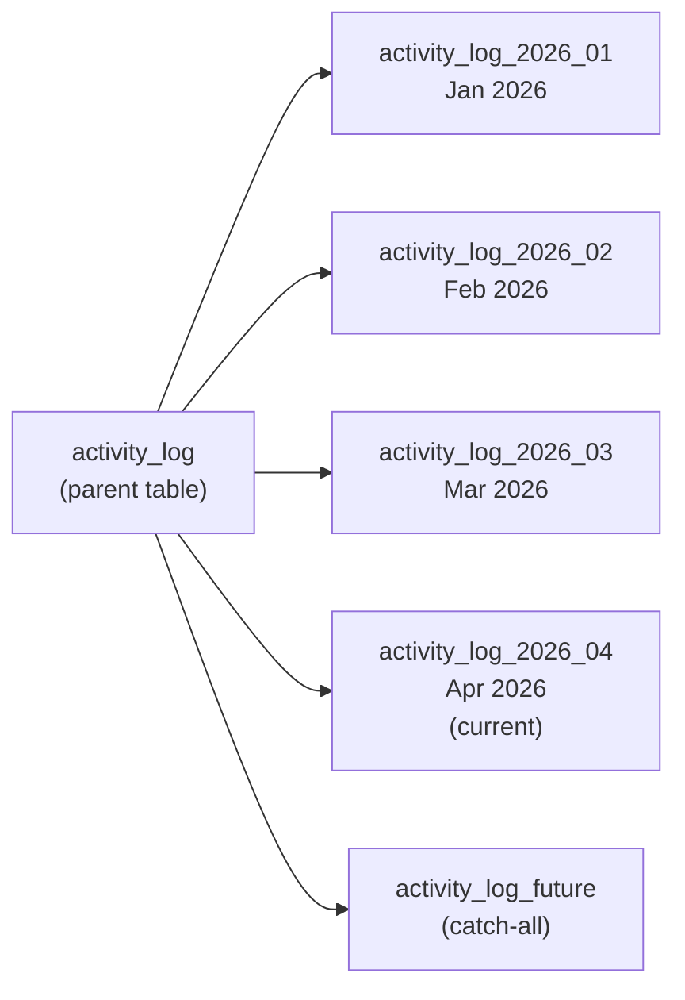
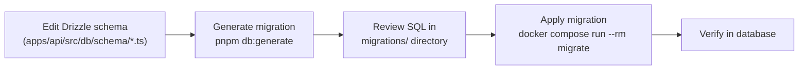

# Database Documentation

BigBlueBam uses PostgreSQL 16 as its primary database, with Row-Level Security (RLS), JSONB custom fields, monthly-partitioned activity logs, and full-text search via `pg_trgm` and `tsvector`.

---

## Entity-Relationship Diagram

```mermaid
erDiagram
    organizations ||--o{ users : "has many"
    organizations ||--o{ projects : "has many"

    projects ||--o{ phases : "has many"
    projects ||--o{ sprints : "has many"
    projects ||--o{ tasks : "has many"
    projects ||--o{ labels : "has many"
    projects ||--o{ epics : "has many"
    projects ||--o{ custom_field_definitions : "has many"
    projects ||--o{ task_states : "has many"
    projects ||--o{ project_memberships : "has many"

    users ||--o{ project_memberships : "has many"
    users ||--o{ sessions : "has many"
    users ||--o{ api_keys : "has many"
    users ||--o{ notifications : "has many"

    project_memberships }o--|| projects : "belongs to"
    project_memberships }o--|| users : "belongs to"

    tasks }o--|| phases : "current phase"
    tasks }o--|| task_states : "current state"
    tasks }o--o| sprints : "assigned to"
    tasks }o--o| epics : "grouped by"
    tasks }o--o| users : "assigned to"
    tasks }o--|| users : "reported by"
    tasks }o--o| tasks : "parent (subtask)"

    tasks ||--o{ comments : "has many"
    tasks ||--o{ attachments : "has many"
    tasks ||--o{ activity_log : "has many"
    tasks ||--o{ time_entries : "has many"

    sprints ||--o{ sprint_tasks : "has many"
    tasks ||--o{ sprint_tasks : "has many"

    comments }o--|| users : "authored by"
    comments ||--o{ comment_reactions : "has many"
    comment_reactions }o--|| users : "reacted by"
    attachments }o--|| users : "uploaded by"
    activity_log }o--|| users : "acted by"
    time_entries }o--|| users : "logged by"

    projects ||--o{ task_templates : "has many"
    projects ||--o{ saved_views : "has many"
    projects ||--o{ webhooks : "has many"
    saved_views }o--|| users : "owned by"
    task_templates }o--|| users : "created by"

    organizations {
        uuid id PK
        varchar name
        varchar slug UK
        text logo_url
        varchar plan
        jsonb settings
        timestamptz created_at
        timestamptz updated_at
    }

    users {
        uuid id PK
        uuid org_id FK
        varchar email UK
        varchar display_name
        text avatar_url
        varchar role
        varchar timezone
        jsonb notification_prefs
        boolean is_active
        timestamptz last_seen_at
        timestamptz created_at
        timestamptz updated_at
    }

    projects {
        uuid id PK
        uuid org_id FK
        varchar name
        varchar slug
        text description
        varchar icon
        varchar color
        integer default_sprint_duration_days
        varchar task_id_prefix
        integer task_id_sequence
        jsonb settings
        boolean is_archived
        timestamptz created_at
        timestamptz updated_at
    }

    project_memberships {
        uuid id PK
        uuid project_id FK
        uuid user_id FK
        varchar role
        timestamptz joined_at
    }

    phases {
        uuid id PK
        uuid project_id FK
        varchar name
        text description
        varchar color
        integer position
        integer wip_limit
        boolean is_start
        boolean is_terminal
        uuid auto_state_on_enter FK
        timestamptz created_at
    }

    task_states {
        uuid id PK
        uuid project_id FK
        varchar name
        varchar color
        varchar icon
        varchar category
        integer position
        boolean is_default
        boolean is_closed
        timestamptz created_at
    }

    sprints {
        uuid id PK
        uuid project_id FK
        varchar name
        text goal
        date start_date
        date end_date
        varchar status
        integer velocity
        text notes
        timestamptz created_at
        timestamptz closed_at
    }

    tasks {
        uuid id PK
        uuid project_id FK
        varchar human_id
        uuid parent_task_id FK
        varchar title
        text description
        text description_plain
        uuid phase_id FK
        uuid state_id FK
        uuid sprint_id FK
        uuid epic_id FK
        uuid assignee_id FK
        uuid reporter_id FK
        varchar priority
        integer story_points
        integer time_estimate_minutes
        integer time_logged_minutes
        date start_date
        date due_date
        timestamptz completed_at
        float position
        jsonb custom_fields
        integer carry_forward_count
        uuid original_sprint_id FK
        timestamptz created_at
        timestamptz updated_at
    }

    sprint_tasks {
        uuid id PK
        uuid sprint_id FK
        uuid task_id FK
        timestamptz added_at
        timestamptz removed_at
        varchar removal_reason
        integer story_points_at_add
    }

    labels {
        uuid id PK
        uuid project_id FK
        varchar name
        varchar color
        text description
        integer position
    }

    epics {
        uuid id PK
        uuid project_id FK
        varchar name
        text description
        varchar color
        date start_date
        date target_date
        varchar status
        timestamptz created_at
    }

    comments {
        uuid id PK
        uuid task_id FK
        uuid author_id FK
        text body
        text body_plain
        boolean is_system
        timestamptz edited_at
        timestamptz created_at
    }

    attachments {
        uuid id PK
        uuid task_id FK
        uuid uploader_id FK
        varchar filename
        varchar content_type
        bigint size_bytes
        text storage_key
        text thumbnail_key
        timestamptz created_at
    }

    activity_log {
        uuid id PK
        uuid project_id FK
        uuid task_id FK
        uuid actor_id FK
        varchar action
        jsonb details
        timestamptz created_at
    }

    custom_field_definitions {
        uuid id PK
        uuid project_id FK
        varchar name
        varchar field_type
        jsonb options
        boolean is_required
        boolean is_visible_on_card
        integer position
        timestamptz created_at
    }

    notifications {
        uuid id PK
        uuid user_id FK
        varchar type
        jsonb payload
        boolean is_read
        timestamptz created_at
    }

    sessions {
        uuid id PK
        uuid user_id FK
        text token_hash
        timestamptz expires_at
        timestamptz created_at
    }

    api_keys {
        uuid id PK
        uuid user_id FK
        varchar name
        text key_hash
        varchar scope
        timestamptz expires_at
        timestamptz created_at
    }

    task_templates {
        uuid id PK
        uuid project_id FK
        varchar name
        varchar title_pattern
        text description
        varchar priority
        uuid phase_id FK
        uuid_array label_ids
        text_array subtask_titles
        integer story_points
        uuid created_by FK
        timestamptz created_at
        timestamptz updated_at
    }

    comment_reactions {
        uuid id PK
        uuid comment_id FK
        uuid user_id FK
        varchar emoji
        timestamptz created_at
    }

    saved_views {
        uuid id PK
        uuid project_id FK
        uuid user_id FK
        varchar name
        jsonb filters
        varchar sort
        varchar view_type
        varchar swimlane
        boolean is_shared
        timestamptz created_at
        timestamptz updated_at
    }

    time_entries {
        uuid id PK
        uuid task_id FK
        uuid user_id FK
        integer minutes
        date date
        text description
        timestamptz created_at
    }

    webhooks {
        uuid id PK
        uuid project_id FK
        text url
        jsonb events
        text secret
        boolean is_active
        timestamptz created_at
        timestamptz updated_at
    }
```



---

## Table Descriptions

### Core Entities

| Table | Purpose | Key Columns |
|---|---|---|
| `organizations` | Top-level tenant. All data is scoped to an org. | `slug` (unique), `settings` (JSONB for org-wide defaults) |
| `users` | User accounts within an organization. | `email` (unique), `role` (owner/admin/member), `notification_prefs` (JSONB) |
| `projects` | Discrete bodies of work with their own boards. | `task_id_prefix` (e.g., "BBB"), `task_id_sequence` (auto-increment), `settings` (JSONB) |
| `project_memberships` | Join table linking users to projects with roles. | `role` (admin/member/viewer), unique on `(project_id, user_id)` |

### Board Structure

| Table | Purpose | Key Columns |
|---|---|---|
| `phases` | Board columns (e.g., "Backlog", "In Progress", "Done"). | `position` (sort order), `wip_limit`, `is_terminal`, `auto_state_on_enter` |
| `task_states` | Configurable status labels orthogonal to phases. | `category` (todo/active/blocked/review/done/cancelled), `is_closed` (for metrics) |

### Tasks and Relations

| Table | Purpose | Key Columns |
|---|---|---|
| `tasks` | The atomic unit of work. | `human_id` (e.g., "BBB-142"), `position` (float for cheap reordering), `custom_fields` (JSONB) |
| `sprints` | Time-boxed iterations. | `status` (planned/active/completed/cancelled), `velocity` (computed on close) |
| `sprint_tasks` | Join table tracking task-sprint membership with history. | `removal_reason` (completed/carried_forward/descoped/cancelled), `story_points_at_add` |
| `labels` | Color-coded tags per project. | `color`, `position` |
| `epics` | Optional grouping across sprints. | `status` (open/in_progress/closed), `target_date` |
| `custom_field_definitions` | Per-project field schema definitions. | `field_type` (text/number/date/select/multi_select/url/checkbox/user), `options` (JSONB for select types) |

### Activity and Communication

| Table | Purpose | Key Columns |
|---|---|---|
| `comments` | Task comments (user and system-generated). | `body` (HTML), `body_plain` (for search), `is_system` |
| `attachments` | File uploads linked to tasks. | `storage_key` (S3 object key), `content_type`, `size_bytes` |
| `activity_log` | Append-only audit trail. Partitioned monthly. | `action` (e.g., "task.created"), `details` (JSONB diff) |
| `notifications` | Per-user notification queue. | `type`, `payload` (JSONB), `is_read` |

### Templates and Views

| Table | Purpose | Key Columns |
|---|---|---|
| `task_templates` | Reusable task templates per project. | `title_pattern`, `subtask_titles` (text array), `label_ids` (UUID array), `story_points` |
| `saved_views` | Saved filter/sort/view configurations per user or shared. | `filters` (JSONB), `view_type` (board/list/calendar/timeline), `swimlane`, `is_shared` |

### Time Tracking

| Table | Purpose | Key Columns |
|---|---|---|
| `time_entries` | Individual time log entries on tasks. | `minutes`, `date`, `description`. Indexed on `(user_id, date)` for reporting. |

### Reactions

| Table | Purpose | Key Columns |
|---|---|---|
| `comment_reactions` | Emoji reactions on comments (toggle semantics). | `emoji`, unique on `(comment_id, user_id, emoji)` |

### Webhooks

| Table | Purpose | Key Columns |
|---|---|---|
| `webhooks` | Outgoing webhook registrations per project. | `url`, `events` (JSONB string array), `secret` (HMAC signing), `is_active` |

### Auth and Security

| Table | Purpose | Key Columns |
|---|---|---|
| `sessions` | Redis-backed session references. | `token_hash`, `expires_at` (30-day sliding) |
| `api_keys` | API keys for automation and MCP. | `key_hash` (Argon2id), `scope` (read/read_write/admin), `expires_at` |

---

## Indexing Strategy

### Primary Query Patterns and Indexes

| Query Pattern | Index | Type |
|---|---|---|
| Board rendering (tasks in sprint/phase) | `(project_id, sprint_id, phase_id, position)` | B-tree composite |
| Task lookup by human ID | `(project_id, human_id)` UNIQUE | B-tree composite |
| "My tasks" view | `(assignee_id, state_id)` | B-tree composite |
| Deadline views | `(project_id, due_date)` | B-tree composite |
| Label filtering | GIN on `labels` (UUID array) | GIN |
| Full-text search | GIN on `to_tsvector('english', description_plain)` | GIN (tsvector) |
| Activity log by time | Partition pruning on `created_at` | Range partition |
| Sprint constraint | Partial unique on `(project_id)` WHERE `status = 'active'` | B-tree partial |

### Design Principles

1. **Composite indexes lead with the most selective column.** The board rendering index starts with `project_id` because all board queries are scoped to a single project.

2. **Float positions avoid reindexing.** Task `position` uses floating-point values. Inserting between positions 1.0 and 2.0 uses 1.5, avoiding the need to update sibling rows.

3. **GIN indexes for array operations.** The `labels` column (UUID array) uses a GIN index to support `@>` (contains) queries efficiently.

4. **Partial indexes for constraints.** The "one active sprint per project" rule uses a partial unique index that only covers rows where `status = 'active'`.

---

## JSONB Usage

BigBlueBam uses JSONB columns for flexibility without sacrificing query capability.

### `tasks.custom_fields`

Stores values for project-defined custom fields as key-value pairs where keys are `custom_field_definitions.id`:

```json
{
  "cf_uuid_platform": "iOS",
  "cf_uuid_reviewed": true,
  "cf_uuid_complexity": 3
}
```

Queried using PostgreSQL JSONB operators:

```sql
-- Find tasks where platform = 'iOS'
SELECT * FROM tasks
WHERE custom_fields->>'cf_uuid_platform' = 'iOS';

-- Find tasks where complexity > 2
SELECT * FROM tasks
WHERE (custom_fields->>'cf_uuid_complexity')::int > 2;
```

### `organizations.settings`

Org-wide defaults:

```json
{
  "timezone": "America/New_York",
  "date_format": "MM/DD/YYYY",
  "enforce_2fa": false,
  "default_project_template": "kanban_standard"
}
```

### `projects.settings`

Project-specific configuration:

```json
{
  "allow_members_to_create_sprints": false,
  "auto_archive_completed_sprints_after_days": 90,
  "require_story_points": true,
  "card_cover_images": true
}
```

### `activity_log.details`

Structured diff for each change:

```json
{
  "field": "phase_id",
  "from": { "id": "uuid-a", "name": "To Do" },
  "to": { "id": "uuid-b", "name": "In Progress" }
}
```

### `users.notification_prefs`

Per-channel, per-event-type preferences:

```json
{
  "email": {
    "task_assigned": true,
    "comment_mention": true,
    "sprint_completed": false,
    "digest_frequency": "daily"
  },
  "push": {
    "task_assigned": true,
    "comment_mention": true
  },
  "dnd_schedule": {
    "start": "18:00",
    "end": "09:00"
  }
}
```

---

## Activity Log Partitioning

The `activity_log` table is partitioned by `created_at` using monthly range partitions. This provides:

1. **Query performance** -- queries for recent activity (the common case) only scan the current partition.
2. **Easy archival** -- old partitions can be detached and moved to cold storage.
3. **Efficient vacuuming** -- PostgreSQL vacuums smaller partitions faster.



### Partition Management

New partitions are created automatically by a scheduled job in the worker process. The job runs monthly and creates the next 3 months of partitions proactively. A separate job archives partitions older than the configured retention period (default: 2 years).

```sql
-- Create a new monthly partition
CREATE TABLE activity_log_2026_05
  PARTITION OF activity_log
  FOR VALUES FROM ('2026-05-01') TO ('2026-06-01');

-- Detach an old partition for archival
ALTER TABLE activity_log DETACH PARTITION activity_log_2024_01;
```

---

## Migration Workflow

BigBlueBam uses **Drizzle ORM** for type-safe schema definitions and migrations.



### Commands

```bash
# Generate a migration from schema changes
pnpm db:generate

# Push schema directly (dev only, no migration file)
pnpm db:push

# Apply pending migrations
docker compose run --rm migrate

# Alternatively, apply from a local environment
pnpm --filter @bigbluebam/api db:migrate
```

### Migration File Structure

```
apps/api/src/db/
  schema/
    index.ts          Re-exports all table definitions
    tasks.ts          24 table definition files (one per table)
    ...
  migrations/
    0001_initial_schema.sql
    0002_activity_log_partitions.sql
    0003_add_custom_fields.sql
    meta/
      _journal.json   Migration history tracking
```

### Best Practices

1. **Never edit applied migrations.** Create a new migration instead.
2. **Test migrations against a copy of production data** before applying to production.
3. **Keep migrations small and focused.** One logical change per migration file.
4. **Use transactions** for DDL changes (PostgreSQL supports transactional DDL).
5. **Add indexes concurrently** in production to avoid table locks: `CREATE INDEX CONCURRENTLY ...`.
