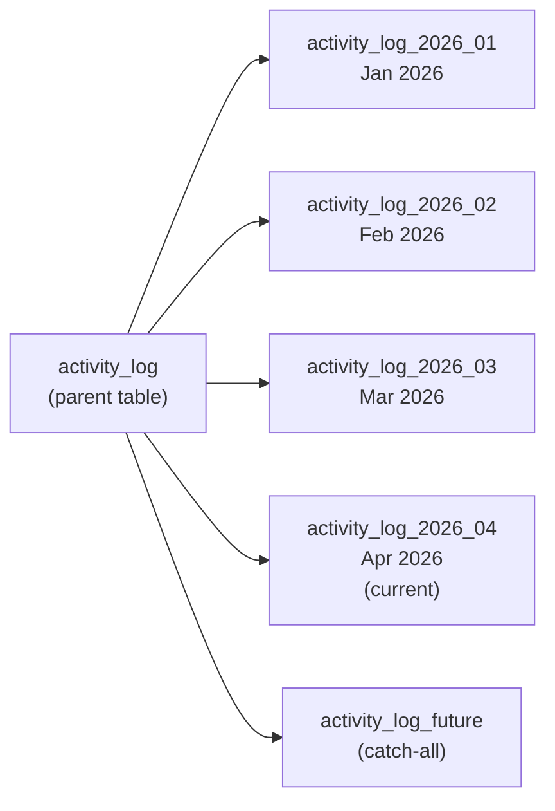

# Database Documentation

BigBlueBam uses PostgreSQL 16 as its primary database, with Row-Level Security (RLS), JSONB custom fields, monthly-partitioned activity logs, and full-text search via `pg_trgm` and `tsvector`.

---

## Entity-Relationship Diagram

```mermaid
erDiagram
    organizations ||--o{ organization_memberships : "has many"
    organizations ||--o{ projects : "has many"
    organizations ||--o{ guest_invitations : "has many"
    organizations ||--o{ banter_audit_log : "has many"

    users ||--o{ login_history : "has many"
    users ||--o{ organization_memberships : "has many"
    organization_memberships }o--|| organizations : "belongs to"
    organization_memberships }o--|| users : "belongs to"

    projects ||--o{ phases : "has many"
    projects ||--o{ sprints : "has many"
    projects ||--o{ tasks : "has many"
    projects ||--o{ labels : "has many"
    projects ||--o{ epics : "has many"
    projects ||--o{ custom_field_definitions : "has many"
    projects ||--o{ task_states : "has many"
    projects ||--o{ project_memberships : "has many"
    projects }o--o| users : "created by"

    users ||--o{ project_memberships : "has many"
    users ||--o{ sessions : "has many"
    users ||--o{ api_keys : "has many"
    users ||--o{ notifications : "has many"
    users ||--o{ superuser_audit_log : "acted as superuser"
    users ||--o{ impersonation_sessions : "initiated impersonation"
    users ||--o{ guest_invitations : "invited by"

    sessions }o--o| organizations : "active org"

    project_memberships }o--|| projects : "belongs to"
    project_memberships }o--|| users : "belongs to"

    tasks }o--|| phases : "current phase"
    tasks }o--|| task_states : "current state"
    tasks }o--o| sprints : "assigned to"
    tasks }o--o| epics : "grouped by"
    tasks }o--o| users : "assigned to"
    tasks }o--|| users : "reported by"
    tasks }o--o| tasks : "parent (subtask)"

    tasks ||--o{ comments : "has many"
    tasks ||--o{ attachments : "has many"
    tasks ||--o{ activity_log : "has many"
    tasks ||--o{ time_entries : "has many"

    sprints ||--o{ sprint_tasks : "has many"
    tasks ||--o{ sprint_tasks : "has many"

    comments }o--|| users : "authored by"
    comments ||--o{ comment_reactions : "has many"
    comment_reactions }o--|| users : "reacted by"
    attachments }o--|| users : "uploaded by"
    activity_log }o--|| users : "acted by"
    activity_log }o--o| users : "impersonated by"
    time_entries }o--|| users : "logged by"

    organizations ||--o{ banter_channels : "has many"
    organizations ||--o{ banter_settings : "has one"
    banter_channels ||--o{ banter_channel_memberships : "has many"
    banter_channels ||--o{ banter_messages : "has many"
    banter_channels ||--o{ banter_calls : "has many"
    banter_messages ||--o{ banter_reactions : "has many"
    banter_messages ||--o{ banter_pins : "has many"
    banter_messages ||--o{ banter_bookmarks : "has many"
    banter_calls ||--o{ banter_call_participants : "has many"
    banter_calls ||--o{ banter_call_transcripts : "has many"
    users ||--o{ banter_channel_memberships : "has many"
    users ||--o{ banter_messages : "authored"
    users ||--o{ banter_user_preferences : "has one"

    projects ||--o{ task_templates : "has many"
    projects ||--o{ saved_views : "has many"
    projects ||--o{ webhooks : "has many"
    saved_views }o--|| users : "owned by"
    task_templates }o--|| users : "created by"

    organizations {
        uuid id PK
        varchar name
        varchar slug UK
        text logo_url
        varchar plan
        jsonb settings
        timestamptz created_at
        timestamptz updated_at
    }

    users {
        uuid id PK
        uuid org_id FK "legacy; use organization_memberships"
        varchar email UK "varchar(320), RFC 5321"
        varchar display_name
        text avatar_url
        varchar role
        varchar timezone
        jsonb notification_prefs
        boolean is_active
        boolean is_superuser
        boolean force_password_change
        boolean email_verified
        varchar pending_email
        text email_verification_token
        timestamptz email_verification_sent_at
        timestamptz disabled_at
        uuid disabled_by FK
        timestamptz last_seen_at
        timestamptz created_at
        timestamptz updated_at
    }

    login_history {
        uuid id PK
        uuid user_id FK "nullable — failed logins against unknown emails still record"
        text email "denormalized"
        inet ip_address
        text user_agent
        boolean success
        text failure_reason
        timestamptz created_at
    }

    organization_memberships {
        uuid id PK
        uuid user_id FK
        uuid org_id FK
        varchar role "owner/admin/member/viewer/guest"
        boolean is_default
        uuid invited_by FK
        timestamptz joined_at
    }

    projects {
        uuid id PK
        uuid org_id FK
        varchar name
        varchar slug
        text description
        varchar icon
        varchar color
        integer default_sprint_duration_days
        varchar task_id_prefix
        integer task_id_sequence
        jsonb settings
        boolean is_archived
        uuid created_by FK
        timestamptz created_at
        timestamptz updated_at
    }

    project_memberships {
        uuid id PK
        uuid project_id FK
        uuid user_id FK
        varchar role
        timestamptz joined_at
    }

    phases {
        uuid id PK
        uuid project_id FK
        varchar name
        text description
        varchar color
        integer position
        integer wip_limit
        boolean is_start
        boolean is_terminal
        uuid auto_state_on_enter FK
        timestamptz created_at
    }

    task_states {
        uuid id PK
        uuid project_id FK
        varchar name
        varchar color
        varchar icon
        varchar category
        integer position
        boolean is_default
        boolean is_closed
        timestamptz created_at
    }

    sprints {
        uuid id PK
        uuid project_id FK
        varchar name
        text goal
        date start_date
        date end_date
        varchar status
        integer velocity
        text notes
        timestamptz created_at
        timestamptz closed_at
    }

    tasks {
        uuid id PK
        uuid project_id FK
        varchar human_id
        uuid parent_task_id FK
        varchar title
        text description
        text description_plain
        uuid phase_id FK
        uuid state_id FK
        uuid sprint_id FK
        uuid epic_id FK
        uuid assignee_id FK
        uuid reporter_id FK
        varchar priority
        integer story_points
        integer time_estimate_minutes
        integer time_logged_minutes
        date start_date
        date due_date
        timestamptz completed_at
        float position
        jsonb custom_fields
        integer carry_forward_count
        uuid original_sprint_id FK
        timestamptz created_at
        timestamptz updated_at
    }

    sprint_tasks {
        uuid id PK
        uuid sprint_id FK
        uuid task_id FK
        timestamptz added_at
        timestamptz removed_at
        varchar removal_reason
        integer story_points_at_add
    }

    labels {
        uuid id PK
        uuid project_id FK
        varchar name
        varchar color
        text description
        integer position
    }

    epics {
        uuid id PK
        uuid project_id FK
        varchar name
        text description
        varchar color
        date start_date
        date target_date
        varchar status
        timestamptz created_at
    }

    comments {
        uuid id PK
        uuid task_id FK
        uuid author_id FK
        text body
        text body_plain
        boolean is_system
        timestamptz edited_at
        timestamptz created_at
    }

    attachments {
        uuid id PK
        uuid task_id FK
        uuid uploader_id FK
        varchar filename
        varchar content_type
        bigint size_bytes
        text storage_key
        text thumbnail_key
        timestamptz created_at
    }

    activity_log {
        uuid id PK
        uuid project_id FK
        uuid task_id FK
        uuid actor_id FK
        uuid impersonator_id FK
        varchar action
        jsonb details
        timestamptz created_at
    }

    custom_field_definitions {
        uuid id PK
        uuid project_id FK
        varchar name
        varchar field_type
        jsonb options
        boolean is_required
        boolean is_visible_on_card
        integer position
        timestamptz created_at
    }

    notifications {
        uuid id PK
        uuid user_id FK
        varchar type
        jsonb payload
        boolean is_read
        timestamptz created_at
    }

    sessions {
        text id PK
        uuid user_id FK
        uuid active_org_id FK
        jsonb data
        timestamptz created_at
        timestamptz last_used_at
        inet ip_address
        text user_agent
        timestamptz expires_at
    }

    api_keys {
        uuid id PK
        uuid user_id FK
        varchar name
        text key_hash
        varchar scope
        timestamptz expires_at
        timestamptz created_at
    }

    task_templates {
        uuid id PK
        uuid project_id FK
        varchar name
        varchar title_pattern
        text description
        varchar priority
        uuid phase_id FK
        uuid_array label_ids
        text_array subtask_titles
        integer story_points
        uuid created_by FK
        timestamptz created_at
        timestamptz updated_at
    }

    comment_reactions {
        uuid id PK
        uuid comment_id FK
        uuid user_id FK
        varchar emoji
        timestamptz created_at
    }

    saved_views {
        uuid id PK
        uuid project_id FK
        uuid user_id FK
        varchar name
        jsonb filters
        varchar sort
        varchar view_type
        varchar swimlane
        boolean is_shared
        timestamptz created_at
        timestamptz updated_at
    }

    time_entries {
        uuid id PK
        uuid task_id FK
        uuid user_id FK
        integer minutes
        date date
        text description
        timestamptz created_at
    }

    webhooks {
        uuid id PK
        uuid project_id FK
        text url
        jsonb events
        text secret
        boolean is_active
        timestamptz created_at
        timestamptz updated_at
    }

    superuser_audit_log {
        uuid id PK
        uuid superuser_id FK
        varchar action
        uuid target_org_id
        uuid target_user_id
        jsonb details
        varchar ip_address
        text user_agent
        timestamptz created_at
    }

    impersonation_sessions {
        uuid id PK
        uuid superuser_id FK
        uuid target_user_id FK
        text reason
        timestamptz started_at
        timestamptz expires_at
        timestamptz ended_at
    }

    guest_invitations {
        uuid id PK
        uuid org_id FK
        uuid invited_by FK
        varchar email
        varchar role
        text_array project_ids
        text_array channel_ids
        varchar token UK
        timestamptz expires_at
        timestamptz accepted_at
        timestamptz revoked_at
        timestamptz created_at
    }

    banter_audit_log {
        uuid id PK
        uuid org_id FK
        uuid user_id FK
        varchar action
        varchar entity_type
        uuid entity_id
        jsonb details
        timestamptz created_at
    }

    schema_migrations {
        text id PK
        text checksum
        timestamptz applied_at
    }
```



---

## Table Descriptions

### Core Entities

| Table | Purpose | Key Columns |
|---|---|---|
| `organizations` | Top-level tenant. All data is scoped to an org. | `slug` (unique), `settings` (JSONB for org-wide defaults) |
| `users` | User accounts. | `email` (unique, varchar(320)), `role` (owner/admin/member), `is_superuser`, `notification_prefs` (JSONB, NOT NULL), `force_password_change` (redirects to password-change form on next login), `email_verified` + `pending_email` + `email_verification_token` + `email_verification_sent_at` (admin-initiated email-change flow), `disabled_at` + `disabled_by` (audit trail for soft-disable). The legacy `org_id` column is retained for backward compatibility but membership is authoritative in `organization_memberships`. |
| `organization_memberships` | Many-to-many join between `users` and `organizations`. Replaces the single-org model of `users.org_id`. | `role` (owner/admin/member/viewer/guest), `is_default` (exactly one default per user, enforced by partial unique index), `invited_by`, unique on `(user_id, org_id)` |
| `projects` | Discrete bodies of work with their own boards. | `task_id_prefix` (e.g., "BBB"), `task_id_sequence` (auto-increment), `settings` (JSONB, NOT NULL), `created_by` |
| `project_memberships` | Join table linking users to projects with roles. | `role` (admin/member/viewer), unique on `(project_id, user_id)` |

### Board Structure

| Table | Purpose | Key Columns |
|---|---|---|
| `phases` | Board columns (e.g., "Backlog", "In Progress", "Done"). | `position` (sort order), `wip_limit`, `is_terminal`, `auto_state_on_enter` |
| `task_states` | Configurable status labels orthogonal to phases. | `category` (todo/active/blocked/review/done/cancelled), `is_closed` (for metrics) |

### Tasks and Relations

| Table | Purpose | Key Columns |
|---|---|---|
| `tasks` | The atomic unit of work. | `human_id` (e.g., "BBB-142"), `position` (float for cheap reordering), `custom_fields` (JSONB) |
| `sprints` | Time-boxed iterations. | `status` (planned/active/completed/cancelled), `velocity` (computed on close) |
| `sprint_tasks` | Join table tracking task-sprint membership with history. | `removal_reason` (completed/carried_forward/descoped/cancelled), `story_points_at_add` |
| `labels` | Color-coded tags per project. | `color`, `position` |
| `epics` | Optional grouping across sprints. | `status` (open/in_progress/closed), `target_date` |
| `custom_field_definitions` | Per-project field schema definitions. | `field_type` (text/number/date/select/multi_select/url/checkbox/user), `options` (JSONB for select types) |

### Activity and Communication

| Table | Purpose | Key Columns |
|---|---|---|
| `comments` | Task comments (user and system-generated). | `body` (HTML), `body_plain` (for search), `is_system` |
| `attachments` | File uploads linked to tasks. | `storage_key` (S3 object key), `content_type`, `size_bytes` |
| `activity_log` | Append-only audit trail. Partitioned monthly. | `action` (e.g., "task.created"), `details` (JSONB diff), `impersonator_id` (set when the actor was a superuser acting as another user) |
| `notifications` | Per-user notification queue. | `type`, `payload` (JSONB), `is_read` |

### Templates and Views

| Table | Purpose | Key Columns |
|---|---|---|
| `task_templates` | Reusable task templates per project. | `title_pattern`, `subtask_titles` (text array), `label_ids` (UUID array), `story_points` |
| `saved_views` | Saved filter/sort/view configurations per user or shared. | `filters` (JSONB), `view_type` (board/list/calendar/timeline), `swimlane`, `is_shared` |

### Time Tracking

| Table | Purpose | Key Columns |
|---|---|---|
| `time_entries` | Individual time log entries on tasks. | `minutes`, `date`, `description`. Indexed on `(user_id, date)` for reporting. |

### Reactions

| Table | Purpose | Key Columns |
|---|---|---|
| `comment_reactions` | Emoji reactions on comments (toggle semantics). | `emoji`, unique on `(comment_id, user_id, emoji)` |

### Webhooks

| Table | Purpose | Key Columns |
|---|---|---|
| `webhooks` | Outgoing webhook registrations per project. | `url`, `events` (JSONB string array), `secret` (HMAC signing), `is_active` |

### Auth and Security

| Table | Purpose | Key Columns |
|---|---|---|
| `sessions` | Server-side session rows (id is a text token). | `user_id`, `active_org_id` (persists the user's selected org across requests/WebSockets/jobs for **all** users — replaces the `X-Org-Id` header echo and the SU-only ephemeral switch), `data` (JSONB, NOT NULL), `created_at`, `last_used_at` (throttled to 60s updates), `ip_address` (inet), `user_agent`, `expires_at` (30-day sliding) |
| `login_history` | Append-only record of every `POST /auth/login` attempt (success or failure). | `user_id` (nullable — failed attempts against non-existent emails still insert a row), `email` (denormalized so audit survives user deletion), `ip_address` (inet), `user_agent`, `success`, `failure_reason`, `created_at`. Indexed on `(user_id, created_at DESC)` and `(email, created_at DESC)`. No TTL yet — a future trimmer will prune. |
| `api_keys` | API keys for automation and MCP. | `key_hash` (Argon2id), `scope` (read/read_write/admin), `expires_at` |
| `superuser_audit_log` | Append-only record of every `/superuser/*` API call. | `superuser_id`, `action`, `target_org_id`/`target_user_id`, `details` (JSONB), `ip_address`, `user_agent` |
| `impersonation_sessions` | Time-bounded "act as user" grants issued by a superuser. | `superuser_id`, `target_user_id`, `started_at`, `expires_at` (NOT NULL), `ended_at`, `reason`. Writes made while impersonating are stamped on `activity_log.impersonator_id`. |
| `guest_invitations` | Limited-scope, token-based invitations for guest users. | `org_id`, `email`, `role` (default `guest`), `project_ids` / `channel_ids` (text[] scoping the grant), `token` (unique), `expires_at`, `accepted_at`, `revoked_at` |
| `banter_audit_log` | Append-only record of Banter admin actions. | `org_id`, `user_id`, `action`, `entity_type`, `entity_id`, `details` (JSONB) |
| `schema_migrations` | Migration runner tracking table. | `id` (filename without `.sql`), `checksum` (SHA-256 of SQL body), `applied_at`. Managed by `apps/api/src/migrate.ts` — do not edit directly. |

---

## Indexing Strategy

### Primary Query Patterns and Indexes

| Query Pattern | Index | Type |
|---|---|---|
| Board rendering (tasks in sprint/phase) | `(project_id, sprint_id, phase_id, position)` | B-tree composite |
| Task lookup by human ID | `(project_id, human_id)` UNIQUE | B-tree composite |
| "My tasks" view | `(assignee_id, state_id)` | B-tree composite |
| Deadline views | `(project_id, due_date)` | B-tree composite |
| Label filtering | GIN on `labels` (UUID array) | GIN |
| Full-text search | GIN on `to_tsvector('english', description_plain)` | GIN (tsvector) |
| Activity log by time | Partition pruning on `created_at` | Range partition |
| Sprint constraint | Partial unique on `(project_id)` WHERE `status = 'active'` | B-tree partial |

### Design Principles

1. **Composite indexes lead with the most selective column.** The board rendering index starts with `project_id` because all board queries are scoped to a single project.

2. **Float positions avoid reindexing.** Task `position` uses floating-point values. Inserting between positions 1.0 and 2.0 uses 1.5, avoiding the need to update sibling rows.

3. **GIN indexes for array operations.** The `labels` column (UUID array) uses a GIN index to support `@>` (contains) queries efficiently.

4. **Partial indexes for constraints.** The "one active sprint per project" rule uses a partial unique index that only covers rows where `status = 'active'`.

---

## JSONB Usage

BigBlueBam uses JSONB columns for flexibility without sacrificing query capability.

### `tasks.custom_fields`

Stores values for project-defined custom fields as key-value pairs where keys are `custom_field_definitions.id`:

```json
{
  "cf_uuid_platform": "iOS",
  "cf_uuid_reviewed": true,
  "cf_uuid_complexity": 3
}
```

Queried using PostgreSQL JSONB operators:

```sql
-- Find tasks where platform = 'iOS'
SELECT * FROM tasks
WHERE custom_fields->>'cf_uuid_platform' = 'iOS';

-- Find tasks where complexity > 2
SELECT * FROM tasks
WHERE (custom_fields->>'cf_uuid_complexity')::int > 2;
```

### `organizations.settings`

Org-wide defaults:

```json
{
  "timezone": "America/New_York",
  "date_format": "MM/DD/YYYY",
  "enforce_2fa": false,
  "default_project_template": "kanban_standard"
}
```

### `projects.settings`

Project-specific configuration:

```json
{
  "allow_members_to_create_sprints": false,
  "auto_archive_completed_sprints_after_days": 90,
  "require_story_points": true,
  "card_cover_images": true
}
```

### `activity_log.details`

Structured diff for each change:

```json
{
  "field": "phase_id",
  "from": { "id": "uuid-a", "name": "To Do" },
  "to": { "id": "uuid-b", "name": "In Progress" }
}
```

### `users.notification_prefs`

Per-channel, per-event-type preferences:

```json
{
  "email": {
    "task_assigned": true,
    "comment_mention": true,
    "sprint_completed": false,
    "digest_frequency": "daily"
  },
  "push": {
    "task_assigned": true,
    "comment_mention": true
  },
  "dnd_schedule": {
    "start": "18:00",
    "end": "09:00"
  }
}
```

---

## Activity Log Partitioning

The `activity_log` table is partitioned by `created_at` using monthly range partitions. This provides:

1. **Query performance** -- queries for recent activity (the common case) only scan the current partition.
2. **Easy archival** -- old partitions can be detached and moved to cold storage.
3. **Efficient vacuuming** -- PostgreSQL vacuums smaller partitions faster.



### Partition Management

New partitions are created automatically by a scheduled job in the worker process. The job runs monthly and creates the next 3 months of partitions proactively. A separate job archives partitions older than the configured retention period (default: 2 years).

```sql
-- Create a new monthly partition
CREATE TABLE activity_log_2026_05
  PARTITION OF activity_log
  FOR VALUES FROM ('2026-05-01') TO ('2026-06-01');

-- Detach an old partition for archival
ALTER TABLE activity_log DETACH PARTITION activity_log_2024_01;
```

---

## Migrations

BigBlueBam uses a **hand-written, forward-only SQL migration system** driven by a small runner at `apps/api/src/migrate.ts`. Drizzle schemas in `apps/{api,helpdesk-api,banter-api}/src/db/schema/*.ts` are the TypeScript source of truth for table shapes; the SQL files in `infra/postgres/migrations/` are the authoritative on-disk history that the runner applies to Postgres.

> **Note:** The legacy `infra/postgres/init.sql` bootstrap file has been **deleted**. The canonical initial schema now lives in `infra/postgres/migrations/0000_init.sql` and is applied by the `migrate` service like every other migration. There is no special first-boot path.

### Directory layout

```
infra/postgres/migrations/
  0000_init.sql                         Canonical initial schema (replaces old init.sql)
  0001_baseline.sql                     Marker migration — stamps a consistent row in schema_migrations
  0002_granular_permissions_and_drift.sql
  0003_session_active_org.sql
  0004_activity_log_impersonator.sql
  0005_projects_created_by.sql
  0006_drizzle_drift_sweep.sql
  0007_api_keys_org_scope.sql
  0008_helpdesk_agent_api_keys.sql
  0010_ticket_activity_log.sql
  0011_user_disable_tracking.sql
  0012_user_email_verification.sql
  0013_access_activity_session_meta.sql
  README.md
```

### User management wave (0011–0013)

The `granular-permissions` branch landed three additive migrations that
back the `/b3/people` and `/b3/superuser/people` surfaces:

| Migration | What it adds |
|---|---|
| `0011_user_disable_tracking.sql` | `users.disabled_at timestamptz` + `users.disabled_by uuid REFERENCES users(id) ON DELETE SET NULL` + partial index on `disabled_by`. Records who disabled an account and when — independent of `activity_log`, which may be rotated or partitioned away. |
| `0012_user_email_verification.sql` | `users.email_verified boolean NOT NULL DEFAULT true` + `users.pending_email varchar(320)` + `users.email_verification_token text` + `users.email_verification_sent_at timestamptz`. Admin-initiated email changes stage in `pending_email`; the swap is committed only after the user redeems the token sent to the new address. Existing users are retroactively `email_verified = true`. |
| `0013_access_activity_session_meta.sql` | `users.force_password_change boolean NOT NULL DEFAULT false`; `sessions.created_at / last_used_at / ip_address / user_agent`; and the new `login_history` table. Enables the force-rotate flow, the Sessions tab's device/IP panel, and the login-history audit surface. |

All three are purely additive — defaults are set so legacy code paths
continue to function until the new surfaces start writing to them.

### How migrations are applied

The `migrate` service in `docker-compose.yml` runs `apps/api/src/migrate.ts` and must complete successfully before `api`, `helpdesk-api`, `banter-api`, and `worker` start. It runs on **every `docker compose up`** — running against an up-to-date DB is a no-op.

For each file (in lexicographic order) the runner:

1. Computes a **SHA-256 checksum over the SQL body only** (the leading block of `--` comment lines and blank lines is stripped before hashing, so maintainers can edit the documented header without invalidating the fingerprint).
2. Checks the `schema_migrations` table for a row with the same `id` (the filename without `.sql`).
3. If not applied, runs the entire file inside a single transaction and records the checksum.
4. If already applied with a matching checksum, skips.
5. If already applied with a **different** checksum, aborts loudly — migrations are **immutable**. The only exception is a one-time re-stamp from the legacy full-file checksum to the new body-only checksum, and an opt-in `MIGRATE_ALLOW_HEADER_RESTAMP=1` env var for header-only edits.

Because migrations may run against fresh DBs (where `0000_init.sql` already created everything) or older DBs catching up, every statement must be **idempotent**:

- `CREATE TABLE IF NOT EXISTS`
- `CREATE [UNIQUE] INDEX IF NOT EXISTS` (or preceded by `DROP INDEX IF EXISTS`)
- `ALTER TABLE ... ADD COLUMN IF NOT EXISTS`
- `DROP TABLE|INDEX|COLUMN IF EXISTS`
- `CREATE TRIGGER` wrapped in `DO $$ ... END $$` or preceded by `DROP TRIGGER IF EXISTS`
- Data migrations via `INSERT ... ON CONFLICT DO NOTHING` or `DO $$` blocks

### Required file header

Every migration file **must** begin with a header matching this shape within the first ~20 lines:

```sql
-- ─────────────────────────────────────────────────────────────────────────
-- NNNN_short_name.sql
-- ─────────────────────────────────────────────────────────────────────────
-- Why: <one-sentence description of what problem this migration solves>
-- Client impact: <what clients will see — "additive only", "breaking", etc.>
-- ─────────────────────────────────────────────────────────────────────────
```

The filename, `Why:` line, and `Client impact:` line are all enforced by the linter. Since header comments are stripped before checksum computation, you can freely amend the documented reason after the fact without tripping the immutability guard.

### Filename convention

Files must match `^[0-9]{4}_[a-z][a-z0-9_]*\.sql$` — a zero-padded 4-digit sequence number, an underscore, and a short snake_case name.

### Linter — `pnpm lint:migrations`

`scripts/lint-migrations.mjs` enforces all of the above:

- Filename pattern
- Required header lines (filename, `Why:`, `Client impact:`)
- Idempotency (`IF NOT EXISTS` / `IF EXISTS` / guarded triggers)
- Warning on unguarded `CREATE TYPE ... AS ENUM` (no `IF NOT EXISTS` syntax exists; wrap in a `DO $$` block)

Rule escape hatch: append `-- noqa: <rule-name>` (or `-- noqa: all`) on a line to silence a single rule. Use sparingly.

### Drift guard — `pnpm db:check`

`scripts/db-check.mjs` parses every `pgTable(...)` declaration across the three schema roots (`apps/api`, `apps/helpdesk-api`, `apps/banter-api`), unions them by table name, and compares the result against the live database pointed to by `DATABASE_URL`. It reports:

- **Missing tables / columns in DB** (Drizzle declares something the DB lacks) — fails with exit code 1
- **Unknown tables / columns in DB** (DB has something no Drizzle schema declares) — fails with exit code 1
- **Type mismatches** — warnings only (the regex parser can't perfectly reproduce Postgres canonical types)

Table `schema_migrations` is always ignored.

### CI enforcement

`.github/workflows/db-drift.yml` runs both `pnpm lint:migrations` and `pnpm db:check` (against a freshly-migrated Postgres 16 container) on every push and PR. A PR that adds a Drizzle column without a corresponding migration, or a migration that violates idempotency rules, will fail CI.

### Schema-change workflow — adding a column

1. **Edit the Drizzle schema** in `apps/<app>/src/db/schema/<table>.ts` to add the column.
2. **Write a new migration** at `infra/postgres/migrations/NNNN_short_name.sql` — pick the next free 4-digit prefix and include the required header.
3. **Use idempotent DDL** — `ALTER TABLE <t> ADD COLUMN IF NOT EXISTS ...`, `CREATE INDEX IF NOT EXISTS ...`.
4. **Run `pnpm lint:migrations`** locally to verify the header and idempotency rules.
5. **Apply locally:** `docker compose up -d postgres && docker compose run --rm migrate` (or restart the stack — the `migrate` service runs automatically).
6. **Run `pnpm db:check`** to verify Drizzle ↔ DB are in sync.
7. **Commit both** the schema file and the migration file together.

### Best practices

1. **Never edit an applied migration** — the checksum guard will abort startup. Create a new numbered file instead.
2. **One logical change per migration file.** Keep them small and focused.
3. **Forward-only.** There are no down migrations. If you need to roll back, write a new forward migration that undoes the change.
4. **Additive is safer than breaking.** Add a new column nullable; backfill in a separate migration; tighten `NOT NULL` in a third. Document breaking changes clearly in `Client impact:`.
5. **For production, add indexes concurrently** to avoid table locks: `CREATE INDEX CONCURRENTLY IF NOT EXISTS ...`. (Note: `CONCURRENTLY` cannot run inside a transaction, so such a migration must be the only statement in its file.)
