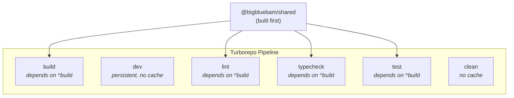
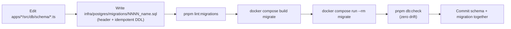
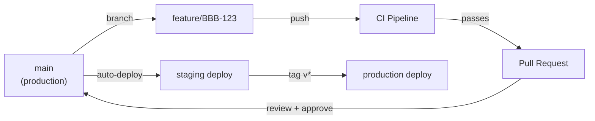

# Development Guide

This guide covers everything you need to contribute to BigBlueBam, from environment setup to code style conventions.

---

## Development Environment Setup

### Prerequisites

- **Node.js 22 LTS** or later
- **pnpm 9+** (`corepack enable && corepack prepare pnpm@latest --activate`)
- **Docker** and **Docker Compose** (for data services and integration tests)
- A code editor with TypeScript support (VS Code recommended)

### Initial Setup

```bash
# Clone the repository
git clone https://github.com/bigblueceiling/BigBlueBam.git
cd BigBlueBam

# Install dependencies
pnpm install

# Copy environment configuration
cp .env.example .env
# Edit .env with your local secrets

# Start data services (PostgreSQL, Redis, MinIO) + the migrate one-shot
docker compose up -d postgres redis minio migrate

# Build shared packages
pnpm --filter @bigbluebam/shared build

# Start all apps in dev mode
pnpm dev
```

> There is **no `init.sql`**. The postgres container boots with an empty DB; the
> `migrate` service (running `node dist/migrate.js`) applies every file in
> `infra/postgres/migrations/` in order and is a `service_completed_successfully`
> dependency of every DB-using app service. On a normal `docker compose up` you
> never run the migrate step by hand — it runs automatically before api,
> banter-api, helpdesk-api, and worker start.

This starts:
- API server on `http://localhost:4000` internally (proxied at `http://localhost/b3/api/` in production, direct access in dev)
- Frontend on `http://localhost:5173` (Vite HMR in dev) or `http://localhost/b3/` (production nginx)
- Banter API on `http://localhost:4002` internally (proxied at `http://localhost/banter/api/`)
- Banter SPA at `http://localhost/banter/` (production nginx) — **Alpha software**
- Helpdesk portal at `http://localhost/helpdesk/` (production nginx)
- MCP server on `http://localhost:3001` internally (proxied at `http://localhost/mcp/`, 86 tools)
- Worker process (with hot reload, includes Banter notification and retention jobs)
- LiveKit SFU on `http://localhost:7880` (voice/video, requires configuration in Banter admin)

In production, all services are accessed through a single nginx container on port 80. In dev mode, you can access the Vite dev server directly on port 5173 or the API on port 4000.

### Alternative: Full Docker Dev Mode

If you prefer everything in Docker:

```bash
docker compose -f docker-compose.yml -f docker-compose.dev.yml up
```

---

## Monorepo Structure and Turborepo

BigBlueBam uses **Turborepo** for task orchestration across the monorepo. The pipeline is defined in `turbo.json`.



### Key Commands

| Command | Description |
|---|---|
| `pnpm build` | Build all packages (shared first, then apps) |
| `pnpm dev` | Start all apps in development mode |
| `pnpm lint` | Run ESLint + Biome across all packages |
| `pnpm typecheck` | Run `tsc --noEmit` across all packages |
| `pnpm test` | Run all tests (Vitest) |
| `pnpm test:unit` | Run unit tests only |
| `pnpm format` | Format all files with Biome |
| `pnpm check` | Biome check with auto-fix |

### Filtering

Run commands for a specific package:

```bash
pnpm --filter @bigbluebam/api build
pnpm --filter @bigbluebam/frontend dev
pnpm --filter @bigbluebam/shared test
```

---

## Adding a New API Endpoint

Step-by-step guide for adding a new endpoint to the API.

### Step 1: Define the Zod Schema

Add request/response schemas to the shared package so they can be reused by the frontend.

**File:** `packages/shared/src/schemas/your-feature.ts`

```typescript
import { z } from 'zod';

export const createWidgetSchema = z.object({
  name: z.string().min(1).max(255),
  description: z.string().optional(),
  project_id: z.string().uuid(),
});

export type CreateWidgetInput = z.infer<typeof createWidgetSchema>;

export const widgetSchema = z.object({
  id: z.string().uuid(),
  name: z.string(),
  description: z.string().nullable(),
  project_id: z.string().uuid(),
  created_at: z.string().datetime(),
});

export type Widget = z.infer<typeof widgetSchema>;
```

Export from the package index: `packages/shared/src/index.ts`.

### Step 2: Define the Database Schema

**File:** `apps/api/src/db/schema/widgets.ts`

```typescript
import { pgTable, uuid, varchar, text, timestamp } from 'drizzle-orm/pg-core';
import { projects } from './projects.js';

export const widgets = pgTable('widgets', {
  id: uuid('id').primaryKey().defaultRandom(),
  name: varchar('name', { length: 255 }).notNull(),
  description: text('description'),
  project_id: uuid('project_id').notNull().references(() => projects.id, { onDelete: 'cascade' }),
  created_at: timestamp('created_at', { withTimezone: true }).defaultNow(),
});
```

Then export from `apps/api/src/db/schema/index.ts`.

### Step 3: Write and Apply a Migration

Hand-author a new numbered SQL file in `infra/postgres/migrations/`. See the
[Database Migrations](#database-migrations) section below for the required
header and idempotency rules.

```bash
pnpm lint:migrations                       # validate the new file
docker compose build migrate               # bake the new file into the image
docker compose run --rm migrate            # apply it to the local DB
pnpm db:check                              # verify zero drift vs Drizzle
```

### Step 4: Create the Service Layer

**File:** `apps/api/src/services/widget.service.ts`

```typescript
import { db } from '../db';
import { widgets } from '../db/schema';
import { eq } from 'drizzle-orm';
import type { CreateWidgetInput } from '@bigbluebam/shared';

export async function createWidget(input: CreateWidgetInput, userId: string) {
  const [widget] = await db.insert(widgets).values(input).returning();
  return widget;
}

export async function getWidgetsByProject(projectId: string) {
  return db.select().from(widgets).where(eq(widgets.projectId, projectId));
}
```

### Step 5: Create the Route Handler

**File:** `apps/api/src/routes/widget.routes.ts`

```typescript
import type { FastifyInstance } from 'fastify';
import { z } from 'zod';
import { db } from '../db/index.js';
import { widgets } from '../db/schema/widgets.js';
import { requireAuth } from '../plugins/auth.js';
import { eq } from 'drizzle-orm';

export default async function widgetRoutes(fastify: FastifyInstance) {
  fastify.get<{ Params: { id: string } }>(
    '/projects/:id/widgets',
    { preHandler: [requireAuth] },
    async (request, reply) => {
      const result = await db
        .select()
        .from(widgets)
        .where(eq(widgets.project_id, request.params.id));
      return reply.send({ data: result });
    },
  );

  fastify.post<{ Params: { id: string } }>(
    '/projects/:id/widgets',
    { preHandler: [requireAuth] },
    async (request, reply) => {
      const schema = z.object({
        name: z.string().min(1).max(255),
        description: z.string().optional(),
      });
      const input = schema.parse(request.body);
      const [widget] = await db
        .insert(widgets)
        .values({ ...input, project_id: request.params.id })
        .returning();
      return reply.status(201).send({ data: widget });
    },
  );
}
```

### Step 6: Register the Route

In `apps/api/src/server.ts`, import and register the new route plugin:

```typescript
import widgetRoutes from './routes/widget.routes.js';
// ... in the setup section:
fastify.register(widgetRoutes, { prefix: '/v1' });
```

### Step 7: Add Tests

**File:** `apps/api/src/routes/widget.routes.test.ts`

Write unit tests with Vitest and integration tests that hit the actual endpoint.

---

## Adding a New MCP Tool

### Step 1: Create the Tool Handler

**File:** `apps/mcp-server/src/tools/list-widgets.ts`

```typescript
import { z } from 'zod';
import type { ToolHandler } from '../types';

export const listWidgetsTool: ToolHandler = {
  name: 'list_widgets',
  description: 'List all widgets in a project.',
  inputSchema: z.object({
    project_id: z.string().uuid().describe('The project UUID'),
  }),
  requiredScope: 'read',
  handler: async (input, context) => {
    const response = await context.api.get(
      `/v1/projects/${input.project_id}/widgets`
    );
    return {
      content: [
        {
          type: 'text',
          text: JSON.stringify(response.data, null, 2),
        },
      ],
    };
  },
};
```

### Step 2: Register in the Tool Registry

In `apps/mcp-server/src/tools/index.ts`, add the tool to the registry:

```typescript
import { listWidgetsTool } from './list-widgets';

export const tools = [
  // ...existing tools
  listWidgetsTool,
];
```

### Step 3: Test the Tool

Use the MCP Inspector or a Claude Desktop connection to verify the tool appears and works correctly.

---

## Adding a New Frontend Component

### Step 1: Create the Component

**File:** `apps/frontend/src/features/widgets/WidgetList.tsx`

```tsx
import { useQuery } from '@tanstack/react-query';
import { api } from '../../api/client';

interface WidgetListProps {
  projectId: string;
}

export function WidgetList({ projectId }: WidgetListProps) {
  const { data, isLoading, error } = useQuery({
    queryKey: ['widgets', projectId],
    queryFn: () => api.get(`/projects/${projectId}/widgets`),
  });

  if (isLoading) return <div>Loading...</div>;
  if (error) return <div>Error loading widgets</div>;

  return (
    <ul>
      {data?.data.map((widget) => (
        <li key={widget.id}>{widget.name}</li>
      ))}
    </ul>
  );
}
```

### Step 2: Add API Hook (Optional)

For reusability, create a dedicated query hook:

**File:** `apps/frontend/src/api/hooks/useWidgets.ts`

```typescript
import { useQuery, useMutation, useQueryClient } from '@tanstack/react-query';
import { api } from '../client';

export function useWidgets(projectId: string) {
  return useQuery({
    queryKey: ['widgets', projectId],
    queryFn: () => api.get(`/projects/${projectId}/widgets`),
  });
}

export function useCreateWidget(projectId: string) {
  const queryClient = useQueryClient();
  return useMutation({
    mutationFn: (input) => api.post(`/projects/${projectId}/widgets`, input),
    onSuccess: () => {
      queryClient.invalidateQueries({ queryKey: ['widgets', projectId] });
    },
  });
}
```

### Step 3: Add Route (if needed)

Register the new view in the router configuration.

### Notable UI Components

The frontend includes several reusable components in `apps/frontend/src/components/common/`:

- **`CommandPalette`** -- Global command palette (Cmd+K / Ctrl+K) for quick navigation and actions
- **`KeyboardShortcutsOverlay`** -- Displays available keyboard shortcuts (toggled with `?`)
- **`DatePicker`** -- Date picker component used for due dates, sprint dates, etc.
- **`Dialog`**, **`DropdownMenu`**, **`Select`** -- Radix UI-based primitives styled with TailwindCSS

Custom hooks in `apps/frontend/src/hooks/`:

- **`useKeyboardShortcuts`** -- Registers and manages keyboard shortcut bindings
- **`useRealtime`** -- WebSocket connection for live board updates
- **`useReducedMotion`** -- Respects user's motion preferences for animations

---

## Database Migrations

BigBlueBam uses **hand-authored, numbered, idempotent SQL migrations** under
`infra/postgres/migrations/`. The `migrate` service (reuses the api image,
runs `node dist/migrate.js`) applies them in lex order, tracks each file in
`schema_migrations` with a SHA-256 checksum of the SQL body, and is a no-op
once the DB is current. **Migrations are append-only and immutable** — never
edit an applied migration.

Drizzle schemas under `apps/*/src/db/schema/` are the ORM-side declaration.
A drift guard (`pnpm db:check`) compares them against the live DB.

### Workflow



### Commands

```bash
# Validate migration files (filename, header, idempotency rules)
pnpm lint:migrations

# Apply migrations to the local DB
docker compose run --rm migrate

# Rebuild the migrate image after adding a new file, then apply
docker compose build migrate && docker compose run --rm migrate

# Drift guard: Drizzle schemas vs live DB
pnpm db:check
```

`pnpm db:check` requires the stack to be up: `docker compose up -d postgres migrate`.
Exits 1 on missing/extra tables or columns; type mismatches are warnings only.
CI runs the same check on every PR via `.github/workflows/db-drift.yml`.

### Migration file rules (enforced by `pnpm lint:migrations`)

1. **Filename**: `^[0-9]{4}_[a-z][a-z0-9_]*\.sql$` (e.g. `0007_add_widget_table.sql`).
2. **Header** (first ~20 lines, SQL comment block) MUST contain:
   - `-- NNNN_<name>.sql` (matching the filename)
   - `-- Why: <1–3 sentences on motivation>`
   - `-- Client impact: none | additive only | expand-contract step N/M | …`
3. **Idempotent DDL**:
   - `CREATE TABLE IF NOT EXISTS`
   - `CREATE [UNIQUE] INDEX IF NOT EXISTS` (or preceded by `DROP INDEX IF EXISTS` within 3 lines)
   - `ADD COLUMN IF NOT EXISTS`
   - `DROP TABLE|INDEX|COLUMN IF EXISTS`
   - `CREATE TRIGGER` must be preceded by `DROP TRIGGER IF EXISTS ... ;` or wrapped in a `DO $$ ... EXCEPTION WHEN duplicate_object THEN NULL; END $$;` block
4. **Destructive `ALTER`s** (`DROP COLUMN`, `SET NOT NULL`, etc.) wrapped in a guarded `DO $$` block that tolerates re-runs.
5. **One logical change per migration.** No unrelated drive-bys.

Rare exceptions may be silenced per-line with `-- noqa: <rule-name>`.

**Checksum behavior:** only the SQL *body* is hashed — the `--` header
comment block is stripped before hashing, so you can edit `-- Why:` /
`-- Client impact:` text on an applied migration without invalidating it.
Any change to executable SQL trips the immutability guard.

### Running migrations against a fresh DB

Nothing special — `docker compose up -d` starts postgres (empty), runs the
`migrate` one-shot, and every app service waits on it. If you wiped volumes
(`docker compose down -v`, which you generally shouldn't — see the note in
[CLAUDE.md](../CLAUDE.md)) the next `docker compose up -d` rebuilds from
`0000_init.sql` forward.

If you just added a new migration file to your working tree:

```bash
docker compose build migrate
docker compose run --rm migrate
```

---

## Local Admin, SuperUser, and Impersonation

### Create an admin (and optionally a SuperUser) via CLI

```bash
docker compose exec api node dist/cli.js create-admin \
  --email admin@example.com \
  --password your-strong-password \
  --name "Admin User" \
  --org "My Organization" \
  --superuser                    # optional: grants platform SuperUser
```

Passwords must be ≥12 characters. Omit `--superuser` for a normal org owner.

### Promote an existing user to SuperUser

There is no CLI flag for this on an existing user; run SQL directly:

```bash
docker compose exec postgres psql -U "$POSTGRES_USER" -d bigbluebam \
  -c "UPDATE users SET is_superuser = true WHERE email = 'you@example.com';"
```

### The SuperUser console

A SuperUser gets a platform-wide console at [`/b3/superuser`](http://localhost/b3/superuser)
with cross-org user/org admin and impersonation controls. A context banner
appears at the top of the BBB SPA whenever a SuperUser is viewing another org
or impersonating.

### Impersonation in dev

Impersonation is SuperUser-only and time-limited (30 min TTL). There are two ways in:

1. **UI:** from `/b3/superuser`, pick a user and click *Impersonate*. The SPA
   calls `POST /v1/platform/impersonate`, which creates an
   `impersonation_sessions` row and then sets the `X-Impersonate-User` header
   on subsequent requests automatically.
2. **Manual (API / curl):**
   ```bash
   # Start a session as the SuperUser
   curl -X POST http://localhost/b3/api/v1/platform/impersonate \
     -H 'Content-Type: application/json' \
     -b 'session=<superuser-session-cookie>' \
     -d '{"target_user_id":"<uuid>"}'

   # Now send requests with the impersonation header
   curl http://localhost/b3/api/v1/me \
     -b 'session=<superuser-session-cookie>' \
     -H 'X-Impersonate-User: <target-user-uuid>'

   # Stop
   curl -X POST http://localhost/b3/api/v1/platform/stop-impersonation \
     -b 'session=<superuser-session-cookie>'
   ```

The auth plugin requires both (a) a valid SuperUser session and (b) an active,
non-expired row in `impersonation_sessions` for the `(superuser_id, target_user_id)`
pair before honoring `X-Impersonate-User`. All impersonated actions are written
to the activity log with the impersonator recorded.

---

## Testing Strategy

### Test Types

| Type | Tool | Location | Command |
|---|---|---|---|
| **Unit tests** | Vitest | `*.test.ts` alongside source (~315 test files, 439 tests) | `pnpm test:unit` |
| **Integration tests** | Vitest + Docker Compose | `*.integration.test.ts` | `pnpm test` |
| **E2E tests** | Playwright (future) | `apps/frontend/e2e/` | `pnpm test:e2e` |

### Unit Tests

Test individual functions, services, and components in isolation:

```typescript
import { describe, it, expect } from 'vitest';
import { createWidgetSchema } from '@bigbluebam/shared';

describe('createWidgetSchema', () => {
  it('accepts valid input', () => {
    const result = createWidgetSchema.safeParse({
      name: 'My Widget',
      project_id: '550e8400-e29b-41d4-a716-446655440000',
    });
    expect(result.success).toBe(true);
  });

  it('rejects empty name', () => {
    const result = createWidgetSchema.safeParse({
      name: '',
      project_id: '550e8400-e29b-41d4-a716-446655440000',
    });
    expect(result.success).toBe(false);
  });
});
```

### Integration Tests

Spin up a Docker Compose stack with real PostgreSQL and Redis:

```typescript
import { describe, it, expect, beforeAll, afterAll } from 'vitest';
import { setupTestApp } from '../test-utils';
import type { FastifyInstance } from 'fastify';

describe('Widget API', () => {
  let app: FastifyInstance;

  beforeAll(async () => {
    app = await setupTestApp();
  });

  afterAll(async () => {
    await app.close();
  });

  it('creates and lists widgets', async () => {
    const createRes = await app.inject({
      method: 'POST',
      url: '/v1/projects/test-project/widgets',
      payload: { name: 'Test Widget' },
      headers: { authorization: 'Bearer test-key' },
    });
    expect(createRes.statusCode).toBe(201);

    const listRes = await app.inject({
      method: 'GET',
      url: '/v1/projects/test-project/widgets',
      headers: { authorization: 'Bearer test-key' },
    });
    expect(listRes.json().data).toHaveLength(1);
  });
});
```

---

## Code Style

### Biome (Formatter + Linter)

BigBlueBam uses [Biome](https://biomejs.dev/) for formatting and linting. Configuration is in `biome.json` at the repository root.

```bash
# Format all files
pnpm format

# Check and auto-fix
pnpm check
```

### Key Rules

- **Indentation:** 2 spaces
- **Semicolons:** Always
- **Quotes:** Single quotes for JS/TS, double quotes for JSX attributes
- **Trailing commas:** ES5 (objects, arrays, function parameters)
- **Line length:** 100 characters soft limit
- **Imports:** Sorted automatically by Biome

### TypeScript

- Enable `strict` mode in all `tsconfig.json` files
- Use explicit return types on exported functions
- Prefer `interface` over `type` for object shapes
- Use `unknown` over `any`

### ESLint

ESLint is used alongside Biome for TypeScript-specific rules. Run with:

```bash
pnpm lint
```

---

## Git Workflow

### Branch Naming

```
feature/BBB-123-add-dark-mode
bugfix/BBB-456-fix-card-drag
chore/update-dependencies
docs/add-api-reference
```

Format: `<type>/<task-id>-<short-description>`

### Development Workflow



### Commit Messages

Follow [Conventional Commits](https://www.conventionalcommits.org/):

```
feat(api): add widget CRUD endpoints

Implements GET/POST/PATCH/DELETE for widgets with
Zod validation and RBAC middleware.

Refs: BBB-123
```

Types: `feat`, `fix`, `chore`, `docs`, `refactor`, `test`, `perf`, `ci`

### Pull Request Process

1. Create a feature branch from `main`
2. Make changes and push
3. CI runs automatically (lint, typecheck, unit tests)
4. Open a PR with a clear description of changes
5. Request review from at least one team member
6. Integration tests run on the PR
7. After approval and green CI, merge to `main`
8. Auto-deploy to staging
9. Tag for production release when ready

### Rules

- All PRs must pass CI before merging
- Squash merge is preferred for feature branches
- Keep PRs focused and reviewable (under 500 lines when possible)
- Update relevant documentation with code changes
