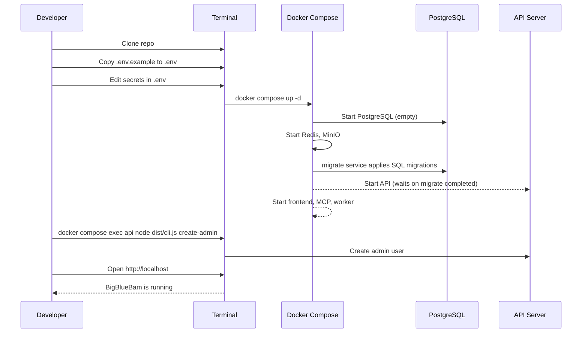

# Getting Started

This guide walks you through setting up BigBlueBam from a fresh clone to a running application.

---

## Prerequisites

| Requirement | Version | Notes |
|---|---|---|
| **Docker** | 24+ | Docker Desktop on macOS/Windows, or Docker Engine on Linux |
| **Docker Compose** | v2.20+ | Included with Docker Desktop; install separately on Linux |
| **Node.js** | 22 LTS+ | Required only for local development outside Docker |
| **pnpm** | 9+ | Required only for local development outside Docker |
| **Git** | 2.40+ | For cloning the repository |

Verify your installations:

```bash
docker --version          # Docker version 24.x+
docker compose version    # Docker Compose version v2.20+
node --version            # v22.x.x (for local dev only)
pnpm --version            # 9.x.x (for local dev only)
```

---

## Quick Start with Docker

The fastest path to a running BigBlueBam instance.



### Step 1: Clone the Repository

```bash
git clone https://github.com/bigblueceiling/BigBlueBam.git
cd BigBlueBam
```

### Step 2: Configure Environment Variables

```bash
cp .env.example .env
```

Open `.env` in your editor and set the required secrets:

```dotenv
# Required -- set these to strong, unique values
POSTGRES_USER=bigbluebam
POSTGRES_PASSWORD=your-strong-db-password-here
REDIS_PASSWORD=your-strong-redis-password-here
MINIO_ROOT_USER=minioadmin
MINIO_ROOT_PASSWORD=your-strong-minio-password-here
SESSION_SECRET=your-random-64-char-session-secret

# Optional -- defaults work for local development
CORS_ORIGIN=http://localhost
LOG_LEVEL=info
```

> **Tip:** Generate a session secret with `openssl rand -hex 32`.

### Step 3: Start the Stack

```bash
docker compose up -d
```

Expected output:

```
[+] Running 7/7
 ✔ Network bigbluebam_backend   Created
 ✔ Network bigbluebam_frontend  Created
 ✔ Container bigbluebam-postgres-1    Healthy
 ✔ Container bigbluebam-redis-1       Healthy
 ✔ Container bigbluebam-minio-1       Healthy
 ✔ Container bigbluebam-api-1         Started
 ✔ Container bigbluebam-worker-1      Started
 ✔ Container bigbluebam-mcp-server-1  Started
 ✔ Container bigbluebam-frontend-1    Started
 ✔ Container bigbluebam-migrate-1     Exited (0)
```

Wait for all services to become healthy:

```bash
docker compose ps
```

All services should show `healthy` or `running` status. The `migrate`
container runs once, applies every file in `infra/postgres/migrations/` in
order, then exits 0 — app services depend on it via
`service_completed_successfully` and won't start until it finishes.

> There is no `init.sql` bootstrap. PostgreSQL starts empty and the
> `migrate` service creates the entire schema from the numbered migration
> files. Re-running `docker compose up -d` is always safe: the migrate
> service is a no-op when the DB is current.

### Step 4: (Optional) Re-run migrations manually

You only need this when you've added a new migration file to your working
tree and want to apply it without recreating the stack:

```bash
docker compose build migrate && docker compose run --rm migrate
```

### Step 5: Create the First User + Organization

Every BigBlueBam deployment needs a bootstrap owner — the first user + their
organization. After that you can add users of any role into the same org,
promote SuperUsers, and mint API keys for agentic clients, all from the
same CLI.

> After the first admin exists you can add the rest of your team from the
> **People** UI at [`/b3/people`](http://localhost/b3/people) (invite,
> role changes, project assignments, password resets, API-key mint/
> revoke). SuperUsers get a cross-org view at
> [`/b3/superuser/people`](http://localhost/b3/superuser/people). The CLI
> paths below remain the scripted / headless way in.

```bash
docker compose exec api node dist/cli.js create-admin \
  --email admin@example.com \
  --password your-admin-password \
  --name "Admin User" \
  --org "My Organization"
```

Expected output:

```
Admin user created successfully:
  User ID:   <uuid>
  Email:     admin@example.com
  Org ID:    <uuid>
  Org Slug:  my-organization
```

> Passwords must be at least 12 characters. The CLI hashes with Argon2id.

### Step 5a: Other account types (optional, but usually needed)

The CLI supports all role + scope combinations. Full usage: `docker compose
exec api node dist/cli.js --help`.

**Platform SuperUser** (you, running the server — grants cross-org visibility
and the `/b3/superuser` console). Either add `--superuser` when creating the
first admin, or promote an existing user later:

```bash
# During bootstrap
docker compose exec api node dist/cli.js create-admin \
  --email you@co.com --password <pw> --name "You" --org "Acme" --superuser

# Promote an existing user (no new org created)
docker compose exec api node dist/cli.js grant-superuser --email you@co.com
# And to revoke:
docker compose exec api node dist/cli.js revoke-superuser --email you@co.com
```

**Additional humans inside an existing org.** Find the org slug with
`list-orgs`, then create users with any of `owner / admin / member / viewer /
guest`:

```bash
# See what orgs exist
docker compose exec api node dist/cli.js list-orgs

# Add an admin (can manage org, cannot delete it or demote the owner)
docker compose exec api node dist/cli.js create-user \
  --email alice@co.com --password <pw> --name "Alice" \
  --org-slug my-organization --role admin

# Add a regular member (the default — can create/edit tasks in projects they join)
docker compose exec api node dist/cli.js create-user \
  --email bob@co.com --password <pw> --name "Bob" \
  --org-slug my-organization --role member

# Add a watch-only viewer (read-only across their org's projects)
docker compose exec api node dist/cli.js create-user \
  --email watcher@co.com --password <pw> --name "Watcher" \
  --org-slug my-organization --role viewer
```

**Agentic (watch-only) user** — a bot that only needs to observe, never
write. Create a viewer-role user, then mint a `read` API key for it:

```bash
# 1. Create the bot's user record with viewer role
docker compose exec api node dist/cli.js create-user \
  --email dashboard-bot@co.com --password <rotate-me-pw> --name "Dashboard Bot" \
  --org-slug my-organization --role viewer

# 2. Issue a read-only API key (printed ONCE — copy and store immediately)
# --org-slug pins the key to exactly one org. Even if the user later joins
# other orgs via organization_memberships, this key will never grant access
# beyond my-organization.
docker compose exec api node dist/cli.js create-api-key \
  --email dashboard-bot@co.com --name "grafana-dashboard" --scope read \
  --org-slug my-organization
```

The CLI prints the raw token once — after that only its Argon2id hash is
stored. The bot uses it as:

```
Authorization: Bearer bbam_<rest-of-token>
```

**Agentic (read-write) user** — a CI bot or automation that creates/updates
tasks. Create a member-role user and a `read_write` key, optionally scoped
to a single project and with an expiry:

```bash
docker compose exec api node dist/cli.js create-user \
  --email ci-bot@co.com --password <rotate-me-pw> --name "CI Bot" \
  --org-slug my-organization --role member

docker compose exec api node dist/cli.js create-api-key \
  --email ci-bot@co.com --name "github-actions" --scope read_write \
  --org-slug my-organization --project-id <project-uuid> --expires-days 90
```

**Admin API key** (for server-to-server integrations that manage org-level
resources). Use with caution — `admin` scope bypasses read/write restrictions:

```bash
docker compose exec api node dist/cli.js create-api-key \
  --email admin@example.com --name "backfill-tool" --scope admin \
  --org-slug my-organization --expires-days 7
```

#### Helpdesk agent API keys

The `/helpdesk/api/agents/*` routes (BBB employees working customer
tickets) use a separate, per-agent key family prefixed `hdag_`. Each key
is tied to one BBB user, Argon2id-hashed at rest, and individually
rotatable / revocable — replacing the legacy shared `AGENT_API_KEY` env
var (HB-28 + HB-49).

```bash
# The BBB user must already exist (create-admin or create-user).
docker compose exec api node dist/cli.js create-helpdesk-agent-key \
  --email agent@example.com --name "agent-laptop" --expires-days 365
```

The token is printed ONCE. Agents present it on every request as:

```
X-Agent-Key: hdag_<rest-of-token>
```

#### Revoking keys

Both key families can be revoked by their 8-character `key_prefix` (the
first 8 characters of the token that was printed at creation time — e.g.
`bbam_abc` or `hdag_xyz`). BBB API keys are hard-deleted; helpdesk agent
keys are soft-revoked by default (the row is kept with `revoked_at` set)
so the audit trail stays intact, with `--hard` available for emergencies.

```bash
# Revoke a BBB API key (hard delete — the token is destroyed immediately)
docker compose exec api node dist/cli.js revoke-api-key --prefix bbam_abc

# Soft-revoke a helpdesk agent key (row kept, revoked_at stamped)
docker compose exec api node dist/cli.js revoke-helpdesk-agent-key --prefix hdag_xyz

# Hard-delete a helpdesk agent key (ops emergency only — breaks audit trail)
docker compose exec api node dist/cli.js revoke-helpdesk-agent-key --prefix hdag_xyz --hard
```

If two keys happen to share the same 8-char prefix (rare but possible),
the CLI lists the candidates and asks you to disambiguate with
`--id <uuid>`.

### Role & scope reference

| **User role** | **What it can do** |
|---|---|
| `owner` | Full org control. Cannot be demoted by other roles. |
| `admin` | Manage org members, settings, projects. Cannot delete org. |
| `member` | Create/edit tasks in projects they join. Default for new humans. |
| `viewer` | Read-only across the org. Good for watch-only agents, stakeholders. |
| `guest` | Invitation-only, scoped to specific projects/channels. |

| **API key scope** | **What it can do** |
|---|---|
| `read` | GET endpoints only. Safe for dashboards, observers, metric exporters. |
| `read_write` | CRUD on tasks, comments, etc. Cannot change org settings. |
| `admin` | Full org-level operations. Treat like a root credential. |

Every API key is bound to exactly one org via `--org-slug` (or `--org-id`)
at creation time and the auth layer enforces that scope on every request,
regardless of which other orgs the owning user joins later (P2-8).
`read_write` and `admin` keys can additionally be project-scoped with
`--project-id <uuid>` to limit their blast radius to a single project
inside that org. All keys can carry an `--expires-days N` TTL.

See the [Permissions Guide](permissions.md) for the complete authorization
model, and the [Development Guide](development.md#local-admin-superuser-and-impersonation)
for how to use the `/b3/superuser` console and test impersonation locally.

### Step 6: Access the Application

Open your browser and navigate to the application.

---

## Accessing Services

All services are accessed through port 80 via a single nginx reverse proxy:

| Service | URL | Purpose |
|---|---|---|
| **Root** | [http://localhost/](http://localhost/) | Redirects to `/helpdesk/` |
| **BigBlueBam SPA** | [http://localhost/b3/](http://localhost/b3/) | Main project management app |
| **BigBlueBam API** | [http://localhost/b3/api/](http://localhost/b3/api/) | REST API and WebSocket |
| **Banter SPA** | [http://localhost/banter/](http://localhost/banter/) | Team messaging app (alpha) |
| **Banter API** | [http://localhost/banter/api/](http://localhost/banter/api/) | Banter REST API and WebSocket |
| **Helpdesk Portal** | [http://localhost/helpdesk/](http://localhost/helpdesk/) | Client-facing ticket submission |
| **Helpdesk API** | [http://localhost/helpdesk/api/](http://localhost/helpdesk/api/) | Helpdesk auth, tickets, messages |
| **MCP Server** | [http://localhost/mcp/](http://localhost/mcp/) | MCP endpoint for AI clients (86 tools) |
| **Uploaded Files** | [http://localhost/files/](http://localhost/files/) | Shared uploaded files |
| **MinIO Console** | [http://localhost:9001](http://localhost:9001) | Object storage admin panel |
| **Health Check** | [http://localhost/b3/api/health](http://localhost/b3/api/health) | API health status |

---

## Development Mode

For active development with hot module replacement and live reloading:

```bash
docker compose -f docker-compose.yml -f docker-compose.dev.yml up
```

Or use the convenience script:

```bash
pnpm docker:dev
```

### What Changes in Dev Mode

| Service | Production | Development |
|---|---|---|
| **Frontend** | nginx serves built assets at `/b3/` on `:80` | Vite dev server with HMR on `:5173` |
| **API** | Compiled JS from `dist/`, proxied at `/b3/api/` | `tsx watch` with auto-reload on `:4000` |
| **Worker** | Compiled JS | `tsx watch` with auto-reload |
| **MCP Server** | Compiled JS, proxied at `/mcp/` | `tsx watch` with auto-reload |

In development mode, source directories are mounted as volumes so changes are reflected immediately.

### Accessing Dev Services

| Service | URL |
|---|---|
| **Vite Dev Server (BBB)** | [http://localhost:5173](http://localhost:5173) |
| **API (direct)** | [http://localhost:4000](http://localhost:4000) |
| **Production URLs (via nginx)** | [http://localhost/b3/](http://localhost/b3/), [http://localhost/helpdesk/](http://localhost/helpdesk/) |

### Running Specific Packages Locally

If you prefer running parts of the stack outside Docker:

```bash
# Install dependencies
pnpm install

# Build shared packages first
pnpm --filter @bigbluebam/shared build

# Run the API in dev mode
pnpm --filter @bigbluebam/api dev

# Run the frontend in dev mode
pnpm --filter @bigbluebam/frontend dev
```

---

## Common Commands

```bash
# Start the full stack
docker compose up -d

# Stop all services
docker compose down

# View logs (follow mode)
docker compose logs -f api mcp-server worker

# Rebuild after code changes
docker compose build

# Re-apply SQL migrations (normally automatic on `docker compose up`)
docker compose run --rm migrate

# Rebuild migrate image after adding a new migration file, then apply
docker compose build migrate && docker compose run --rm migrate

# Lint migration files (header, filename, idempotency)
pnpm lint:migrations

# Drift guard: Drizzle schemas vs live DB
pnpm db:check

# Run all tests
pnpm test

# Run linting
pnpm lint

# Run type checking
pnpm typecheck

# Format code
pnpm format
```

---

## Troubleshooting

### Port Conflicts

If you see errors like `Bind for 0.0.0.0:80: address already in use`:

```bash
# Check what is using the port
# Linux/macOS:
lsof -i :80
# Windows:
netstat -ano | findstr :80
```

Override the HTTP port in your `.env` file:

```dotenv
HTTP_PORT=8888
HTTPS_PORT=8443
```

### Database Connection Errors

If the API fails to connect to PostgreSQL:

1. Verify PostgreSQL is healthy:
   ```bash
   docker compose ps postgres
   docker compose logs postgres
   ```

2. Check your `POSTGRES_USER` and `POSTGRES_PASSWORD` match in `.env`.

3. Ensure the `backend` network exists:
   ```bash
   docker network ls | grep bigbluebam
   ```

4. Try recreating the stack:
   ```bash
   docker compose down -v
   docker compose up -d
   ```

   > **Warning:** The `-v` flag removes volumes, which deletes all data. Only use this for a fresh start.

### Permission Errors on Linux

If containers fail with permission errors on mounted volumes:

```bash
# Fix ownership for volume directories
sudo chown -R 1000:1000 ./infra/postgres/
sudo chown -R 1000:1000 ./infra/nginx/
```

### Build Failures

If Docker builds fail:

```bash
# Clear Docker build cache
docker builder prune

# Rebuild without cache
docker compose build --no-cache
```

### MinIO Bucket Not Found

The MinIO bucket is created automatically by the init script. If attachments fail:

```bash
# Access MinIO console at http://localhost:9001
# Login with MINIO_ROOT_USER / MINIO_ROOT_PASSWORD
# Create the bucket manually: bigbluebam-uploads
```

### Redis Connection Refused

Verify Redis is running and the password matches:

```bash
docker compose exec redis redis-cli -a "$REDIS_PASSWORD" ping
# Expected: PONG
```

---

## Next Steps

- Read the [Architecture Overview](architecture.md) to understand how the system fits together
- Explore the [API Reference](api-reference.md) for endpoint documentation
- Set up the [MCP Server](mcp-server.md) for AI client integration
- Review the [Development Guide](development.md) for contributing
