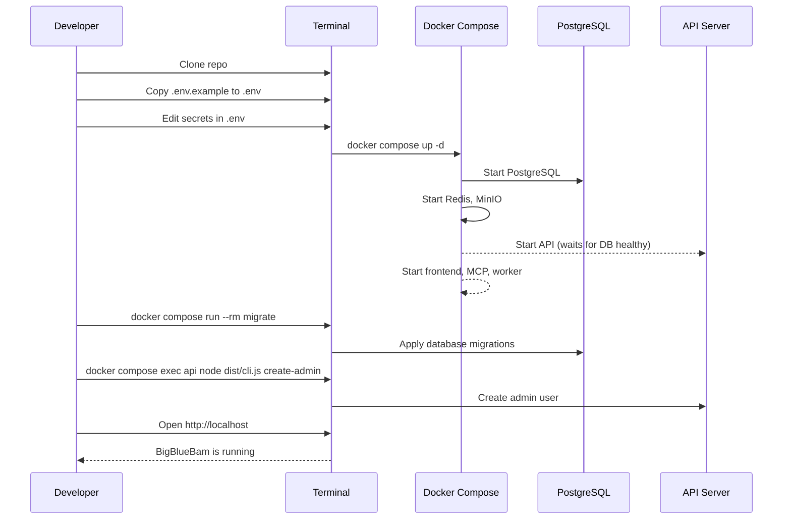

# Getting Started

This guide walks you through setting up BigBlueBam from a fresh clone to a running application.

---

## Prerequisites

| Requirement | Version | Notes |
|---|---|---|
| **Docker** | 24+ | Docker Desktop on macOS/Windows, or Docker Engine on Linux |
| **Docker Compose** | v2.20+ | Included with Docker Desktop; install separately on Linux |
| **Node.js** | 22 LTS+ | Required only for local development outside Docker |
| **pnpm** | 9+ | Required only for local development outside Docker |
| **Git** | 2.40+ | For cloning the repository |

Verify your installations:

```bash
docker --version          # Docker version 24.x+
docker compose version    # Docker Compose version v2.20+
node --version            # v22.x.x (for local dev only)
pnpm --version            # 9.x.x (for local dev only)
```

---

## Quick Start with Docker

The fastest path to a running BigBlueBam instance.



### Step 1: Clone the Repository

```bash
git clone https://github.com/bigblueceiling/BigBlueBam.git
cd BigBlueBam
```

### Step 2: Configure Environment Variables

```bash
cp .env.example .env
```

Open `.env` in your editor and set the required secrets:

```dotenv
# Required -- set these to strong, unique values
POSTGRES_USER=bigbluebam
POSTGRES_PASSWORD=your-strong-db-password-here
REDIS_PASSWORD=your-strong-redis-password-here
MINIO_ROOT_USER=minioadmin
MINIO_ROOT_PASSWORD=your-strong-minio-password-here
SESSION_SECRET=your-random-64-char-session-secret

# Optional -- defaults work for local development
CORS_ORIGIN=http://localhost
LOG_LEVEL=info
```

> **Tip:** Generate a session secret with `openssl rand -hex 32`.

### Step 3: Start the Stack

```bash
docker compose up -d
```

Expected output:

```
[+] Running 7/7
 ✔ Network bigbluebam_backend   Created
 ✔ Network bigbluebam_frontend  Created
 ✔ Container bigbluebam-postgres-1    Healthy
 ✔ Container bigbluebam-redis-1       Healthy
 ✔ Container bigbluebam-minio-1       Healthy
 ✔ Container bigbluebam-api-1         Started
 ✔ Container bigbluebam-worker-1      Started
 ✔ Container bigbluebam-mcp-server-1  Started
 ✔ Container bigbluebam-frontend-1    Started
```

Wait for all services to become healthy:

```bash
docker compose ps
```

All services should show `healthy` or `running` status.

### Step 4: Run Database Migrations

```bash
docker compose run --rm migrate
```

Expected output:

```
Running migrations...
Migration 0001_initial_schema applied successfully.
Migration 0002_activity_log_partitions applied successfully.
All migrations complete.
```

### Step 5: Create the Admin User

```bash
docker compose exec api node dist/cli.js create-admin \
  --email admin@example.com \
  --password your-admin-password \
  --name "Admin User" \
  --org "My Organization"
```

Expected output:

```
Admin user created successfully.
  Email: admin@example.com
  Organization: My Organization (slug: my-organization)
  Role: owner
```

### Step 6: Access the Application

Open your browser and navigate to the application.

---

## Accessing Services

| Service | URL | Purpose |
|---|---|---|
| **Frontend** | [http://localhost](http://localhost) | Main web application |
| **API** | [http://localhost:4000](http://localhost:4000) | REST API and WebSocket server |
| **MCP Server** | [http://localhost:3001](http://localhost:3001) | MCP endpoint for AI clients |
| **MinIO Console** | [http://localhost:9001](http://localhost:9001) | Object storage admin panel |
| **Health Check** | [http://localhost:4000/health](http://localhost:4000/health) | API health status |

---

## Development Mode

For active development with hot module replacement and live reloading:

```bash
docker compose -f docker-compose.yml -f docker-compose.dev.yml up
```

Or use the convenience script:

```bash
pnpm docker:dev
```

### What Changes in Dev Mode

| Service | Production | Development |
|---|---|---|
| **Frontend** | nginx serves built assets on `:80` | Vite dev server with HMR on `:5173` |
| **API** | Compiled JS from `dist/` | `tsx watch` with auto-reload on `:4000` |
| **Worker** | Compiled JS | `tsx watch` with auto-reload |
| **MCP Server** | Compiled JS | `tsx watch` with auto-reload |

In development mode, source directories are mounted as volumes so changes are reflected immediately.

### Accessing the Dev Frontend

| Service | URL |
|---|---|
| **Vite Dev Server** | [http://localhost:5173](http://localhost:5173) |
| **API (unchanged)** | [http://localhost:4000](http://localhost:4000) |

### Running Specific Packages Locally

If you prefer running parts of the stack outside Docker:

```bash
# Install dependencies
pnpm install

# Build shared packages first
pnpm --filter @bigbluebam/shared build

# Run the API in dev mode
pnpm --filter @bigbluebam/api dev

# Run the frontend in dev mode
pnpm --filter @bigbluebam/frontend dev
```

---

## Common Commands

```bash
# Start the full stack
docker compose up -d

# Stop all services
docker compose down

# View logs (follow mode)
docker compose logs -f api mcp-server worker

# Rebuild after code changes
docker compose build

# Run database migrations
docker compose run --rm migrate

# Generate new migration from schema changes
pnpm db:generate

# Run all tests
pnpm test

# Run linting
pnpm lint

# Run type checking
pnpm typecheck

# Format code
pnpm format
```

---

## Troubleshooting

### Port Conflicts

If you see errors like `Bind for 0.0.0.0:80: address already in use`:

```bash
# Check what is using the port
# Linux/macOS:
lsof -i :80
# Windows:
netstat -ano | findstr :80
```

Override ports in your `.env` file:

```dotenv
HTTP_PORT=8080
HTTPS_PORT=8443
API_PORT=4001
MCP_PORT=3002
```

### Database Connection Errors

If the API fails to connect to PostgreSQL:

1. Verify PostgreSQL is healthy:
   ```bash
   docker compose ps postgres
   docker compose logs postgres
   ```

2. Check your `POSTGRES_USER` and `POSTGRES_PASSWORD` match in `.env`.

3. Ensure the `backend` network exists:
   ```bash
   docker network ls | grep bigbluebam
   ```

4. Try recreating the stack:
   ```bash
   docker compose down -v
   docker compose up -d
   ```

   > **Warning:** The `-v` flag removes volumes, which deletes all data. Only use this for a fresh start.

### Permission Errors on Linux

If containers fail with permission errors on mounted volumes:

```bash
# Fix ownership for volume directories
sudo chown -R 1000:1000 ./infra/postgres/
sudo chown -R 1000:1000 ./infra/nginx/
```

### Build Failures

If Docker builds fail:

```bash
# Clear Docker build cache
docker builder prune

# Rebuild without cache
docker compose build --no-cache
```

### MinIO Bucket Not Found

The MinIO bucket is created automatically by the init script. If attachments fail:

```bash
# Access MinIO console at http://localhost:9001
# Login with MINIO_ROOT_USER / MINIO_ROOT_PASSWORD
# Create the bucket manually: bigbluebam-uploads
```

### Redis Connection Refused

Verify Redis is running and the password matches:

```bash
docker compose exec redis redis-cli -a "$REDIS_PASSWORD" ping
# Expected: PONG
```

---

## Next Steps

- Read the [Architecture Overview](architecture.md) to understand how the system fits together
- Explore the [API Reference](api-reference.md) for endpoint documentation
- Set up the [MCP Server](mcp-server.md) for AI client integration
- Review the [Development Guide](development.md) for contributing
